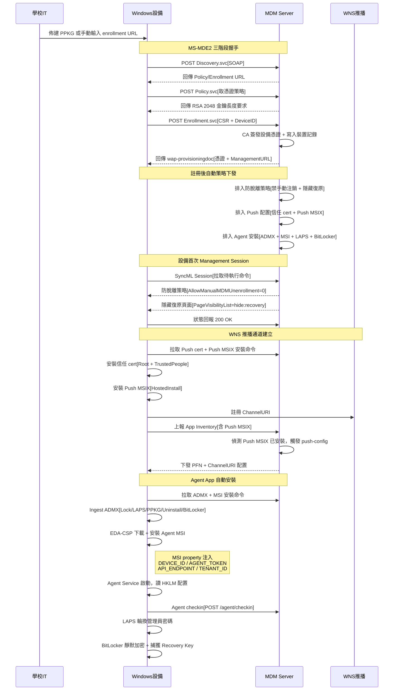

# 設備納管（Enrollment）

Windows 設備透過 MS-MDE2 協議完成自動註冊，註冊成功後伺服器自動下發防脫離策略、WNS 推播配置、Agent App 安裝及 LAPS/BitLocker 加固，實現「一鍵開箱即納管」。

## 完整流程總覽



## 流程說明

### 1. Discovery（服務發現）

設備向 `/t/{tenantSlug}/EnrollmentServer/Discovery.svc` 發送 SOAP Discover 請求，攜帶 EmailAddress 與裝置資訊。伺服器回傳三個關鍵 URL：

- **EnrollmentPolicyServiceUrl** → `Policy.svc`
- **EnrollmentServiceUrl** → `Enrollment.svc`
- **AuthPolicy** → `OnPremise`（用戶名密碼認證）

### 2. Policy（憑證策略）

設備呼叫 `/t/{tenantSlug}/EnrollmentServer/Policy.svc`，取得憑證請求策略（金鑰長度 RSA 2048、Hash SHA-256）。設備據此生成 PKCS#10 CSR。

### 3. Enrollment（CSR 簽發與裝置註冊）

設備向 `/t/{tenantSlug}/EnrollmentServer/Enrollment.svc` 提交 RST（RequestSecurityToken）：

1. 伺服器解析 BinarySecurityToken 中的 CSR 與 ContextItem（DeviceID、HWDevID、DeviceName、OSVersion）
2. 載入該租戶的 per-tenant CA，簽發設備憑證
3. 構建 `wap-provisioningdoc`，包含：
   - 設備憑證（client auth TLS）
   - CA 根憑證
   - ManagementURL：`/api/mdm/win/manage/{deviceId}`
4. 寫入 `mdm_devices` + `mdm_certificates` 表

### 4. 註冊後自動策略下發

Enrollment 回應 200 前，伺服器自動排入以下命令到 `mdm_commands` 佇列（try-catch 隔離，任一失敗不影響註冊）：

| 順序 | 命令類型 | 說明 |
|------|----------|------|
| 1 | SetManualUnenroll | 禁止手動注銷（灰掉「斷開連接」按鈕） |
| 2 | DisableRestore | 隱藏「重設此電腦」復原頁面 |
| 3 | InstallTrustedCert | 下發 Push 簽名 cert 到 Root + TrustedPeople |
| 4 | MsixInstall | 派送 Push MSIX（Add + Exec HostedInstall） |
| 5 | SetPollInterval | 加速輪詢（首 10 次 2 分鐘，之後 15 分鐘） |
| 6 | AppInventoryConfig/Fetch | 啟動應用清單上報，觸發 push-config 自癒 |
| 7 | policy_admx_install ×5 | Ingest Lock/LAPS/PPKGRemoval/SelfUninstall/BitLocker ADMX |
| 8 | msi_install (Add+Exec) | EDA-CSP 下載安裝 Agent MSI |
| 9 | LapsRotatePassword | 自動輪換管理員密碼（queued_at 晚於 ADMX） |
| 10 | BitLockerEnable | 靜默啟用 XTS-AES 256 加密 |

### 5. 設備首次 Management Session

設備使用 enrollment 取得的憑證 + ManagementURL 發起 SyncML session（OMA-DM 協議），從 `mdm_commands` 佇列按序拉取並執行上述命令。

### 6. Agent App 啟動鏈路

MSI 安裝時透過 msiexec public property 將配置寫入 `HKLM\SOFTWARE\Policies\CoGrowMDM\Agent`：

```
DEVICE_ID={uuid}  AGENT_TOKEN={hex64}  API_ENDPOINT=https://…/api/v1  TENANT_ID={uuid}
```

Agent Service 啟動後讀取 HKLM → 向 `POST /api/v1/tenants/{tid}/agent/checkin` 報到 → 觸發 LAPS 密碼輪換 + BitLocker Recovery Key 捕獲。

## 關鍵技術細節

### API 端點

| 端點 | 協議 | 用途 |
|------|------|------|
| `/t/{slug}/EnrollmentServer/Discovery.svc` | SOAP 1.2 | 服務發現 |
| `/t/{slug}/EnrollmentServer/Policy.svc` | SOAP 1.2 | 憑證策略 |
| `/t/{slug}/EnrollmentServer/Enrollment.svc` | SOAP 1.2 | CSR 簽發 + 裝置註冊 |
| `/api/mdm/win/manage/{deviceId}` | SyncML (OMA-DM) | 設備管理通道 |
| `/api/v1/tenants/{tid}/agent/checkin` | REST JSON | Agent 啟動簽到 |

### CSP 路徑

| CSP 路徑 | Verb | 說明 |
|----------|------|------|
| `./Device/Vendor/MSFT/Policy/Config/Experience/AllowManualMDMUnenrollment` | Replace | 0=禁止手動注銷 |
| `./Device/Vendor/MSFT/Policy/Config/Settings/PageVisibilityList` | Replace | `hide:recovery` 隱藏復原頁 |
| `./Device/Vendor/MSFT/DMClient/Provider/{ProviderID}/Push/PFN` | Replace | WNS 推播 PFN |
| `./Device/Vendor/MSFT/EnterpriseDesktopAppManagement/MSI/{ProductCode}/DownloadInstall` | Add+Exec | MSI 下載安裝（兩段式） |
| `./Device/Vendor/MSFT/EnterpriseModernAppManagement/AppInstallation/{PFN}/HostedInstall` | Add+Exec | MSIX 安裝 |

### SOAP Content-Type

回應必須攜帶正確的 `action` 參數，否則 Win10 ENROLLClient 報 `0x80192F76`：

```
Content-Type: application/soap+xml; charset=utf-8; action="http://schemas.microsoft.com/windows/management/2012/01/enrollment/IDiscoveryService/DiscoverResponse"
```

### 防代理干擾

SOAP 回應強制設定以下 header，阻止反向代理（ngrok / Cloudflare）修改 body：

```
Content-Encoding: identity
Cache-Control: no-transform, no-store
Content-Length: {精確位元組長度}
```

### MSI 配置注入

Registry CSP 在 Win10 22H2 全面不可用（所有 LocURI 回 404），改由 MSI public property 注入：

- MSI 安裝時 `msiexec` 的 CommandLine 帶入 `DEVICE_ID=... AGENT_TOKEN=...`
- MSI 的 `Product.wxs` 中 `RegistryValue` 將 property 寫入 HKLM
- Agent Service 啟動時從 HKLM 讀取，無 race condition

## 相關源碼

| 檔案 | 說明 |
|------|------|
| `app/routes/windows-mdm.ts` | MS-MDE2 SOAP 端點 + 註冊後自動策略編排 |
| `app/services/mdm/windows/discovery.ts` | Discovery 請求解析與回應構建 |
| `app/services/mdm/windows/policy.ts` | Policy 憑證策略回應 |
| `app/services/mdm/windows/enrollment.ts` | CSR 簽發 + wap-provisioningdoc 構建 |
| `app/services/mdm/windows/csp.ts` | SyncML 命令封裝（MSI/MSIX/Reboot/Wipe 等） |
| `app/services/mdm/windows/csp-experience.ts` | 防脫離策略（AllowManualMDMUnenrollment + PageVisibilityList） |
| `app/services/mdm/windows/push-setup.ts` | WNS 推播配置（cert + MSIX + poll + inventory） |
| `app/services/mdm/windows/command.ts` | SyncML session 處理 + 命令佇列 |
| `app/services/install-agent.ts` | Agent App 一鍵安裝（token 簽發 + MSI 派發 + LAPS + BitLocker） |
| `app/services/mdm/windows/provisioning.ts` | wap-provisioningdoc XML 生成 |
| `app/services/mdm/crypto.ts` | CA 憑證管理與 CSR 簽發 |
