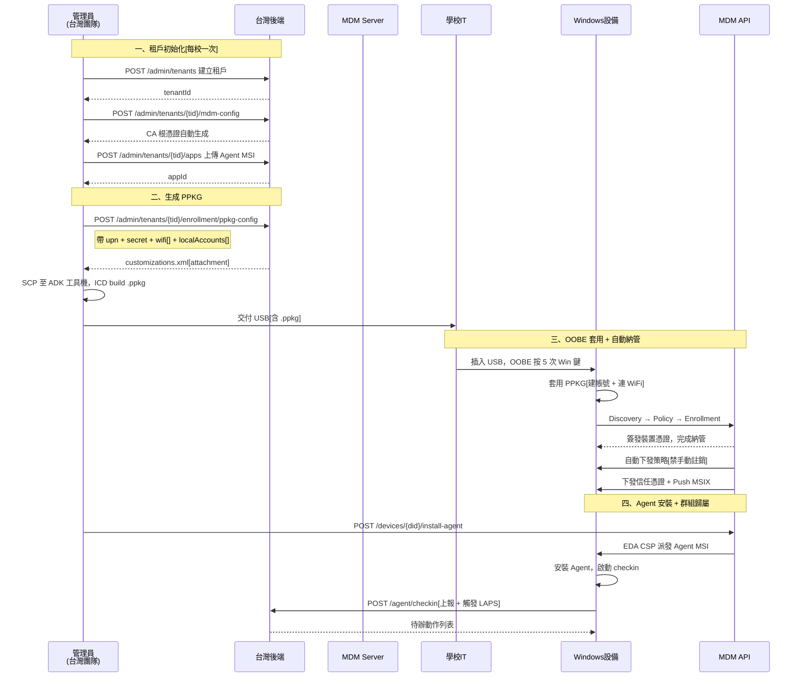
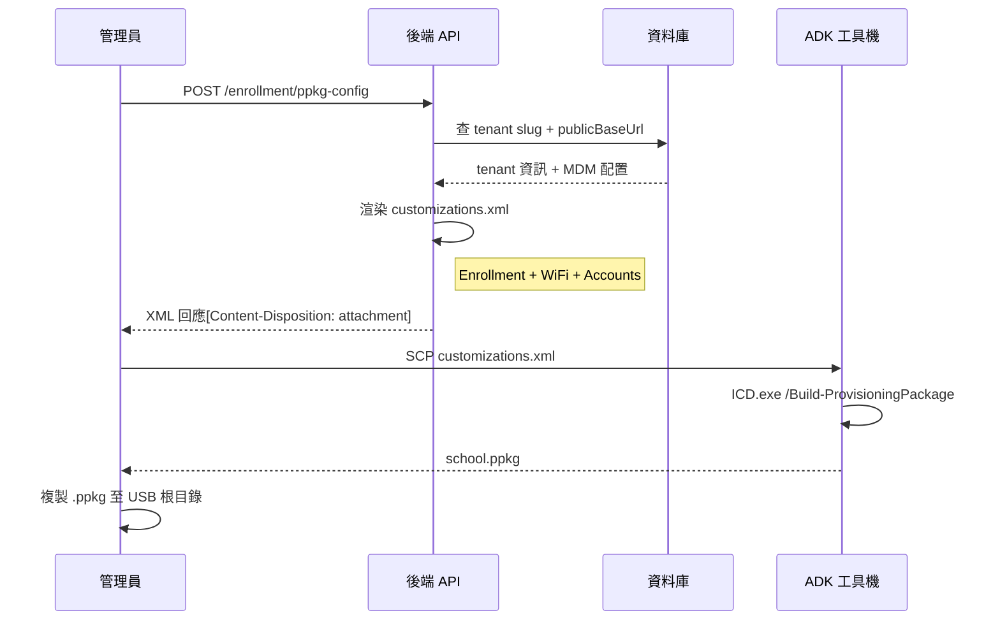

# PPKG 批次部署（Zero-touch）

透過後端 API 生成 Windows Provisioning Package（PPKG），由學校 IT 以 USB 在 OOBE 階段一次完成「建帳號 + 連 WiFi + 納管 MDM」，實現批量設備初始化的最少人工介入流程。

## 流程說明

### 一、租戶初始化（每校一次）

每個學校作為獨立租戶，首次部署前須完成三步初始化：

1. **建立租戶** — `POST /api/v1/admin/tenants`，取得 `tenantId`，設定 `slug`（如 `guangfu-es`）作為 enrollment 路由識別
2. **初始化 MDM 配置** — `POST /api/v1/admin/tenants/{tid}/mdm-config`，填入 `publicBaseUrl`（必須 HTTPS），系統自動生成 per-tenant CA 根憑證（10 年有效期）
3. **上傳 Agent MSI** — `POST /api/v1/admin/tenants/{tid}/apps`，multipart/form-data 上傳 CoGrow MDM Agent 安裝包

### 二、生成 PPKG 配置

**API 端點**：`POST /api/v1/admin/tenants/{tenantId}/enrollment/ppkg-config`

**Request Body**：

| 欄位 | 必填 | 說明 |
|------|------|------|
| `upn` | 是 | Enrollment 服務帳號 UPN（須含 `@`） |
| `secret` | 是 | OnPremise 模式密碼 |
| `authPolicy` | 否 | 預設 `OnPremise`；`Certificate` 尚未驗證 |
| `wifi[]` | 否 | WiFi profile（ssid + securityType + securityKey），強烈建議填寫 |
| `localAccounts[]` | 否 | 本機帳號（username + password + isAdmin） |

**回傳**：`application/xml` 格式的 `customizations.xml`，包含三段配置：

- `Workplace/Enrollments` — MDM 註冊（DiscoveryUrl 自動帶 tenant slug）
- `ConnectivityProfiles/WLAN/WLANSetting` — WiFi 預配
- `Accounts/Users` — 本機帳號（Standard Users / Administrators）

生成後須在 Windows ADK 工具機用 ICD 命令列 build 成 `.ppkg`。

### 三、OOBE 套用與自動納管

1. 設備開機進入 OOBE 第一畫面（選擇國家或地區）
2. 插入含 `.ppkg` 的 USB
3. 連按 5 次 Windows 鍵，觸發「設定此裝置」頁面
4. 選中 USB 上的 `.ppkg`，確認安裝
5. PPKG 自動套用：建帳號 → 連 WiFi → 發起 MDM Enrollment
6. 設備向 `{publicBaseUrl}/t/{slug}/EnrollmentServer/Discovery.svc` 發起 Discovery
7. 完成 Enrollment 後，MDM Server 自動下發禁手動註銷策略 + Push 推送通道配置

### 四、Agent 安裝與群組歸屬

納管成功後，管理員透過 `POST /api/v1/admin/tenants/{tid}/devices/{did}/install-agent` 下發 Agent MSI。Agent 安裝後自動 checkin，觸發 LAPS 密碼輪換（將 PPKG 建立的統一管理員密碼改為每台隨機值）。

## 關鍵技術細節

| 項目 | 值 / 說明 |
|------|-----------|
| PPKG XML Schema | `urn:schemas-microsoft-com:windows-provisioning`（ICD GUI 反向工程取得） |
| Enrollment DiscoveryUrl | `{publicBaseUrl}/t/{slug}/EnrollmentServer/Discovery.svc` |
| AuthPolicy | `OnPremise`（真機驗證通過）；`Certificate` 回 501 |
| WiFi SecurityType | `Open` / `WEP` / `WPA2-Personal`（ICD GUI export 字面值） |
| 帳號 UserGroup | `Standard Users`（學生）/ `Administrators`（IT） |
| PackageId | 每次生成新 UUID，同設備重裝須先移除舊套件（否則 `0x800700B7`） |
| 密碼安全 | XML 含明文密碼，用完即焚；納管後由 LAPS 輪換為每台隨機值 |
| publicBaseUrl | 必須 HTTPS（Windows DMClient 拒絕 HTTP） |
| 最低系統要求 | Windows 10/11 Pro / Enterprise / Education（Home 不支援 MDM） |
| Audit | 每次生成寫 audit log（`enrollment.ppkg_generate`），不記敏感欄位 |

## 相關源碼

| 檔案 | 說明 |
|------|------|
| `app/routes/v1/admin/enrollment-ppkg.ts` | API 路由定義（OpenAPI spec + handler） |
| `app/services/admin/enrollment-ppkg.ts` | XML 渲染邏輯（`renderCustomizationsXml` 純函式） |
| `app/middleware/admin-auth.ts` | Admin Bearer Token 鑑權中介層 |
| `app/services/admin/audit.ts` | 審計日誌記錄 |
| `docs/windows-deployment/device-provisioning-guide.md` | 完整設備初始化操作指南（給 IT 團隊） |
| `win-agent-app/scripts/ppkg/` | ICD build 腳本與 Schema 查證文件 |
