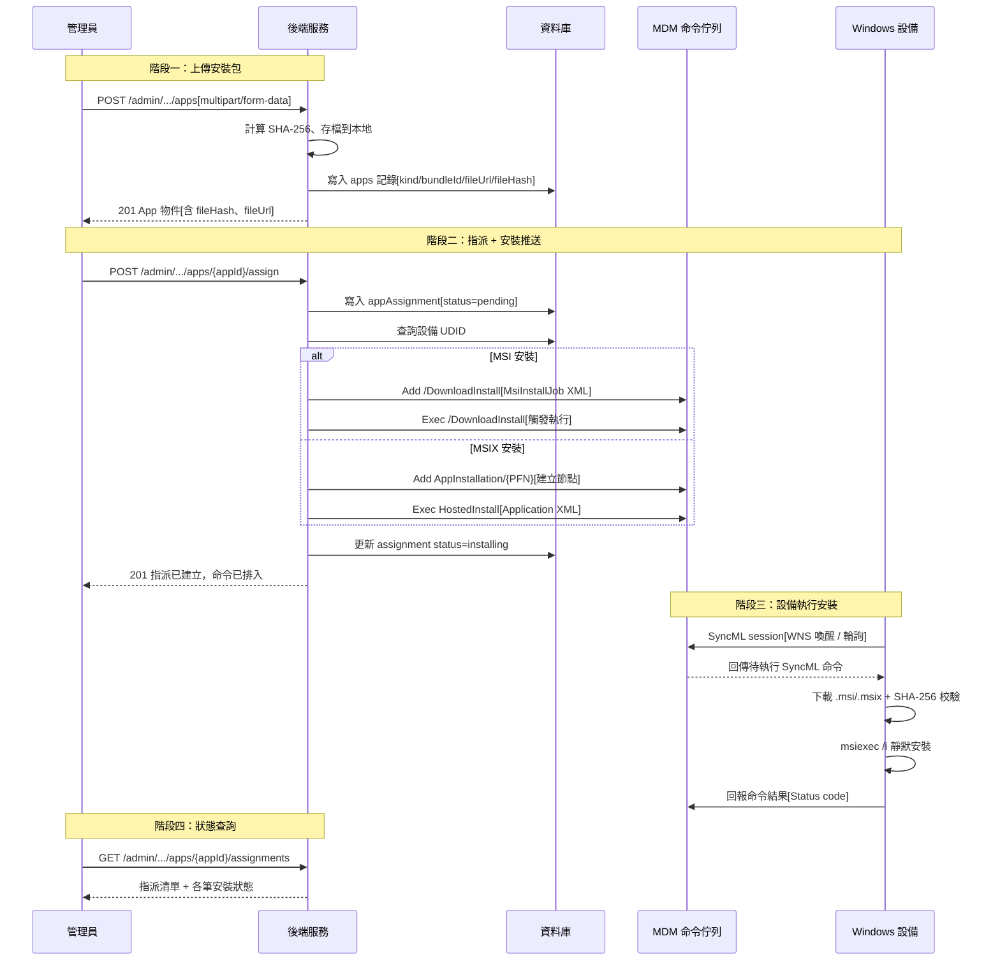
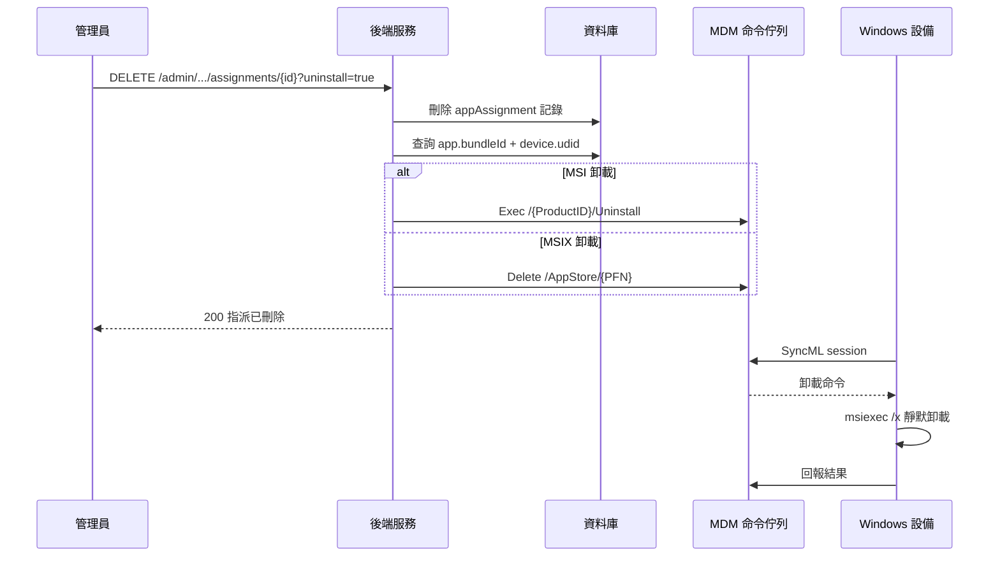

# App 派發與管理

管理員透過 Admin API 上傳應用安裝包（MSI/MSIX），指派到目標設備後，由自建 MDM 伺服器透過 OMA-DM SyncML 協議將安裝命令下發至 Windows 設備，實現應用的遠端靜默安裝、狀態追蹤與卸載。

## 安裝流程



## 卸載流程



## 流程說明

### 上傳安裝包

1. 管理員透過 `POST /admin/tenants/{tenantId}/apps` 以 multipart/form-data 上傳 `.msi`、`.exe` 或 `.msix` 檔案
2. 後端自動偵測檔案類型（可透過 `kind` 欄位覆寫）、計算 SHA-256 雜湊值、存儲至本地目錄
3. 建立 `apps` 記錄，包含 `fileUrl`（相對下載路徑）、`fileHash`、`bundleId`（MSI ProductCode / MSIX PFN）等元資料

### 指派到設備

1. 管理員透過 `POST /admin/.../apps/{appId}/assign` 建立指派關係
2. `scope` 決定推送行為：
   - `scope=device`：立即排入安裝命令到 MDM 佇列
   - `scope=device_group`：僅建立 pending 記錄，群組展開推送留後段實現
3. 同一 App 對同一目標重複指派回傳 409 Conflict
4. 僅 `platform=windows` 的 App 會觸發 MDM 命令推送

### MSI 安裝命令（EDA-CSP）

MSI 安裝需要兩條 SyncML 命令依序下發：

1. **Add**（建立 DownloadInstall 節點）：將 `MsiInstallJob` XML 寫入 CSP 路徑 `./Device/Vendor/MSFT/EnterpriseDesktopAppManagement/MSI/{ProductID}/DownloadInstall`
2. **Exec**（觸發執行）：對同一路徑發送 Exec 命令啟動下載安裝流程

`MsiInstallJob` XML 包含下載 URL、SHA-256 校驗值、msiexec 命令行參數、超時與重試策略。

### MSIX 安裝命令（EnterpriseModernAppManagement）

MSIX 安裝同樣需要兩步：

1. **Add**（建立 PFN 節點）：`./User/Vendor/MSFT/EnterpriseModernAppManagement/AppInstallation/{PFN}`，format=node
2. **Exec HostedInstall**：對 `{PFN}/HostedInstall` 發送包含 `<Application PackageUri="..." DeploymentOptions="N"/>` 的 XML

首次安裝必須先 Add 建立節點，否則設備回 404。升級場景可直接 Exec。

### 卸載

1. 管理員呼叫 `DELETE /admin/.../assignments/{assignmentId}?uninstall=true`
2. 後端刪除 assignment 記錄後，若 `uninstall=true` 且設備有 UDID，下發卸載命令
3. 卸載為非同步執行，API 回傳 200 不代表設備已完成卸載

### 重試失敗安裝

管理員可透過 `POST /admin/.../assignments/{assignmentId}/retry` 重新排入安裝命令，僅支援 `scope=device` 的指派。

## 關鍵技術細節

### EDA-CSP 路徑（MSI）

| 操作 | Verb | LocURI |
|------|------|--------|
| 安裝 | Add + Exec | `./Device/Vendor/MSFT/EnterpriseDesktopAppManagement/MSI/{ProductID}/DownloadInstall` |
| 卸載 | Exec | `./Device/Vendor/MSFT/EnterpriseDesktopAppManagement/MSI/{ProductID}/Uninstall` |
| 狀態查詢 | Get | `./Device/Vendor/MSFT/EnterpriseDesktopAppManagement/MSI/{ProductID}/Status` |
| 錯誤碼 | Get | `./Device/Vendor/MSFT/EnterpriseDesktopAppManagement/MSI/{ProductID}/LastError` |

### EnterpriseModernAppManagement 路徑（MSIX）

| 操作 | Verb | LocURI |
|------|------|--------|
| 建立節點 | Add | `./User/Vendor/MSFT/EnterpriseModernAppManagement/AppInstallation/{PFN}` |
| 安裝 | Exec | `./User/.../AppInstallation/{PFN}/HostedInstall` |
| 卸載 | Delete | `./User/.../AppManagement/AppStore/{PFN}` |

### MSI 安裝狀態碼（EDA-CSP Status）

| 狀態碼 | 含義 | 說明 |
|--------|------|------|
| 10 | Initialized | 命令已初始化 |
| 20 | Download In Progress | 正在下載 |
| 25 | Pending Download Retry | 下載失敗，等待重試 |
| 30 | Download Failed | 下載失敗（終態） |
| 40 | Download Completed | 下載完成 |
| 48 | Pending User Session | 等待使用者登入 |
| 50 | Enforcement In Progress | 安裝執行中 |
| **60** | **Enforcement Completed** | **安裝成功（成功終態）** |
| 70 | Enforcement Pending Retry | 安裝失敗，等待重試 |
| **80** | **Enforcement Failed** | **安裝失敗（失敗終態）** |

### MsiInstallJob XML 結構

```xml
<MsiInstallJob id="{ProductCode}">
  <Product Version="1.0.0">
    <Download>
      <ContentURLList>
        <ContentURL>https://server/path/agent.msi</ContentURL>
      </ContentURLList>
    </Download>
    <Validation>
      <FileHash>sha256-hex-string</FileHash>
    </Validation>
    <Enforcement>
      <CommandLine>/quiet /norestart</CommandLine>
      <TimeOut>10</TimeOut>
      <RetryCount>3</RetryCount>
      <RetryInterval>5</RetryInterval>
    </Enforcement>
  </Product>
</MsiInstallJob>
```

### 下載 URL 組裝

完整下載地址 = `appDownloadBaseUrl`（或 `publicBaseUrl`）+ `app.fileUrl`。`appDownloadBaseUrl` 可設為 HTTP 局域網地址以繞過大檔案走公網的不穩定性。

## 相關源碼

| 檔案 | 職責 |
|------|------|
| `app/routes/v1/admin/apps.ts` | App 安裝包上傳 / 列表 / 刪除 API |
| `app/routes/v1/admin/app-deploy.ts` | App 指派 / 卸載 / 重試 / 狀態查詢 API |
| `app/services/app-deploy.ts` | 指派 CRUD + 安裝/卸載命令推送邏輯 |
| `app/services/apps.ts` | App 安裝包存儲 + SHA-256 計算 |
| `app/services/mdm/windows/csp.ts` | CSP 命令封裝（`buildMsiInstall`、`buildMsiUninstall`、`buildMsixInstall` 等） |
| `app/services/mdm/windows/command.ts` | `enqueueWindowsCommand`：SyncML 命令佇列寫入 |
| `app/db/schema/apps.ts` | `apps` / `appAssignments` 資料表 schema |
