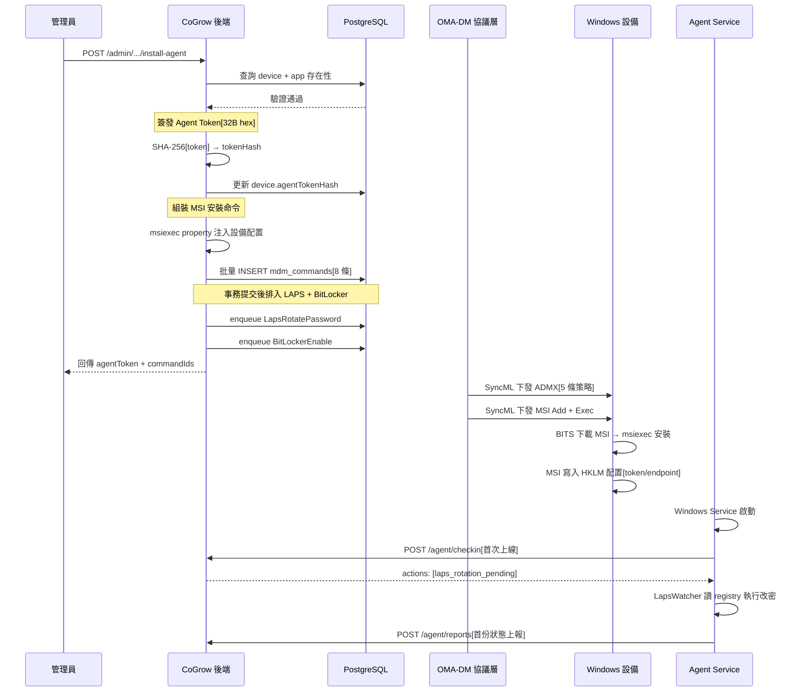
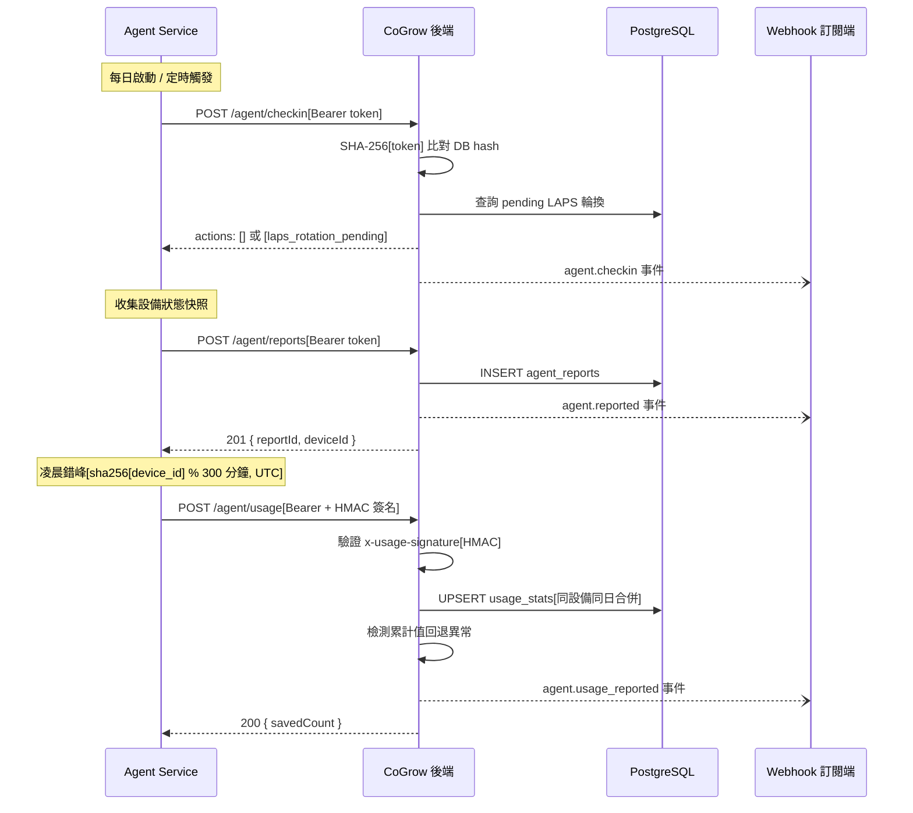
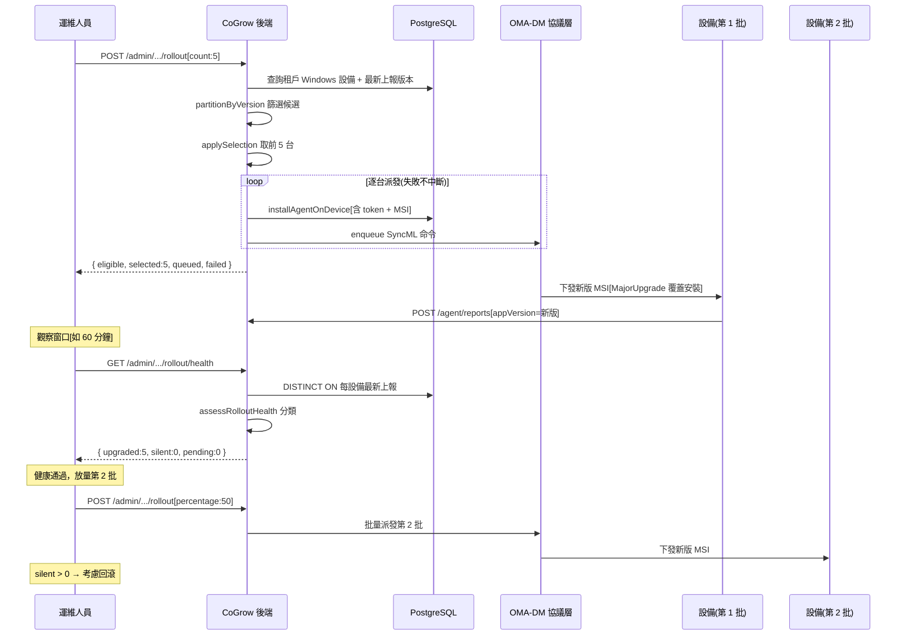

# Agent App 安裝與數據上報

Agent App 是部署在受管設備上的常駐服務，負責設備狀態上報、LAPS 密碼輪換、BitLocker 加密及使用時長採集。本文件描述 Agent 從首次安裝到持續上報、再到灰度升級的完整業務流程。

---

## 1. Agent 首次安裝流程

設備完成 MDM Enrollment 後，管理員透過 Admin API 觸發一鍵安裝。後端在單一事務中完成 token 簽發、MSI 派發、ADMX 策略下發及自動化安全配置。

### 流程說明

1. **管理員觸發安裝**：呼叫 `POST /api/v1/admin/tenants/{tid}/devices/{did}/install-agent`，帶 `appId` 與 `apiEndpoint`。
2. **Token 簽發**：後端以 `crypto.randomBytes(32)` 產生 64 字元 hex token（256 bit 熵），僅此次回傳明文；DB 只存 `SHA-256(token)` 雜湊，無法逆向還原。
3. **MSI Property 注入**：由於 Registry CSP 在 Win10 22H2 全回 404，改以 `msiexec /quiet DEVICE_ID=... AGENT_TOKEN=... API_ENDPOINT=... TENANT_ID=...` 將配置透過 MSI public property 寫入 `HKLM\SOFTWARE\Policies\CoGrowMDM\Agent`。
4. **ADMX 信箱策略**：在同一事務中排入 5 條 `policy_admx_install` 命令，為設備預裝自定義 ADMX 策略。
5. **EDA-CSP 兩段式派發**：MSI DownloadInstall 需先 `Add`（建 install job）再 `Exec`（觸發 BITS 下載 + msiexec），缺 Exec 則 job 停留在 Ready。
6. **LAPS / BitLocker**：事務提交後才 enqueue（`queued_at` 晚於 ADMX），確保設備在後續 SyncML session 中 ADMX 已生效再收到 Replace 命令。
7. **Agent 啟動**：Windows Service 啟動後讀取 HKLM 配置，立即 checkin 取得待辦動作（LAPS 輪換）。

---

## 2. Agent 每日上報流程

Agent 安裝後持續運行，定時執行 checkin（啟動時）、狀態上報（每日）及使用時長上報（凌晨錯峰）。

### 流程說明

1. **Checkin（啟動觸發）**：Agent 每次啟動呼叫一次 `POST /agent/checkin`，後端回傳待辦動作列表。若有 pending 的 LAPS 輪換，回傳 `laps_rotation_pending`（不含密碼，密碼經 MDM CSP 通道下發到 registry）。
2. **狀態上報（每日）**：`POST /agent/reports` 上報電量、儲存、網路、OS/App 版本等快照。Windows 設備額外帶 `extraData.windows`（Defender、Firewall、更新狀態等）。
3. **使用時長上報（錯峰）**：`POST /agent/usage` 上報每日使用統計（總時長、拿起次數、最長連續使用）。Agent 以 `sha256(device_id) % 300` 將上報分散到 0:00–5:00 **UTC** 窗口內的固定分鐘（同設備每日同一分鐘），避免 8000 台同時打（見 `JitterScheduler`）。
4. **防篡改三層防線**：
   - **第 1 層**：Bearer token 鑑權（SHA-256 比對）
   - **第 2 層**：累計值回退偵測（totalMinutes 回降 → 疑似本地 DB 被改 → 觸發 `agent.usage_anomaly` webhook）
   - **第 3 層**：HMAC 簽名驗證（`x-usage-signature`，密鑰為 agent_token）；目前簽名不符僅告警不拒絕（漸進上線）
5. **Webhook 事件**：每次上報成功後非阻塞觸發對應 webhook（`agent.checkin` / `agent.reported` / `agent.usage_reported`），失敗不影響 Agent 回應。

---

## 3. Agent 灰度升級流程

為避免壞 build 一次推送 8000 台導致全體崩潰循環，升級採分批灰度派發 + 健康驗證模式。

### 流程說明

1. **候選篩選**：`partitionByVersion` 比對每台設備最新上報的 `appVersion` 與目標版本，排除已是目標版本的設備。版本比對剝離 SemVer build metadata（`+gitsha` 後綴）。
2. **批次選擇**：`applySelection` 支援三種模式：
   - `deviceIds`：指定設備 ID 列表
   - `count`：候選中取前 N 台
   - `percentage`：候選中取前 N%（`ceil(len × pct%)`）
3. **逐台派發**：對選中設備逐台呼叫 `installAgentOnDevice`（完整流程同首次安裝），單台失敗記入 `results.error` 不中斷整批。MSI `MajorUpgrade` 自動覆蓋舊版。
4. **健康驗證**：`assessRolloutHealth` 將設備分為四類：
   - **upgraded**：上報版本已等於目標版本（成功）
   - **silent**：曾上報但超過觀察窗口無上報（失聯告警，可能崩潰循環）
   - **pending**：未升級但窗口內有上報（進行中）
   - **neverReported**：從未上報（可能從未裝 agent，不計入告警）
5. **逐批收斂**：升級成功的設備下次上報版本等於目標版本，自動退出候選池。反覆呼叫 rollout 即可覆蓋全量。
6. **回滾決策**：若 `silent` 數量異常（升級後失聯），運維應停止放量並考慮回滾。

---

## 4. 防止卸載（防止學生刪除 App，PRD §1.4）

確保 Agent App（及其他關鍵教學軟體）不被學生自行移除：

| 機制 | 說明 |
|------|------|
| **ARPSYSTEMCOMPONENT=1** | Agent MSI 設此 property，讓 Agent **不出現在「設定 → 應用程式」/「控制台 → 新增或移除程式」清單**，學生看不到、無從點擊卸載（這也是為何 Agent 不出現在 installed-apps 清單，屬設計預期）。 |
| **MDM 移除授權** | 合法卸載只透過 MDM 通道（EDA-CSP `Delete /MSI/{ProductID}` 觸發 `msiexec /x`），見 [03-app-deployment](03-app-deployment.md)；學生無此權限。 |
| **防脫離納管** | `AllowManualMDMUnenrollment=0`，學生無法在系統設定中移除 MDM 管理（否則可繞過所有保護），見 [01-device-enrollment](01-device-enrollment.md)。 |
| **Agent 自我保護** | Agent 服務被非 MDM 手段強停時觸發 crash-restart + 鎖文件保護；MDM 派發的 MSI 優雅停啟不受影響（升級用），見 [agent-upgrade-rollback-strategy](../windows-deployment/agent-upgrade-rollback-strategy.md)。 |

> 一般教學軟體若也要「防刪」，同樣可用 MSI `ARPSYSTEMCOMPONENT=1` 隱藏 + 依賴防脫離納管兜底；AppLocker（[12-app-blocklist](12-app-blocklist.md)）管的是「防執行」不是「防卸載」，兩者互補。

---

## 關鍵技術細節

### Token 簽發機制

| 項目 | 說明 |
|------|------|
| 產生方式 | `crypto.randomBytes(32).toString("hex")` → 64 字元 hex（256 bit 熵） |
| 儲存方式 | DB 只存 `SHA-256(token)` 雜湊，明文僅回傳一次 |
| 驗證方式 | Agent 帶 `Authorization: Bearer <token>`，後端 `SHA-256(token)` 比對 DB hash |
| 重新簽發 | `issueAgentTokenForDevice` 覆蓋 hash，舊 token 立即失效 |
| 適用平台 | Windows（install-agent 注入）+ iOS（agent-token 端點簽發，注入 Managed App Config） |

### ADMX 信箱模式

安裝時批量下發 5 條自定義 ADMX 策略，建立 Agent 各功能模組的 Registry 信箱：

| 策略 | CSP Builder | 用途 |
|------|-------------|------|
| Lock | `buildLockAdmxInstall()` | 螢幕鎖定策略信箱 |
| LAPS | `buildLapsAdmxInstall()` | 密碼輪換指令信箱 |
| PPKG Removal | `buildPpkgRemovalAdmxInstall()` | 佈建套件移除信箱 |
| SelfUninstall | `buildSelfUninstallAdmxInstall()` | Agent 自卸載信箱 |
| BitLocker | `buildBitLockerAdmxInstall()` | 磁碟加密策略信箱 |

Agent Service 各 Watcher（LapsWatcher、BitLockerWatcher、PpkgRemovalWatcher 等）監聽對應 Registry 路徑，收到指令後執行本地操作。

### MSI 派發命令序列

| 序號 | commandType | SyncML Verb | 說明 |
|------|-------------|-------------|------|
| 1-5 | `policy_admx_install` | Add | 5 條 ADMX 策略 |
| 6 | `msi_install` | Add | 建立 MsiInstallJob（含 CommandLine） |
| 7 | `msi_install` | Exec | 觸發 BITS 下載 + msiexec 安裝 |
| 8 | `msi_status_query` | Get | 輪詢安裝進度 |
| 9 | `LapsRotatePassword` | Replace | LAPS 首次密碼輪換（事務後 enqueue） |
| 10 | `BitLockerEnable` | Replace | BitLocker 靜默加密（事務後 enqueue） |

### 上報端點一覽

> 下表端點為簡寫，實際路徑均含多租戶前綴 `/api/v1/tenants/{tenantId}/`，例如 `POST /api/v1/tenants/{tenantId}/agent/checkin`。

| 端點 | 方法 | 鑑權 | 說明 |
|------|------|------|------|
| `/agent/checkin` | POST | Bearer（已簽發時必帶） | 啟動 checkin，取得待辦動作 |
| `/agent/reports` | POST | Bearer（已簽發時必帶） | 上報設備狀態快照 |
| `/agent/usage` | POST | Bearer + HMAC 簽名 | 上報使用時長（同日 upsert） |
| `/agent/devices/{serial}/reports` | GET | 無 | 查詢上報歷史 |
| `/agent/devices/{serial}/reports/latest` | GET | 無 | 最新一筆上報 |
| `/agent/devices/{serial}/usage` | GET | 無 | 查詢使用時長統計 |

---

## 相關源碼

| 檔案 | 說明 |
|------|------|
| `app/services/install-agent.ts` | Agent 一鍵安裝主流程（token 簽發 + MSI 派發 + ADMX + LAPS + BitLocker） |
| `app/services/agent-auth.ts` | Agent 鑑權邏輯（Bearer token 驗證、extractBearerToken） |
| `app/services/agent.ts` | Agent 上報核心業務（saveAgentReport、upsertUsageStats、resolveAgentDevice） |
| `app/services/agent-report-hooks.ts` | 上報副作用接縫（LAPS / BitLocker 觸發） |
| `app/services/agent-rollout.ts` | 灰度升級編排（rolloutAgentVersion、getRolloutHealth） |
| `app/services/agent-rollout-selection.ts` | 灰度選擇純邏輯（partitionByVersion、applySelection、assessRolloutHealth） |
| `app/routes/v1/agent.ts` | Agent 上報路由定義（checkin / report / usage 端點） |
| `app/services/mdm/windows/csp.ts` | CSP 命令建構（buildMsiInstall、buildLapsAdmxInstall 等） |
| `app/services/mdm/windows/csp-bitlocker.ts` | BitLocker CSP 命令（buildBitLockerAdmxInstall、buildBitLockerEnable） |
| `app/services/laps.ts` | LAPS 密碼產生（generateLapsPassword） |
| `app/services/usage-signature.ts` | Usage HMAC 簽名驗證 |
| `win-agent-app/src/CoGrowMDMAgent/` | Windows Agent 服務端（Worker / Watcher 實作） |
