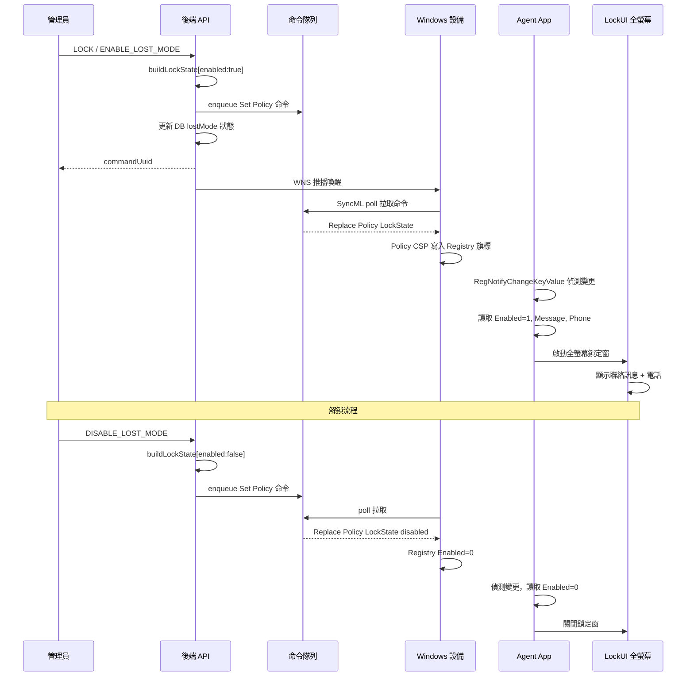
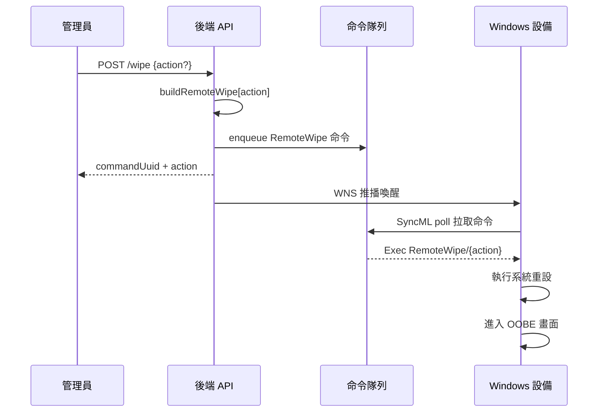
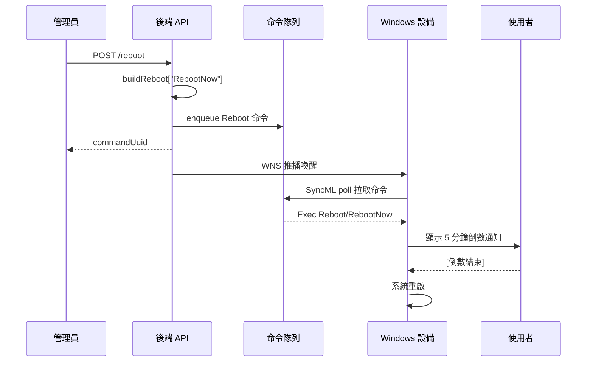

# 遠端鎖定 / 清除 / 重啟

管理員對納管 Windows 設備執行三種遠端控制操作：鎖定螢幕（防止未授權使用）、清除資料（設備遺失或退役）、強制重啟（維護或故障恢復）。三者均透過 SyncML 命令隊列下發，設備經 WNS 推播或定期 poll 拉取執行。

---

## 1. 遠端鎖定

桌面 Windows 無即時鎖屏 CSP（RemoteLock 僅限 Mobile/Phone）。本方案改用 ADMX-backed Policy CSP 將鎖定旗標寫入設備 Registry，由 Agent App 監聽後彈出全螢幕鎖定窗。

### 流程說明

1. **管理員下發鎖定**：呼叫統一命令端點，command 為 `LOCK` 或 `ENABLE_LOST_MODE`（兩者等價）。可附帶 `lostModeMessage`（聯絡訊息）和 `lostModePhone`（聯絡電話）。
2. **後端建構命令**：`buildLockState({ enabled: true, message, phone })` 產生一條 Replace 命令，target 為 ADMX-backed Policy CSP 路徑，data 為內嵌 XML（`<enabled/>` + Message/Phone 元素）。
3. **命令入隊 + WNS 推播**：命令寫入隊列，同時觸發 WNS push 喚醒設備發起 SyncML session。
4. **設備執行策略**：Policy CSP 解析 ADMX 定義，將 `Enabled=1`、`Message`、`Phone` 寫入 `HKLM\SOFTWARE\CoGrow\Agent\Lock`。
5. **Agent 監聽 Registry**：Agent App 的 LockWatcher 透過 `RegNotifyChangeKeyValue` 即時偵測 Registry 變更，讀取鎖定狀態後啟動 LockUI。
6. **LockUI 全螢幕覆蓋**：WPF 應用覆蓋整個螢幕，顯示聯絡訊息與電話。
7. **解鎖**：管理員下發 `DISABLE_LOST_MODE`，`buildLockState({ enabled: false })` 產生 `<disabled/>` 命令，設備寫入 `Enabled=0`，Agent 偵測後關閉 LockUI。

### 前置條件

設備必須已完成 ADMX ingest（`buildLockAdmxInstall`），否則 Policy CSP 回 404。新設備由 install-agent 流程自動注入；存量設備透過 `POST /api/mdm/win/devices/:udid/provision-lock-policy` 補發。

---

## 2. 遠端清除

透過 Windows RemoteWipe CSP 觸發設備恢復出廠設定，設備進入 OOBE（開箱體驗）畫面。

### 流程說明

1. **管理員下發清除**：呼叫 `POST /api/mdm/win/devices/:udid/wipe`，可選 body `{ action }` 指定清除模式。
2. **後端建構命令**：`buildRemoteWipe(action)` 產生 Exec 命令，target 為 `./Device/Vendor/MSFT/RemoteWipe/{action}`。
3. **設備拉取執行**：設備透過 WNS push 或定期 poll（1–60 分鐘）拉取命令後立即執行系統重設。
4. **設備進入 OOBE**：所有使用者資料被清除，設備回到初始設定畫面。

### 清除模式

| action | 說明 |
|--------|------|
| `doWipe` | 一般清除（預設） |
| `doWipeProtected` | 受保護清除，重設後重新進入 OOBE |
| `doWipePersistProvisionedData` | 保留預配資料，適合 Autopilot 重設場景 |

---

## 3. 遠端重啟

透過 Windows Reboot CSP 觸發設備重啟，支援立即重啟與排程重啟。

### 流程說明

1. **管理員下發重啟**：呼叫 `POST /api/mdm/win/devices/:udid/reboot`，目前固定使用 `RebootNow` 模式。
2. **後端建構命令**：`buildReboot("RebootNow")` 產生 Exec 命令，target 為 `./Device/Vendor/MSFT/Reboot/RebootNow`。
3. **設備拉取執行**：設備 ack 命令後，系統向使用者顯示約 5 分鐘倒數通知。
4. **倒數結束重啟**：使用者有機會儲存工作，倒數歸零後系統自動重啟。

### 重啟模式（CSP 支援）

| 模式 | CSP 路徑 | 說明 |
|------|----------|------|
| `RebootNow` | `.../Reboot/RebootNow` | 立即重啟（5 分鐘倒數） |
| `ScheduleSingle` | `.../Reboot/Schedule/Single` | 指定時間單次重啟（ISO 8601） |
| `ScheduleDailyRecurrent` | `.../Reboot/Schedule/DailyRecurrent` | 每日定時重啟（ISO 8601） |

---

## 關鍵技術細節

### CSP 路徑一覽

| 操作 | CSP 路徑 | SyncML 動作 |
|------|----------|-------------|
| 遠端清除 | `./Device/Vendor/MSFT/RemoteWipe/{action}` | Exec |
| 遠端重啟 | `./Device/Vendor/MSFT/Reboot/RebootNow` | Exec |
| 鎖定 ADMX 注入 | `./Device/Vendor/MSFT/Policy/ConfigOperations/ADMXInstall/CoGrowMDM/Policy/AgentPolicy` | Add |
| 鎖定/解鎖狀態 | `./Device/Vendor/MSFT/Policy/Config/CoGrowMDM~Policy~CoGrowLock/LockState` | Replace |

### 鎖定機制技術要點

- **Registry 路徑**：`HKLM\SOFTWARE\CoGrow\Agent\Lock`（Enabled / Message / Phone 三個值）
- **Registry CSP 不可用**：桌面 Windows 的 `./Vendor/MSFT/Registry` 整體 404（僅 Win10 Mobile），改用 ADMX-backed Policy CSP
- **ADMX ingest 限制**：重複 Add 同一 App 回 418 Already exists，因此 ingest 僅在 install-agent 時執行一次
- **加固**：鎖定期間 Agent 端自行寫入 `DisableTaskMgr=1` 禁用工作管理員（自定義 ADMX 被 425 拒絕，改由 Agent LocalSystem 權限直寫）

### 命令投遞機制

- 命令入隊後透過 **WNS 推播**秒級喚醒設備發起 SyncML session
- 若 WNS 未配置或不可達，設備靠 **定期 poll**（1–60 分鐘間隔）自然拉取
- 所有命令支援 **commandUuid** 追蹤執行狀態

---

## 相關源碼

| 檔案 | 說明 |
|------|------|
| `app/services/mdm/windows/csp.ts` | `buildRemoteWipe`、`buildReboot`、`buildLockAdmxInstall`、`buildLockState` 等 CSP 命令建構函式 |
| `app/routes/windows-mdm.ts` | `/reboot`、`/wipe`、`/provision-lock-policy` 等 HTTP 端點 |
| `app/services/devices.ts` | `sendWindowsDeviceCommand` 統一命令派發（LOCK / WIPE / REBOOT / Lost Mode 映射） |
| `win-agent-app/src/CoGrowMDMAgent/Locking/` | Agent 端 LockWatcher（Registry 監聽）實作 |
| `win-agent-app/src/CoGrowMDMAgent.LockUI/` | LockUI 全螢幕鎖定窗 WPF 應用 |
