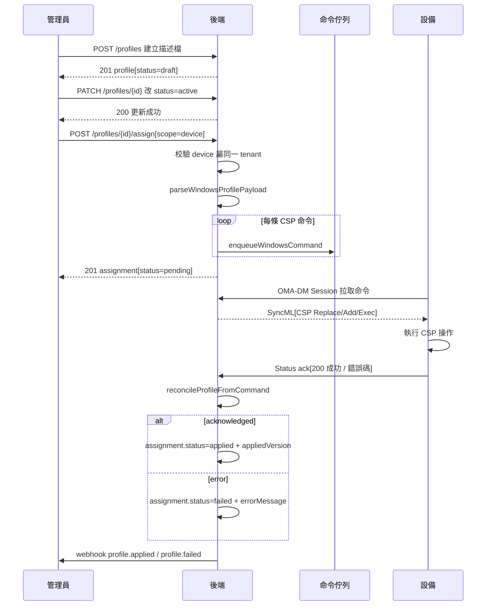
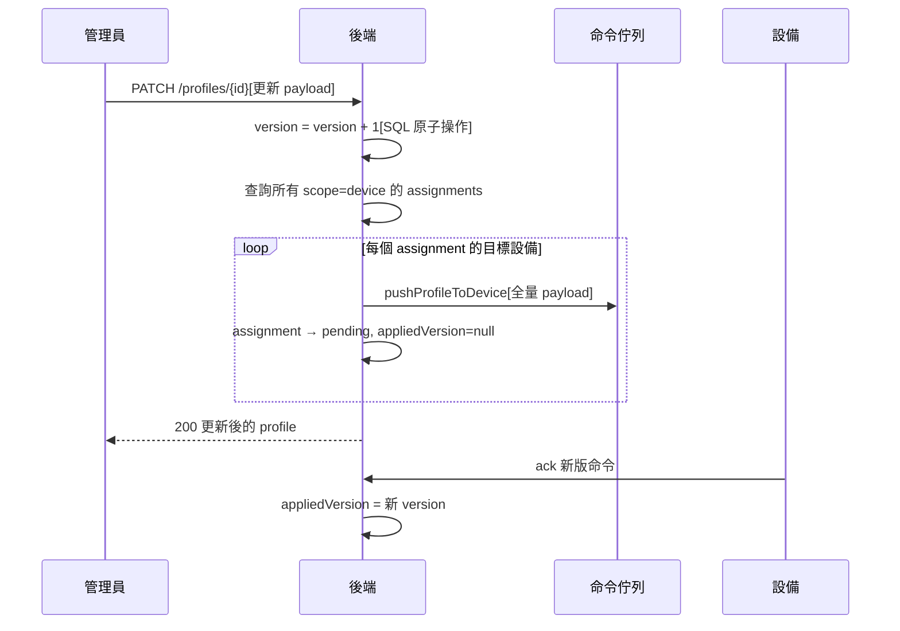

# 配置描述檔（Profile）推送

管理員透過 Admin API 建立配置描述檔，指派給設備或設備群組後，後端將 payload 中的 CSP 命令逐條下發至 Windows 設備，設備執行後回傳 ack，後端據此更新套用狀態。payload 變更自動觸發版本遞增與重推。

## 主流程

## 流程說明

### 1. 建立描述檔

管理員呼叫 `POST /admin/tenants/{tid}/profiles`，帶入 `platform`、`displayName`、`payload`。新建 profile 預設 `status=draft`、`version=1`。draft 狀態不會被自動派發。

### 2. 啟用描述檔

透過 `PATCH /admin/tenants/{tid}/profiles/{pid}` 將 `status` 改為 `active`，使其可被指派。此操作不影響 version。

### 3. 指派到設備

呼叫 `POST /profiles/{pid}/assign`，指定 `scope=device` 或 `scope=device_group`。Service 層執行：

1. 校驗 profile 存在且屬同一 tenant
2. 校驗目標設備 / 群組屬同一 tenant
3. 插入 `profile_assignments` 記錄（`status=pending`），唯一索引防重複指派（違反返回 409）
4. 若 `scope=device` 且 `platform=windows`，立即呼叫 `pushProfileToDevice` 推送

### 4. 推送 CSP 命令

`pushProfileToDevice` 將 `payload.csps` 陣列拆解為逐條 SyncML 命令：

1. 校驗 payload 格式（path 必填、verb 必須是 Add/Replace/Exec/Get/Delete）
2. 每條 CSP 呼叫 `enqueueWindowsCommand`，commandType 為 `profile_apply:{profileId}`
3. 將第一條命令的 UUID 回填至 `assignment.lastCommandId` 作為代表性命令

推送失敗只記錄日誌，不阻塞 assign 主流程。

### 5. 設備執行與 Ack

設備在下一次 OMA-DM Session 中拉取待執行命令，執行 CSP 操作後回傳 Status。後端 `updateMdmCommand` 觸發 `reconcileProfileFromCommand`：

- **acknowledged** → `assignment.status=applied`，寫入 `appliedVersion`（取自當前 profile.version）和 `appliedAt`
- **error** → `assignment.status=failed`，記錄 `errorMessage`
- **其他狀態**（queued/sent）→ 保持 pending 不更新

終態保護：`failed` 狀態不會被後續 acknowledged 覆蓋，確保失敗信號不丟失。

## Payload 變更與自動重推

### 版本管理規則

- 僅 `payload` 欄位變更會觸發 `version + 1`（SQL `SET version = version + 1` 避免競態）
- `displayName`、`description`、`status` 變更不影響版本號
- 版本遞增後，`repushPayloadToAssignments` 遍歷所有 `scope=device` 的 assignment，逐一重推全量 payload
- 重推前清空 `appliedVersion`、`appliedAt`、`errorMessage`，status 重設為 `pending`

## 解除指派與移除

呼叫 `DELETE /profiles/{pid}/assignments/{aid}` 刪除 assignment 記錄後，發佈 `profile.removed` webhook 事件通知外部系統。刪除 profile 本身時，`ON DELETE CASCADE` 自動清理所有關聯 assignments。

## 關鍵技術細節

| 項目 | 說明 |
|------|------|
| Payload 格式（Windows） | `{ csps: [{ path, verb, format?, data? }] }` |
| CSP verb | `Add` / `Replace` / `Exec` / `Get` / `Delete` |
| CSP format | `int` / `chr` / `xml` / `b64` / `node` |
| commandType 格式 | `profile_apply:{profileId}` |
| Ack 反查邏輯 | 從 commandType 解析 profileId + deviceId 查 assignment |
| 版本遞增 | SQL `version + 1` 原子操作，避免讀-改-寫競態 |
| 重複指派防護 | Partial unique index（profile × device / profile × group），違反返回 409 |
| 多租戶隔離 | 所有查詢帶 `eq(tenantId)`；target 歸屬校驗 |
| Webhook 事件 | `profile.applied` / `profile.failed` / `profile.removed` |
| Apple 平台 | 目前未實作推送（`platform_not_supported`），預留 payloadContent 結構 |

## 相關源碼

| 檔案 | 職責 |
|------|------|
| `app/routes/v1/admin/profiles.ts` | Admin API 路由定義、OpenAPI schema、request handler |
| `app/services/admin/profiles.ts` | Profile CRUD、assign/unassign、repush 邏輯 |
| `app/services/profile-push.ts` | payload 解析、CSP 校驗、逐條 enqueueWindowsCommand |
| `app/services/profile-ack-reconciler.ts` | 命令 ack 回寫 assignment 狀態、webhook 發佈 |
| `app/db/schema/profiles.ts` | profiles / profile_assignments 資料表定義 |
| `app/services/mdm/windows/command.ts` | SyncML 命令佇列（enqueueWindowsCommand） |
