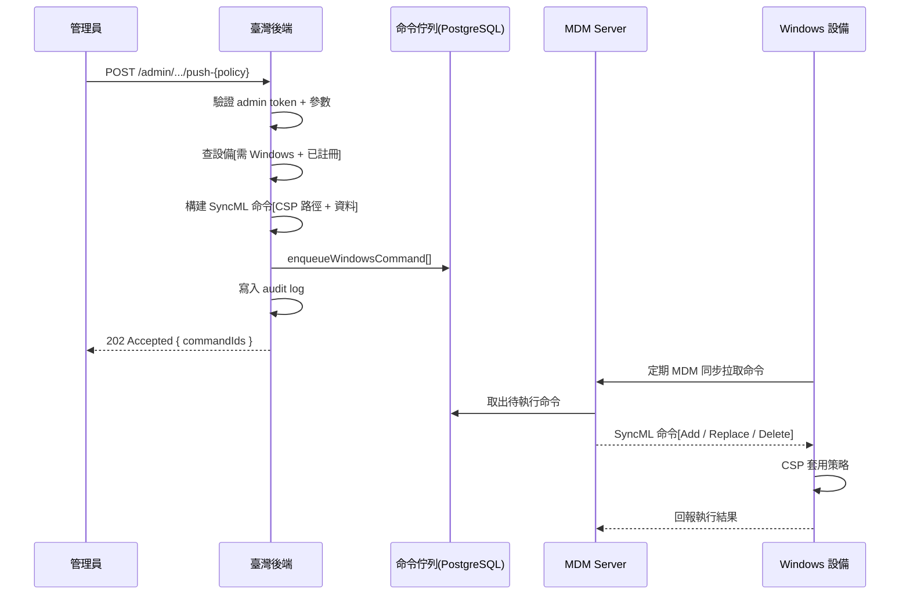

# 設備策略推送（WiFi / VPN / 桌布 / 密碼 / USB / Camera / 防火牆 / 自動命名 / AppLocker / Settings）

管理員透過 Admin API 將安全與配置策略遠端推送到 Windows 設備。後端將業務參數轉換為 Windows CSP（Configuration Service Provider）SyncML 命令，排入命令佇列，設備在下次 MDM 同步時套用。

## 通用流程



## 流程說明

1. **管理員發起請求** — 呼叫對應的 Admin API 端點，帶上業務參數（如 SSID、密碼長度、圖片 URL 等）。
2. **鑑權與驗證** — 後端驗證 Bearer admin token，透過 `getWindowsDeviceForPolicy()` 確認：設備存在、平台為 Windows、已完成 MDM 註冊（有 UDID）。
3. **構建 SyncML** — 呼叫對應的 `build*` 函式，將業務參數轉為 SyncML 命令（含 CSP LocURI 路徑、verb、資料格式）。
4. **排入佇列** — 透過 `enqueueWindowsCommand()` 寫入 PostgreSQL 命令佇列，回傳 UUID。
5. **審計記錄** — 寫入 audit log（含操作者、動作類型、目標設備、推送參數）。
6. **回應管理員** — 回傳 `202 Accepted` 與 `commandIds`，表示命令已排入但尚未執行。
7. **設備同步** — 設備在下次 MDM 同步週期拉取命令，Windows CSP 引擎套用策略並回報結果。

## WiFi 連線設定

| 項目 | 說明 |
|------|------|
| 端點 | `POST /admin/tenants/{tid}/devices/{did}/push-wifi` |
| CSP 路徑 | `./Vendor/MSFT/WiFi/Profile/{SSID}/WlanXml` |
| SyncML verb | `Add`（新增 profile） |
| 資料格式 | `chr`（WLANProfile XML） |
| 認證方式 | `open`（無密碼）或 `WPA2PSK`（AES 加密） |

移除端點：`POST /admin/.../remove-wifi`，verb 為 `Delete`，路徑為 `./Vendor/MSFT/WiFi/Profile/{SSID}`。

### WiFi 參數

| 參數 | 型別 | 說明 |
|------|------|------|
| `ssid` | string | WiFi SSID（1-32 字元） |
| `auth.type` | `"open"` \| `"WPA2PSK"` | 認證方式 |
| `auth.password` | string | WPA2 密碼（8-63 字元，僅 WPA2PSK） |
| `autoConnect` | boolean | 自動連線（預設 `true`） |
| `nonBroadcast` | boolean | 隱藏 SSID（預設 `false`） |

## 桌布與登入畫面

| 項目 | 說明 |
|------|------|
| 端點 | `POST /admin/tenants/{tid}/devices/{did}/push-wallpaper` |
| CSP 路徑 | `./Vendor/MSFT/Personalization/DesktopImageUrl`<br>`./Vendor/MSFT/Personalization/LockScreenImageUrl` |
| SyncML verb | `Replace`（覆蓋式設定） |
| 資料格式 | `chr`（HTTPS URL） |

### 桌布參數

| 參數 | 型別 | 說明 |
|------|------|------|
| `desktopImageUrl` | string? | 桌布圖 URL（HTTPS） |
| `lockScreenImageUrl` | string? | 鎖屏圖 URL（HTTPS） |

至少需提供其中一項。每項生成一條獨立的 SyncML 命令。

### 版本限制

- 支援：Windows 10/11 Education / Enterprise / Pro 1703+
- Pro 22H2 以下可能回傳失敗
- Home 版完全不支援
- 可透過 `DesktopImageStatus` / `LockScreenImageStatus` 查詢套用結果（`1` = 成功）

## 密碼政策

| 項目 | 說明 |
|------|------|
| 端點 | `POST /admin/tenants/{tid}/devices/{did}/push-password-policy` |
| CSP 路徑 | `./Device/Vendor/MSFT/Policy/Config/DeviceLock/{PolicyName}` |
| SyncML verb | `Replace` |
| 資料格式 | `int` |

### 密碼政策 CSP 映射

| 業務參數 | CSP Policy 名稱 | 值邏輯 |
|----------|-----------------|--------|
| `enabled` | `DevicePasswordEnabled` | **反邏輯**：`true` → `0`（啟用），`false` → `1`（停用） |
| `minLength` | `MinDevicePasswordLength` | 直接值（4-16） |
| `complexity` | `MinDevicePasswordComplexCharacters` | 1=數字 / 2=數字+小寫 / 3=字母數字 / 4=含特殊字元 |
| `allowSimple` | `AllowSimpleDevicePassword` | `true` → `1`，`false` → `0` |
| `maxFailedAttempts` | `MaxDevicePasswordFailedAttempts` | 直接值（0=不限） |
| `maxInactivityMinutes` | `MaxInactivityTimeDeviceLock` | 直接值（0=不限） |
| `history` | `DevicePasswordHistory` | 直接值（0-50） |
| `expirationDays` | `DevicePasswordExpiration` | 直接值（0=永不過期） |

只有提供的欄位會被設定，未提供的欄位保持設備原值。每個欄位生成一條獨立的 SyncML 命令。

## USB 存儲管控

| 項目 | 說明 |
|------|------|
| 端點 | `POST /admin/tenants/{tid}/devices/{did}/push-usb-policy` |
| CSP 路徑 | `./Device/Vendor/MSFT/Policy/Config/Storage/{PolicyName}` |
| SyncML verb | `Replace` |
| 資料格式 | `int`（`1`=禁止，`0`=允許） |

### USB CSP 映射

| 業務參數 | CSP Policy 名稱 | 說明 |
|----------|-----------------|------|
| `denyWriteAccess` | `RemovableDiskDenyWriteAccess` | 禁止 USB 存儲寫入 |
| `denyReadAccess` | `RemovableDiskDenyReadAccess` | 禁止 USB 存儲讀取 |

更徹底的「按設備類別 / 設備 ID 全黑名單」需走 DeviceInstallation CSP，留後續擴展。

## AppLocker 應用限制

| 項目 | 說明 |
|------|------|
| 端點 | `POST /admin/tenants/{tid}/devices/{did}/push-app-restriction` |
| CSP 路徑 | `./Vendor/MSFT/AppLocker/ApplicationLaunchRestrictions/Grouping/{group}/{collection}/Policy` |
| SyncML verb | `Add` |
| 資料格式 | `chr`（`<RuleCollection>` XML） |

### AppLocker 參數

| 參數 | 型別 | 說明 |
|------|------|------|
| `grouping` | string | 規則分組識別符，同 group 重推會覆蓋 |
| `ruleCollection` | `EXE` \| `MSI` \| `Script` \| `StoreApps` \| `DLL` | 規則集類型 |
| `enforcementMode` | `Enabled` \| `AuditOnly` \| `NotConfigured` | 強制模式（預設 `Enabled`） |
| `rules` | array | 規則列表（`path` 或 `publisher` 類型） |

### LocURI 段名與 XML Type 映射

| LocURI 段名 | XML Type 屬性 |
|-------------|---------------|
| `EXE` | `Exe` |
| `MSI` | `Msi` |
| `Script` | `Script` |
| `StoreApps` | `Appx` |
| `DLL` | `Dll` |

### 規則類型

- **FilePathRule**（`type: "path"`）：按路徑模式匹配，支援 `*` 萬用字元，可設例外路徑
- **FilePublisherRule**（`type: "publisher"`）：按簽名者 X.500 DN 匹配，支援產品名稱和版本範圍過濾
- 設備需 Windows 10/11 Enterprise 或 Education 才完整支援 AppLocker

## VPN 連線設定

| 項目 | 說明 |
|------|------|
| 端點 | `POST /admin/tenants/{tid}/devices/{did}/push-vpn` |
| CSP 路徑 | `./Vendor/MSFT/VPNv2/{profileName}/ProfileXML` |
| SyncML verb | `Add`（同名重派覆蓋） |
| 資料格式 | `chr`（VPNv2 ProfileXML） |
| 支援協議 | `IKEv2`（推薦,內建 EAP-MSCHAPv2 wrapper）/ `L2TP`（含 PSK） |

移除端點：`POST /admin/.../remove-vpn`，verb 為 `Delete`。

### VPN 參數

| 參數 | 型別 | 說明 |
|------|------|------|
| `profileName` | string | 顯示於設備 VPN 設定畫面（不可含 `/`） |
| `serverHost` | string | VPN 伺服器 FQDN 或 IP |
| `protocol` | `"IKEv2"` \| `"L2TP"` | VPN 協議 |
| `l2tpPsk` | string? | L2TP 預共享密鑰（protocol=L2TP 時必填） |
| `rememberCredentials` | boolean | 允許設備記住帳密（預設 `true`） |
| `alwaysOn` | boolean | 螢幕解鎖即自動連線（預設 `false`） |
| `dnsSuffix` | string? | DNS 後綴 |
| `routingPolicy` | `"SplitTunnel"` \| `"ForceTunnel"` | 路由策略（預設 SplitTunnel） |
| `trustedNetworkDetection` | string[]? | 信任網路 DNS 後綴清單 |

### 重要說明

- VPN 帳號密碼**不在 profile 內**，使用者首次連線時自行輸入
- **IKEv2 自動內嵌 EAP-MSCHAPv2 wrapper**（Win10+ 不再接受直接 MSChapv2 UserMethod）
- L2TP PSK 會明文寫在 ProfileXML 中，OS 設備端加密儲存
- 不支援 SSTP / PPTP / 證書認證 / 第三方 Plugin VPN
- 真機驗證：`Get-VpnConnection -AllUserConnection`

## Camera 禁用 / 啟用

| 項目 | 說明 |
|------|------|
| 端點 | `POST /admin/tenants/{tid}/devices/{did}/push-camera-policy` |
| CSP 路徑 | `./Device/Vendor/MSFT/Policy/Config/Camera/AllowCamera` |
| SyncML verb | `Replace` |
| 資料格式 | `int`（`1`=允許，`0`=禁用） |

### Camera 參數

| 參數 | 型別 | 說明 |
|------|------|------|
| `allow` | boolean | `true` 允許 / `false` 禁用內建相機 |

支援 Win10 1607+ 所有版本（Home/Pro/Edu/Ent）。僅控制內建相機，外接 USB 視訊裝置需配 USB 管控政策。

## 防火牆

| 項目 | 說明 |
|------|------|
| 端點 | `POST /admin/tenants/{tid}/devices/{did}/push-firewall-policy` |
| CSP 路徑 | `./Vendor/MSFT/Firewall/MdmStore/{Domain,Private,Public}Profile/{prop}` |
| SyncML verb | `Replace` |
| 資料格式 | `bool` |
| 命令數 | 9（三個 profile × 3 個 prop） |

### 防火牆參數

| 參數 | 型別 | 預設 | 說明 |
|------|------|------|------|
| `enabled` | boolean | `true` | 強制啟用三個 profile（Domain/Private/Public） |
| `stealthMode` | boolean | `true` | 啟用隱形模式（拒絕未請求的入站連線） |
| `showNotifications` | boolean | `false` | 顯示阻擋通知（學校場景關通知） |

### CSP 反邏輯

| 業務參數 | CSP 欄位 | 值邏輯 |
|----------|----------|--------|
| `enabled` | `EnableFirewall` | 直接值 |
| `stealthMode` | `DisableStealthMode` | **反邏輯**：`true` → `false`（啟用隱形） |
| `showNotifications` | `DisableInboundNotifications` | **反邏輯**：`false` → `true`（不顯示通知） |

### ⚠️ 驗證注意

`Get-NetFirewallProfile` 預設查 **PersistentStore**（本地用戶層），**不反映 MDM 加持**。CSP 寫入後正確驗證命令：

```powershell
# 查 MDM PolicyStore（CSP 直接寫入的 store）
Get-NetFirewallProfile -PolicyStore MDM

# 查 ActiveStore（實際生效狀態 = MDM 加持後最終結果）
Get-NetFirewallProfile -PolicyStore ActiveStore
```

CSP 寫入後**不會寫** `HKLM:\SOFTWARE\Microsoft\PolicyManager\current\device\Firewall` registry — Firewall 走 service 內部 MDM store 而非 PolicyManager。同類 service-level CSP（BitLocker / Defender / VPNv2 / WiFi）皆然。

## 自動設備命名

| 項目 | 說明 |
|------|------|
| 端點 | `POST /admin/tenants/{tid}/devices/{did}/rename` |
| CSP 路徑 | `./Device/Vendor/MSFT/Accounts/ComputerName` |
| SyncML verb | `Replace` |
| 資料格式 | `chr` |

### 命名參數（二選一）

| 參數 | 型別 | 說明 |
|------|------|------|
| `explicitName` | string? | 直接指定名稱（1-15 字元，無空白與保留符號） |
| `template` | string? | 命名模板（後端替換變數後派發） |

### 模板變數

| 變數 | 替換為 | 範例 |
|------|--------|------|
| `{schoolCode}` | `device_group.code` | `TPE001` |
| `{serial}` | 完整序號 | `ABC1234` |
| `{serial4}` | 序號後 4 碼（不足補 0） | `1234` |
| `{udid8}` | UDID 前 8 碼（去非字母數字） | `windowsd` |

範例：`{schoolCode}-{serial4}` + serial=`ABC1234` + schoolCode=`TPE001` → **`TPE001-1234`**

### 名稱規範

- Windows ComputerName 最長 **15 字元**
- 不含空白與保留符號（`\/:*?"<>|...`）
- 變更後**設備需重啟**新名稱才生效
- 回傳 `appliedName` 為實際派發的最終名稱

## 設備功能限制（Settings 頁面可見性）

| 項目 | 說明 |
|------|------|
| 端點 | `POST /admin/tenants/{tid}/devices/{did}/push-settings-restriction` |
| CSP 路徑 | `./Device/Vendor/MSFT/Policy/Config/Settings/PageVisibilityList` |
| SyncML verb | `Replace` |
| 資料格式 | `chr` |

### 設定限制參數

| 參數 | 型別 | 說明 |
|------|------|------|
| `mode` | `"hide"` \| `"showonly"` | `hide` 隱藏列出的頁面 / `showonly` 只顯示列出的頁面 |
| `pages` | string[] | ms-settings 識別符（不含 `ms-settings:` 前綴） |

### 常用識別符

| 識別符 | 對應頁面 |
|--------|----------|
| `recovery` | 復原 |
| `windowsupdate` | Windows Update |
| `printers` | 印表機 |
| `network-wifi` | Wi-Fi |
| `accounts` | 帳戶 |
| `personalization` | 個人化 |
| `apps` | 應用 |
| `system` | 系統 |
| `privacy` | 隱私 |

### ⚠️ 限制

- 同一設備 PageVisibilityList **只能設一條**，後送的覆蓋前送的
- 這是 **UI 層隱藏**，不是系統層禁用（搭配標準帳戶 + LAPS 才完整）
- `showonly` 模式請保留必要頁面（如 `network-wifi`），否則學生無法連網

## 關鍵技術細節

### 直推 vs 持久化 Profile 的區別

| 機制 | 說明 | 使用場景 |
|------|------|----------|
| **直推（本流程）** | 透過 SyncML `Add` / `Replace` 直接操作 CSP 節點，命令執行即生效 | WiFi、桌布、密碼、USB、AppLocker |
| **Profile 推送** | 透過 `InstallProfile` MDM 命令安裝 `.mobileconfig` 描述檔，設備持久化 profile 並追蹤來源 | 單 App 模式（App Lock）、iOS 配置 |

直推方式的特點：
- 命令式操作，無 profile 生命週期管理
- 適合原子性設定（單個 CSP 節點 = 單項設定）
- 移除需發送對應的 `Delete` 命令或設回預設值
- 不產生 profile 實體，設備管理介面不會顯示「已安裝的描述檔」

### HTTP 回應

所有策略推送端點統一回傳：

- **202 Accepted** — 命令已排入佇列（非同步執行）
- **400** — 參數錯誤 / 設備非 Windows / 設備未註冊
- **404** — 設備不存在
- **401/403** — 鑑權失敗

### 審計記錄

每次策略推送均寫入 audit log，記錄 action 類型：

| 操作 | action |
|------|--------|
| 推送 WiFi | `device.push_wifi` |
| 移除 WiFi | `device.remove_wifi` |
| 推送 VPN | `device.push_vpn` |
| 移除 VPN | `device.remove_vpn` |
| 推送桌布 | `device.push_wallpaper` |
| 推送密碼政策 | `device.push_password_policy` |
| 推送 USB 管控 | `device.push_usb_policy` |
| 推送 Camera 政策 | `device.push_camera_policy` |
| 推送防火牆政策 | `device.push_firewall_policy` |
| 設備重命名 | `device.rename` |
| 推送設定頁面限制 | `device.push_settings_restriction` |
| 推送應用限制 | `device.push_app_restriction` |

## 相關源碼

| 檔案 | 說明 |
|------|------|
| `app/routes/v1/admin/device-policies.ts` | Admin API 路由定義（OpenAPI spec + handler） |
| `app/services/device-policies.ts` | 業務邏輯層（設備驗證 + 命令排入） |
| `app/services/mdm/windows/csp.ts` | CSP 構建函式（Camera / Firewall / DeviceName / WiFi / USB / 密碼 / AppLocker / 桌布） |
| `app/services/mdm/windows/csp-vpn.ts` | VPN CSP 構建函式（IKEv2 EAP wrapper + L2TP PSK） |
| `app/services/mdm/windows/csp-experience.ts` | Experience 與 Settings PageVisibility CSP |
| `app/services/mdm/windows/command.ts` | `enqueueWindowsCommand()` 命令佇列 |
| `app/middleware/admin-auth.ts` | Admin 鑑權中介層 |
| `app/services/admin/audit.ts` | 審計日誌服務 |
