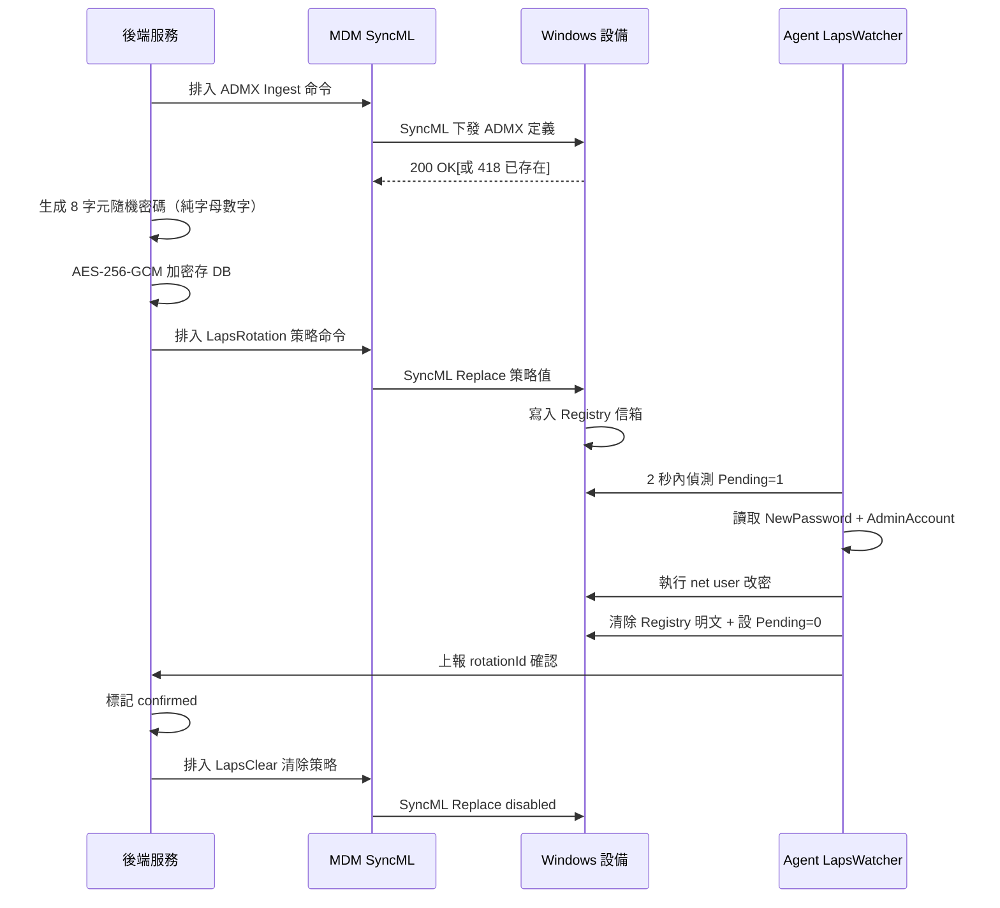
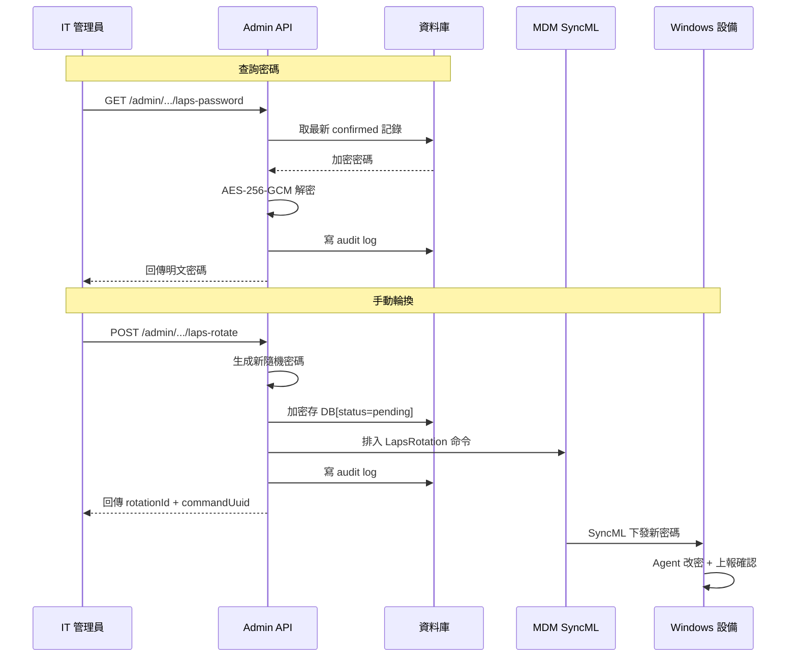
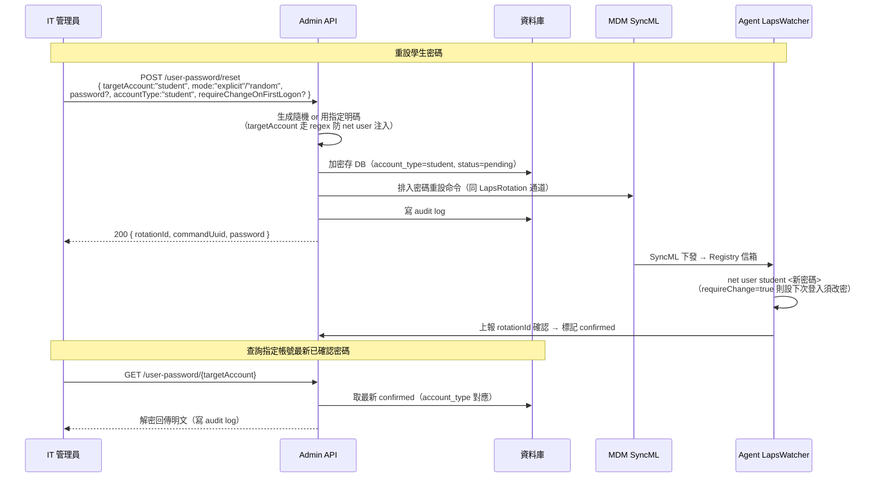

# LAPS 密碼託管

設備透過 PPKG 批量部署時共用同一組管理員臨時密碼，一旦洩漏即全線失陷。LAPS（Local Administrator Password Solution）在設備納管後自動將管理員密碼改為每台獨立的隨機值，加密存後端，IT 按設備查詢，徹底消除共用密碼風險。

---

## 首次 LAPS 初始化

設備納管後全自動完成，無需人工介入。

### 流程說明

1. **ADMX Ingest**：後端透過 `buildLapsAdmxInstall()` 將自定義 ADMX 策略定義注入設備的 Policy CSP。此操作冪等，重複 Add 回傳 418 無害。
2. **生成密碼**：使用 `crypto.randomBytes` 生成 8 字元密碼（大小寫 + 數字各至少一個，純字母數字無特殊符號），Fisher-Yates 洗牌後加密存入 `mdm_windows_laps` 表。
3. **下發策略**：`buildLapsRotation()` 透過 ADMX Policy CSP 將 `NewPassword`、`AdminAccount`、`RotationId` 寫入設備 Registry 信箱，並設 `Pending=1`。
4. **Agent 執行**：LapsWatcher 每 2 秒輪詢 Registry，偵測到 `Pending=1` 後讀取密碼、執行 `net user <AdminAccount> <NewPassword>` 改密，隨即清除 `NewPassword` 並設 `Pending=0`。
5. **上報確認**：Agent 在下次 report 或 checkin 時帶上 `rotationId`，後端比對後標記 `confirmed`。
6. **清除殘留**：確認成功後排入 `buildLapsClear()`，將策略設為 `<disabled/>`，清除 Registry 殘留值。

---

## 管理員查詢與手動輪換

IT 管理員透過 Admin API 查詢或強制輪換設備密碼。

### 流程說明

**查詢密碼**：
1. IT 呼叫 `GET /admin/tenants/{tid}/devices/{did}/laps-password`。
2. 後端從 `mdm_windows_laps` 取最新 `confirmed` 記錄，解密後回傳明文。
3. 每次查詢都寫入 audit log（`device.laps_password_viewed`），記錄操作人與時間。

**手動輪換**：
1. IT 呼叫 `POST /admin/tenants/{tid}/devices/{did}/laps-rotate`，可選指定 `adminAccount`（預設 `Administrator`）。
2. 後端生成新密碼、加密存 DB、透過 ADMX Policy CSP 排入命令。
3. 寫入 audit log（`device.laps_rotated`），回傳 `rotationId` 供追蹤。
4. 設備在線時透過 SyncML poll 或 WNS push 收到命令，Agent 執行改密後上報確認。

---

## 學生 / 指定帳號密碼重設（PRD Phase 3 遠端密碼重設）

管理員重設設備上**任意本機帳號**的密碼（不限管理員），最常見是重設學生帳號密碼。與 LAPS 管理員輪換**共用同一條通道**（同 ADMX Policy CSP + 同 Registry 信箱 + 同 Agent `LapsWatcher`），差別只在目標帳號與語意分類。

### 端點與參數

| 方法 | 路徑 | 用途 |
|------|------|------|
| `POST` | `/admin/tenants/{tid}/devices/{did}/user-password/reset` | 重設指定帳號密碼（含 student / admin / other） |
| `GET` | `/admin/tenants/{tid}/devices/{did}/user-password/{targetAccount}` | 查該帳號最新已確認密碼 |

| 參數 | 型別 | 必填 | 說明 |
|------|------|------|------|
| `targetAccount` | string | ✅ | 目標本機帳號名，regex `^[a-zA-Z0-9._-]{1,20}$`（防 `net user` 參數注入） |
| `mode` | `"random"` \| `"explicit"` | ✅ | random=後端隨機生成；explicit=用管理員指定明碼 |
| `password` | string(4–127) | mode=explicit 時必填 | 指定明碼；mode=random 時忽略 |
| `requireChangeOnFirstLogon` | boolean? | | 設 true 則使用者下次登入強制改密 |
| `accountType` | `"admin"`\|`"student"`\|`"other"`? | | 僅用於 DB row 分類，決定查詢時的歸類 |

> 與 `laps-rotate`（#管理員查詢與手動輪換）的差別：`laps-rotate` 語意固定為 `accountType=admin`、不強制改密、只隨機；`user-password/reset` 是通用入口，可指定任意帳號、明碼或隨機、可強制改密。兩者底層是同一套 CSP 通道與 Agent 執行邏輯。

---

## 自動觸發判斷

後端在 Agent report 與 checkin 兩個時點自動判斷是否需要觸發輪換（`shouldTriggerLaps`）：

| 狀態 | 行為 |
|------|------|
| 無 LAPS 記錄 | 觸發首次輪換 |
| 最新為 `confirmed` | 不觸發（已完成） |
| 最新為 `pending` 且未超 24 小時 | 不觸發（等待 Agent 回覆） |
| 最新為 `pending` 且超過 24 小時 | 觸發重試（視為逾時） |
| 最新為 `failed` | 觸發重試 |

---

## 關鍵技術細節

### ADMX 信箱模式

LAPS 採用 ADMX-backed Policy CSP「信箱」模式，後端不直接操作 Registry，而是透過 MDM Policy CSP 間接寫值：

| 項目 | 值 |
|------|-----|
| ADMX App ID | `CoGrowMDM` |
| Policy Area | `CoGrowMDM~Policy~CoGrowLaps` |
| Policy Name | `LapsRotation` |
| CSP Ingest 路徑 | `./Device/Vendor/MSFT/Policy/ConfigOperations/ADMXInstall/CoGrowMDM/Policy/LapsPolicy` |
| CSP Config 路徑 | `./Device/Vendor/MSFT/Policy/Config/CoGrowMDM~Policy~CoGrowLaps/LapsRotation` |

### Registry 信箱位置

策略落地後寫入以下 Registry 鍵（`HKLM\Software\CoGrow\Agent\Laps`）：

| 鍵名 | 類型 | 說明 |
|------|------|------|
| `Pending` | DWORD | `1`=有待處理輪換；`0`=已完成 |
| `NewPassword` | REG_SZ | 新密碼明文（Agent 讀後立即清除） |
| `AdminAccount` | REG_SZ | 受管帳號名稱 |
| `RotationId` | REG_SZ | 輪換唯一識別碼（UUID） |

### 安全機制

| 環節 | 措施 |
|------|------|
| DB 儲存 | AES-256-GCM 加密（`v1:` 前綴），需設 `DATA_ENCRYPTION_KEY` |
| Registry 暫態 | 明文僅存在 ≤2 秒，僅 SYSTEM/Admin 可讀，Agent 讀後立即清除 |
| 防重放 | 每次輪換帶唯一 `rotationId`（UUID），Agent 確認時比對 |
| 審計追蹤 | 查詢、輪換均寫 `audit_logs` |
| 逾時重試 | `pending` 超過 24 小時自動重新觸發 |

---

## 相關源碼

| 檔案 | 說明 |
|------|------|
| `app/services/laps.ts` | LAPS 核心服務：密碼生成、輪換、確認、查詢、自動觸發判斷 |
| `app/services/mdm/windows/csp.ts` | ADMX Policy CSP 命令構建：`buildLapsAdmxInstall`、`buildLapsRotation`、`buildLapsClear` |
| `app/routes/v1/admin/laps.ts` | Admin API 路由：查詢密碼、手動觸發輪換 |
| `app/db/schema/index.ts` | `mdm_windows_laps` 資料表定義 |
| `app/services/mdm/windows/command.ts` | SyncML 命令佇列（`enqueueWindowsCommand`） |
| `app/lib/secrets.ts` | AES-256-GCM 加解密工具（`encryptSecret` / `decryptSecret`） |
