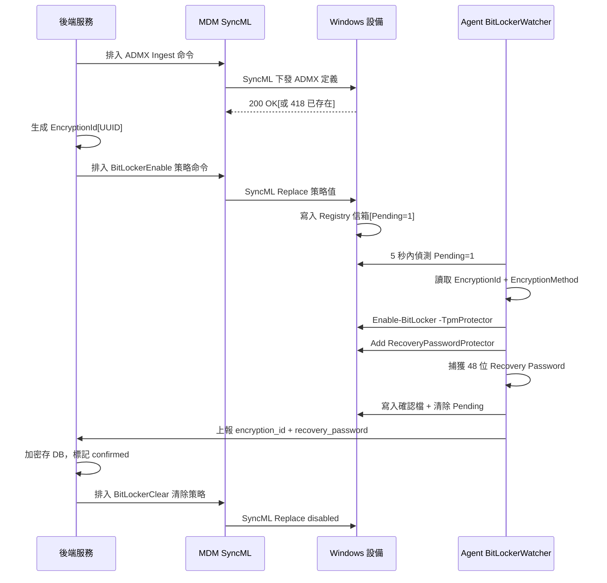
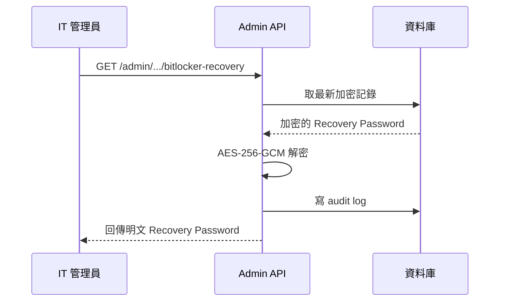

# BitLocker 磁碟加密

學生可透過 USB 開機重灌系統，繞過所有 MDM 策略。BitLocker 全碟加密後，即使拆碟或 USB 開機，資料與系統都受密鑰保護。設備納管後自動靜默啟用 XTS-AES 256 加密，Recovery Key 由 Agent 捕獲上報後端，IT 按設備查詢。

---

## 自動加密流程

設備透過 PPKG 納管後，BitLocker 加密全自動，無需手動觸發。

### 流程說明

1. **ADMX Ingest**：後端透過 `buildBitLockerAdmxInstall()` 將自定義 ADMX 策略定義注入設備的 Policy CSP。此操作冪等，重複 Add 回傳 418 無害。
2. **生成 EncryptionId**：後端為本次加密生成唯一 UUID（`encryptionId`），用於防重放與上報對帳。
3. **下發策略**：`buildBitLockerEnable()` 透過 ADMX Policy CSP 將 `EncryptionId`、`EncryptionMethod`（預設 `XtsAes256`）寫入設備 Registry 信箱，並設 `Pending=1`。
4. **Agent 靜默加密**：BitLockerWatcher 每 5 秒輪詢 Registry，偵測到 `Pending=1` 後依序執行：
   - `Enable-BitLocker -MountPoint C: -TpmProtector -SkipHardwareTest`
   - `Add-BitLockerKeyProtector -MountPoint C: -RecoveryPasswordProtector`
   - 捕獲系統生成的 48 位 Recovery Password
5. **寫確認檔**：Agent 將 `encryption_id`、`recovery_password`、`confirmed_at` 寫入本地確認檔 `C:\ProgramData\CoGrow\MDM Agent\bitlocker-confirmation.json`，並清除 Registry `Pending` 標誌。
6. **上報後端**：Agent 在下次 report 時帶上加密資訊，後端加密存入 DB 並標記 `confirmed`。
7. **清除殘留**：確認成功後排入 `buildBitLockerClear()`，將策略設為 `<disabled/>`，清除 Registry 殘留值。

---

## Recovery Key 查詢

IT 管理員透過 Admin API 查詢設備的 BitLocker Recovery Password。

### 流程說明

1. IT 呼叫 `GET /admin/tenants/{tid}/devices/{did}/bitlocker-recovery`。
2. 後端取最新加密記錄，解密後回傳明文 Recovery Password（48 位數字，8 組 6 位）。
3. 每次查詢都寫入 audit log（`device.bitlocker_recovery_viewed`），記錄操作人、設備與 encryptionId。

---

## 關鍵技術細節

### 為何不直接使用 BitLocker CSP

Windows MDM 的 `./Device/Vendor/MSFT/BitLocker/RequireDeviceEncryption` 在非 AAD 設備上無法靜默加密——Win10 會彈出確認框要求使用者手動同意。教育場景不能依賴學生點確認，因此改用與 LAPS 一致的 ADMX 信箱模式。

### ADMX 信箱配置

| 項目 | 值 |
|------|-----|
| ADMX App ID | `CoGrowMDM` |
| Policy Area | `CoGrowMDM~Policy~CoGrowBitLocker` |
| Policy Name | `BitLockerEnable` |
| CSP Ingest 路徑 | `./Device/Vendor/MSFT/Policy/ConfigOperations/ADMXInstall/CoGrowMDM/Policy/BitLockerPolicy` |
| CSP Config 路徑 | `./Device/Vendor/MSFT/Policy/Config/CoGrowMDM~Policy~CoGrowBitLocker/BitLockerEnable` |

### Registry 信箱位置

策略落地後寫入 `HKLM\Software\CoGrow\Agent\BitLocker`：

| 鍵名 | 類型 | 說明 |
|------|------|------|
| `Pending` | DWORD | `1`=待執行；`0`=已完成 |
| `EncryptionId` | REG_SZ | 唯一識別碼（UUID，防重放 + 回報對帳） |
| `EncryptionMethod` | REG_SZ | 加密演算法（預設 `XtsAes256`） |

### 加密規格

| 項目 | 值 |
|------|-----|
| 加密演算法 | XTS-AES 256 |
| 保護器 | TPM + Recovery Password |
| Recovery Password 格式 | 48 位數字，8 組 6 位（如 `034386-466246-...`） |
| 加密行為 | 背景靜默執行，無彈窗、無使用者確認 |
| 設備前提 | TPM Ready + Windows 10/11 Pro/Enterprise/Education |

### 安全機制

| 環節 | 措施 |
|------|------|
| DB 儲存 | AES-256-GCM 加密（`DATA_ENCRYPTION_KEY`） |
| Registry 暫態 | 信箱僅含 EncryptionId 與 Method，不含敏感資料（密碼由 Agent 本地生成） |
| 防重放 | 每次加密帶唯一 `encryptionId`（UUID），Agent 確認時比對 |
| 審計追蹤 | Recovery Key 查詢寫 `audit_logs`（`device.bitlocker_recovery_viewed`） |
| 確認檔生命週期 | 上報成功後刪除本地確認檔，Recovery Password 不持久留在設備 |

---

## 相關源碼

| 檔案 | 說明 |
|------|------|
| `app/services/mdm/windows/csp-bitlocker.ts` | BitLocker ADMX 定義與命令構建：`buildBitLockerAdmxInstall`、`buildBitLockerEnable`、`buildBitLockerClear` |
| `app/routes/v1/admin/bitlocker.ts` | Admin API 路由：查詢 Recovery Password |
| `app/services/bitlocker.ts` | BitLocker 核心服務：Recovery Key 存取與解密 |
| `app/services/mdm/windows/command.ts` | SyncML 命令佇列（`enqueueWindowsCommand`） |
| `app/lib/secrets.ts` | AES-256-GCM 加解密工具（`encryptSecret` / `decryptSecret`） |
