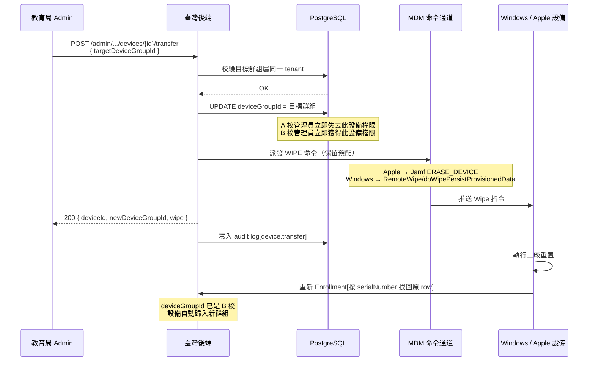

# 設備轉校

教育局管理員將設備從 A 校轉移至 B 校：更新設備歸屬群組、遠端擦除（**保留預配資料**）、設備重置後自動重新註冊並歸入新校。此操作會清除使用者資料，執行前須確認學生資料已備份。

> 💡 **轉校 vs 退役**：轉校保留 PPKG，設備重置後**自動回管**到新分組。若要讓設備永久離開管理（畢業淘汰 / 報廢），請改用 [16-device-retire](16-device-retire.md)，走預設 doWipe 連 PPKG + enrollment 一併抹除，設備不再自動回管。

## 整體流程



## 流程說明

### 1. 發起轉校請求

教育局管理員呼叫 Admin API，傳入設備 ID 與目標 device group ID：

```
POST /api/v1/admin/tenants/{tenantId}/devices/{deviceId}/transfer
Authorization: Bearer <ADMIN_API_TOKEN>
Body: { "targetDeviceGroupId": "<B 校群組 UUID>" }
```

### 2. 校驗目標群組

後端執行 `assertDeviceGroupBelongsToTenant`，確認目標群組存在且屬於同一 tenant。不同 tenant 的群組會回傳 `400 device_group_not_in_tenant`。

### 3. 標記新歸屬（先行 commit）

立即將 `mdm_devices.deviceGroupId` 更新為目標群組。此步驟先於 Wipe 派發完成——即使後續 Wipe 失敗，群組歸屬已生效。

**權限即時切換**：
- A 校管理員查詢設備列表時，此設備不再出現
- B 校管理員查詢設備列表時，此設備立即可見

### 4. 派發 Wipe 命令

依設備平台自動路由：

| 平台 | 命令路徑 | 實際操作 |
|------|----------|----------|
| Apple | Jamf Pro API → `ERASE_DEVICE` | 遠端擦除並觸發 DEP 重新註冊 |
| Windows | SyncML → `RemoteWipe/doWipePersistProvisionedData` | 工廠重置但**保留 PPKG**，重置後自動重走 OOBE 佈建 → 重新 Enrollment |

### 5. 設備重置與重新註冊

設備收到 Wipe 後執行工廠重置（保留預配資料）。重啟後：
- Apple 設備透過 DEP/ADE 自動重新 Enroll
- Windows 設備因 `doWipePersistProvisionedData` 保留了 PPKG，重置後自動重走 OOBE 佈建流程 → 自動重新 Enrollment（無須人工介入）

重新註冊時，後端按 `(tenantId, serialNumber)` 找回原有裝置記錄，`deviceGroupId` 已是 B 校群組，設備自動歸入新校。

## 關鍵技術細節

- **冪等性**：`deviceGroupId` UPDATE 與 Wipe 命令均為冪等操作。Wipe 派發失敗時 `deviceGroupId` 不回滾，管理員可安全重試。
- **鑑權**：需 `ADMIN_API_TOKEN` Bearer token（`adminAuth` 中介層）+ 可選 HMAC 簽名。
- **審計日誌**：成功後寫入 `action: "device.transfer"` 審計記錄，包含 `targetDeviceGroupId`。
- **錯誤碼**：
  - `404 device_not_found` — 設備不存在或不屬於該 tenant
  - `400 device_group_not_in_tenant` — 目標群組不屬於該 tenant
  - `409 device_not_jamf_managed` — Apple 設備未綁定 Jamf 實例
  - `409 device_missing_udid` — Windows 設備缺少 UDID（註冊未完成）
- **Windows Wipe CSP**：走 `./Device/Vendor/MSFT/RemoteWipe/doWipePersistProvisionedData`，由 `buildRemoteWipe("doWipePersistProvisionedData")` 構建 SyncML 命令。此動作保留執行階段佈建的 PPKG，使設備重置後能自動重走 OOBE → 重新 Enrollment。（退役用的預設 `doWipe` 則連 PPKG 一併抹除，見 [16-device-retire](16-device-retire.md)。）

## 相關源碼

| 檔案 | 說明 |
|------|------|
| `app/routes/v1/admin/devices.ts` | 路由定義、OpenAPI spec、audit log 記錄 |
| `app/services/devices.ts` → `transferDeviceToGroup()` | 核心業務：校驗群組 → 標記 → 派 Wipe |
| `app/services/devices.ts` → `sendCommandToDevice()` | 跨平台命令派發（Apple/Windows 路由） |
| `app/services/devices.ts` → `assertDeviceGroupBelongsToTenant()` | 目標群組歸屬校驗 |
| `app/middleware/admin-auth.ts` | Admin Bearer token 鑑權中介層 |
| `app/services/admin/audit.ts` | 審計日誌服務 |
