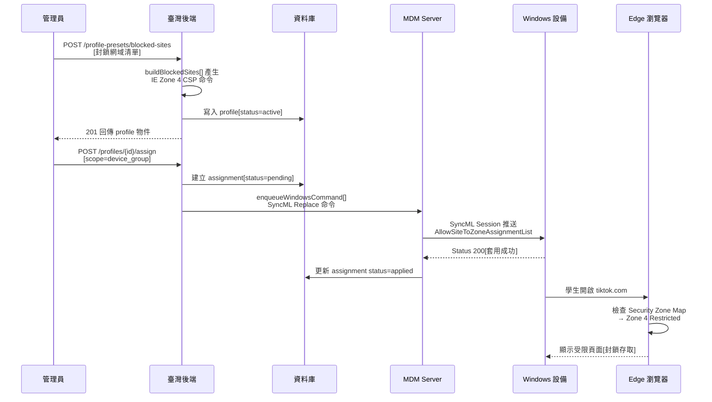

# 網站黑名單

管理員透過 Admin API 建立封鎖網域清單，系統將其轉為 IE Security Zone CSP 策略，經 MDM 通道推送至 Windows 設備，使 Edge Chromium 瀏覽器自動封鎖受限網站。適用於教育場景中限制學生存取社群媒體、遊戲等網站。

## 整體流程



## 流程說明

### 步驟一：建立封鎖清單 Profile

管理員呼叫 preset API，傳入要封鎖的網域清單：

```
POST /api/v1/admin/tenants/{tenantId}/profile-presets/blocked-sites
```

請求 body 包含 `hosts` 陣列（如 `["tiktok.com", "*.facebook.com"]`）。後端呼叫 `buildBlockedSites()` 將每個 host 對應到 Zone 4（Restricted Sites），產生一條 SyncML `Replace` 命令，包裝為 profile 寫入資料庫。

進階用法可改用 `sites` 欄位，為每個 host 指定不同 Zone（1=Intranet / 2=Trusted / 3=Internet / 4=Restricted）。提供 `sites` 時系統忽略 `hosts`。

### 步驟二：指派到設備或群組

管理員呼叫 assign API 將 profile 指派到目標：

```
POST /api/v1/admin/tenants/{tenantId}/profiles/{profileId}/assign
```

- `scope=device`：單台設備，立即透過 `pushProfileToDevice()` 推送 SyncML 命令
- `scope=device_group`：設備群組，fan-out 到群組內所有設備

### 步驟三：設備套用策略

MDM Server 在下一次 SyncML Session 中將 `Replace` 命令推送至設備。設備收到後寫入 Windows IE Security Zone Registry，Edge Chromium 即時生效。

### 步驟四：封鎖生效

學生在 Edge 瀏覽器存取被列入 Zone 4 的網域時，瀏覽器檢查 Security Zone Map，判定為 Restricted Site，拒絕載入頁面並顯示受限提示。

## 關鍵技術細節

### CSP 路徑

| 範圍 | LocURI |
|------|--------|
| 全裝置（device） | `./Device/Vendor/MSFT/Policy/Config/InternetExplorer/AllowSiteToZoneAssignmentList` |
| 當前使用者（user） | `./User/Vendor/MSFT/Policy/Config/InternetExplorer/AllowSiteToZoneAssignmentList` |

### SyncML 命令格式

- **Verb**：`Replace`
- **Format**：`chr`（text/plain）
- **Data**：`<enabled/><data id="IZ_ZonemapPrompt" value="host1␀zone1␀host2␀zone2␀..."/>`
  - `␀` 代表 U+F000 分隔符，MS ADMX 專用
  - host 中若含 U+F000 會被拒絕（破壞分隔結構）

### Security Zone 對應

| Zone | 名稱 | 行為 |
|------|------|------|
| 1 | Intranet | 低安全性，允許自動登入 |
| 2 | Trusted Sites | 中安全性 |
| 3 | Internet | 預設安全性 |
| 4 | **Restricted Sites** | **最高限制，封鎖存取** |

### 萬用字元支援

host 欄位支援萬用字元，與 Windows IE Zone Map 原生語法一致：

- `*.tiktok.com` — 封鎖所有子網域
- `tiktok.com` — 封鎖主網域
- `https://*.example.com` — 僅封鎖 HTTPS 子網域

### Edge Chromium 相容性

Microsoft Edge Chromium 仍尊重 Windows IE Security Zones 機制。Zone 4 Restricted Sites 對 Edge 同樣生效，無需額外 ADMX ingestion 即可達成網站封鎖。

### 清除策略

呼叫 `buildIESiteZoneClear()` 產生 `<disabled/>` 命令，可解除全部裝置端 Zone Map 管理，還原為本機原有設定。

## 相關源碼

| 檔案 | 說明 |
|------|------|
| `app/routes/v1/admin/profile-presets.ts` | blocked-sites preset API 路由與 handler |
| `app/services/mdm/windows/csp-browser.ts` | `buildBlockedSites()`、`buildIESiteZoneAssignment()`、`buildIESiteZoneClear()` |
| `app/routes/v1/admin/profiles.ts` | Profile CRUD + assign / unassign 路由 |
| `app/services/admin/profiles.ts` | `assignProfile()`、`maybePushAndRecord()` 推送邏輯 |
| `app/services/profile-push.ts` | `pushProfileToDevice()` — 解析 payload.csps 逐條 enqueue SyncML |
| `app/services/mdm/windows/command.ts` | `enqueueWindowsCommand()` — SyncML 命令排入佇列 |
