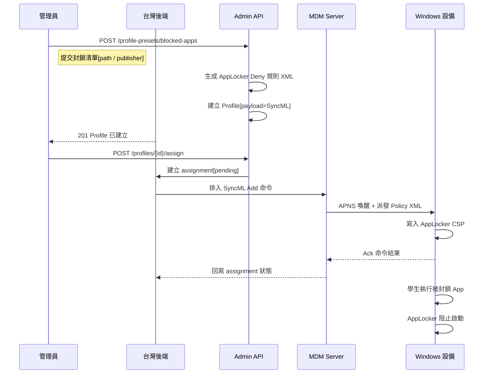

# App 黑名單（AppLocker）

管理員透過 Admin API 定義要封鎖的應用程式清單，後端生成 Windows AppLocker Deny 規則 XML 並以 MDM Profile 形式派發到設備，設備端由 AppLocker 引擎即時阻止學生執行被封鎖的程式。



## 流程說明

### 1. 管理員建立黑名單 Profile

管理員呼叫 `POST /admin/tenants/{tid}/profile-presets/blocked-apps`，提交 JSON body 包含：

| 欄位 | 說明 |
|------|------|
| `displayName` | Profile 顯示名稱（如「學校 App 黑名單 — 遊戲與社交」） |
| `apps[]` | 封鎖清單，每項為 `path` 或 `publisher` 類型 |
| `ruleCollection` | 規則集類型，預設 `EXE`（可選 MSI / Script / StoreApps / DLL） |
| `enforcementMode` | `Enabled`（強制封鎖）或 `AuditOnly`（僅記錄） |
| `grouping` | 規則分組識別符，預設 `blocked-apps`；同 grouping 重複派發會覆蓋 |

### 2. 後端生成 AppLocker Policy XML

`buildAppLockerPolicy()` 將每條 app 規則轉為 `<RuleCollection>` XML，封裝成 SyncML `Add` 命令：

- 目標 CSP 路徑：`./Vendor/MSFT/AppLocker/ApplicationLaunchRestrictions/Grouping/{group}/{EXE}/Policy`
- XML 內含 `<FilePathRule>` 或 `<FilePublisherRule>` 節點
- `Action="Deny"` + `UserOrGroupSid="S-1-1-0"`（Everyone）

Profile 建立後寫入資料庫，同時記錄 audit log（`preset.create_blocked_apps`）。

### 3. 指派到設備

管理員呼叫 `POST /profiles/{id}/assign`，指定目標設備或群組。後端排入 SyncML 命令並透過 APNS 喚醒設備拉取。設備回報 ack 後，assignment 狀態更新為 `applied` 或 `failed`。

### 4. 設備端執行封鎖

Windows AppLocker 引擎載入 Policy XML 後，持續監控程式啟動事件。當學生嘗試執行匹配 Deny 規則的可執行檔時，系統直接阻止啟動並顯示封鎖提示。

## 兩種封鎖方式

### Path 規則（按路徑）

以可執行檔路徑模式匹配，支援 `*` 萬用字元：

```json
{
  "type": "path",
  "path": "*\\TikTok.exe",
  "name": "Block TikTok"
}
```

生成 XML：

```xml
<FilePathRule Id="{uuid}" Name="Block TikTok" Action="Deny" UserOrGroupSid="S-1-1-0">
  <Conditions><FilePathCondition Path="*\TikTok.exe"/></Conditions>
</FilePathRule>
```

**適用場景**：已知安裝路徑的桌面程式、可攜式執行檔。支援 `exceptions` 排除特定子路徑。

### Publisher 規則（按簽名者）

以程式碼簽名的發行者 X.500 DN 匹配，可限定產品名稱與版本範圍：

```json
{
  "type": "publisher",
  "publisherName": "O=Epic Games, L=Cary, S=North Carolina, C=US",
  "productName": "*"
}
```

生成 XML：

```xml
<FilePublisherRule Id="{uuid}" Name="Block: Epic Games" Action="Deny" UserOrGroupSid="S-1-1-0">
  <Conditions>
    <FilePublisherCondition PublisherName="O=Epic Games, ..." ProductName="*" BinaryName="*">
      <BinaryVersionRange LowSection="*" HighSection="*"/>
    </FilePublisherCondition>
  </Conditions>
</FilePublisherRule>
```

**適用場景**：封鎖某家廠商所有產品（如遊戲公司全系列）、不依賴安裝路徑更可靠。

## 關鍵技術細節

| 項目 | 說明 |
|------|------|
| CSP 路徑 | `./Vendor/MSFT/AppLocker/ApplicationLaunchRestrictions/Grouping/{group}/{collection}/Policy` |
| SyncML 動詞 | `Add`（format=chr，data 為 RuleCollection XML） |
| SID | `S-1-1-0`（Everyone），可替換為特定使用者/群組 SID |
| LocURI → XML 映射 | `EXE→Exe`、`MSI→Msi`、`StoreApps→Appx`、`DLL→Dll`、`Script→Script` |
| 覆蓋行為 | 同 grouping + 同 ruleCollection 重複派發會覆蓋先前規則 |
| 系統需求 | Windows 10/11 Enterprise 或 Education 版本 |
| 未實作 | `FileHashRule`（SHA-256）、`FilePublisherRule` 的 Exceptions |

## 相關源碼

| 檔案 | 說明 |
|------|------|
| `app/routes/v1/admin/profile-presets.ts` | blocked-apps 端點定義、請求 schema、handler 邏輯 |
| `app/services/mdm/windows/csp.ts` | `buildAppLockerPolicy()`、`ruleToXml()`、型別定義 |
| `app/services/admin/profiles.ts` | Profile CRUD、assign/unassign、repush 邏輯 |
| `app/services/profile-ack-reconciler.ts` | 命令 ack 回寫 assignment 狀態 |
| `app/db/schema/profiles.ts` | profiles / profile_assignments 資料表定義 |
