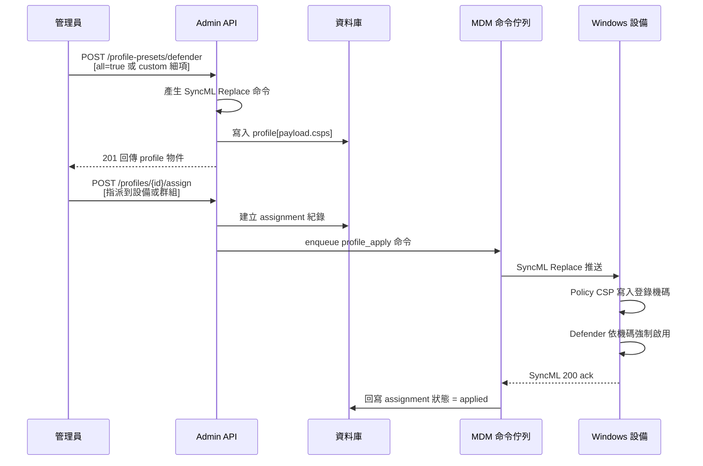

# Windows Defender 強制啟用

教育場景中，學生經常自行關閉本機防毒軟體，導致設備暴露於惡意程式風險。本流程透過 MDM Policy CSP 強制啟用 Windows Defender 各項防護，確保學生無法手動關閉。

## 整體流程

## 流程說明

### 步驟 1：建立 Defender Profile

管理員呼叫 `POST /admin/tenants/{tid}/profile-presets/defender`，有兩種模式：

- **全開模式**：設定 `all: true`，自動套用最嚴防護組合（見下方防護項清單）
- **自訂模式**：透過 `custom` 物件逐項控制各防護開關
- **混合模式**：`all: true` + `custom` 同時提供，custom 欄位覆寫全開預設中的對應項

後端呼叫 `buildDefenderEnforceAll()` 或 `buildDefenderEnforce(custom)` 產生 SyncML Replace 命令，透過 `cmdsToPayload()` 序列化為 profile payload 存入資料庫。

### 步驟 2：指派到設備

管理員呼叫 `POST /admin/tenants/{tid}/profiles/{profileId}/assign`，指派 profile 到單一設備或設備群組。後端建立 assignment 紀錄，並對 Windows 設備立即呼叫 `pushProfileToDevice()` 將 payload 中的每條 CSP 命令 enqueue 至 MDM 命令佇列。

### 步驟 3：設備套用

設備下次 SyncML session 時拉取排隊命令，Windows Policy CSP 將值寫入對應登錄機碼。Defender 引擎偵測到機碼變更後強制啟用各防護項，學生無法透過 Windows Security 介面關閉（機碼受 MDM Policy 保護）。

### 步驟 4：狀態回報

設備回傳 SyncML 200 ack 後，`profile-ack-reconciler` 識別 `profile_apply:{profileId}` 命令類型，自動回寫 assignment 狀態為 `applied`。管理員可透過 `GET /profiles/{profileId}/status` 查詢各設備套用結果。

## 防護項清單

全開模式（`all: true`）啟用的防護項：

| 防護項 | Policy CSP 名稱 | 全開值 | 說明 |
|--------|------------------|--------|------|
| 即時掃描 | `AllowRealtimeMonitoring` | 1（啟用） | 檔案存取時即時掃描惡意程式 |
| 行為監控 | `AllowBehaviorMonitoring` | 1（啟用） | 啟發式偵測可疑行為 |
| 雲端防護 | `AllowCloudProtection` | 1（啟用） | 連線 Microsoft 雲端加速辨識新威脅 |
| IOAV 防護 | `AllowIOAVProtection` | 1（啟用） | 掃描下載檔案與 IE 附件 |
| 網路防護 | `EnableNetworkProtection` | 1（封鎖） | 封鎖已知惡意網路連線（0=停用 / 1=封鎖 / 2=稽核） |
| PUA 攔截 | `PUAProtection` | 1（封鎖） | 阻擋潛在不需要的應用程式（0=停用 / 1=封鎖 / 2=稽核） |
| 樣本提交 | `SubmitSamplesConsent` | 1（傳送安全樣本） | 0=總是提示 / 1=傳送安全樣本 / 2=不傳送 / 3=全部傳送 |

## 關鍵技術細節

### CSP 路徑

- **Policy 設定**：`./Device/Vendor/MSFT/Policy/Config/Defender/{PolicyName}`（Replace，int format）
- **Health 查詢**：`./Device/Vendor/MSFT/Defender/Health/{Node}`（Get，唯讀）

### 命令合併邏輯

當 `all` 與 `custom` 同時提供時，後端以 LocURI（target 路徑）為 key 執行合併：custom 命令覆蓋 base 命令中相同路徑的項目，base 命令中未被覆蓋的項目保留。合併後命令清單為空時回傳 400 `empty_preset`。

### Tamper Protection 注意事項

若設備已啟用 Tamper Protection（`TamperProtectionEnabled`），Defender 自身會攔截外部 Policy 變更。管理員須先確認設備 Tamper Protection 狀態，必要時透過 Microsoft Defender for Endpoint 後台管理。

### 審計日誌

成功建立 Defender profile 時，後端寫入 `preset.create_defender` 審計事件，記錄 `all`、`custom`、`status` 等入參。

### Profile 狀態

- `draft`：不派發，僅儲存
- `active`：可派發到設備
- `archived`：停用歸檔

## 相關源碼

| 檔案 | 說明 |
|------|------|
| `app/services/mdm/windows/csp-defender.ts` | Defender CSP 命令產生器（`buildDefenderEnforce` / `buildDefenderEnforceAll` / `buildDefenderHealthQuery`） |
| `app/routes/v1/admin/profile-presets.ts` | Defender preset 建立端點（路由定義 + handler） |
| `app/routes/v1/admin/profiles.ts` | Profile assign / unassign / status 端點 |
| `app/services/admin/profiles.ts` | `assignProfile` / `pushProfileToDevice` 呼叫邏輯 |
| `app/services/profile-push.ts` | Profile Push 引擎，拆 payload → enqueue SyncML 命令 |
| `app/services/profile-ack-reconciler.ts` | SyncML ack 回寫 assignment 狀態 |
