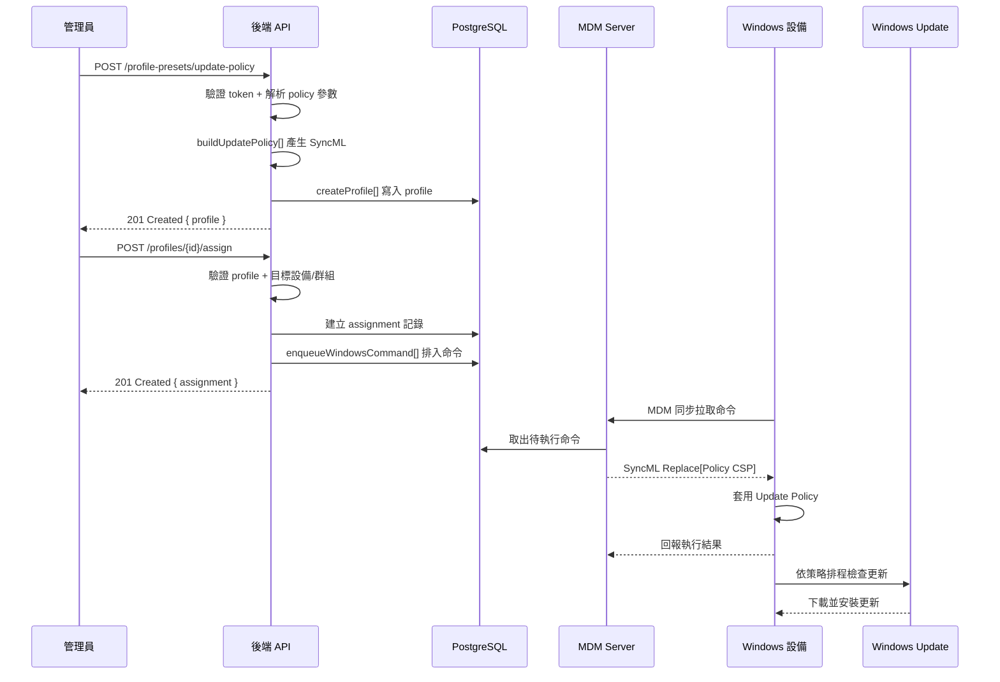

# OS 更新管理（Windows Update）

管理員透過 Admin API 建立 Windows Update 策略 Profile，控制設備的自動更新模式、排程時間、延後天數、活動時段保護與暫停開關。Profile 指派到設備後，後端將策略轉為 Policy CSP SyncML 命令推送，設備按策略自動執行 Windows Update。

## 整體流程



## 流程說明

1. **建立更新策略 Profile** — 管理員呼叫 `POST /admin/tenants/{tid}/profile-presets/update-policy`，傳入 `policy` 物件（含 autoUpdate、排程、延後、暫停等參數）。後端呼叫 `buildUpdatePolicy()` 將業務參數轉為 Policy CSP SyncML 命令陣列，存為 profile 的 `payload.csps`。
2. **指派到設備或群組** — 管理員呼叫 `POST /admin/tenants/{tid}/profiles/{profileId}/assign`，指定 `scope`（`device` 或 `device_group`）及目標 ID。後端建立 assignment 記錄，並透過 `pushProfileToDevice()` 將 profile 的每條 CSP 拆開逐條 `enqueueWindowsCommand()`。
3. **設備同步套用** — 設備在下次 MDM 同步週期拉取命令，收到 `Replace` verb 的 SyncML，Windows CSP 引擎寫入對應的 Policy Config 節點。
4. **Windows Update 按策略執行** — 策略生效後，設備的 Windows Update 服務依 `AllowAutoUpdate` 模式決定下載/安裝/重啟行為，依 `ScheduledInstallDay/Time` 排程執行，並受 ActiveHours 保護和 Defer/Pause 控制。

## autoUpdate 模式對照

| 值 | 模式 | 行為說明 |
|----|------|----------|
| `0` | 通知後下載 | 偵測到更新時通知使用者，由使用者手動下載安裝 |
| `1` | 維護時段自動安裝 | 自動下載，在系統維護時段安裝 |
| `2` | 自動安裝＋通知重啟 | 自動下載安裝，通知使用者重啟（可延後） |
| `3` | 排程自動安裝重啟 | 搭配 `scheduledDay` + `scheduledHour` 在指定時間自動安裝並重啟 |
| `4` | 強制自動安裝重啟 | 自動安裝，強制在排程時間重啟，使用者無法延後 |
| `5` | 關閉自動更新 | 完全停用（不建議生產環境使用） |

## ActiveHours 活動時段保護

ActiveHours 定義使用者活動時段，Windows Update 不會在此時段內強制重啟。

| 參數 | 型別 | 範圍 | 說明 |
|------|------|------|------|
| `activeHoursStart` | int | 0–23 | 活動時段起始小時 |
| `activeHoursEnd` | int | 0–23 | 活動時段結束小時 |
| `activeHoursMaxRange` | int | 8–18 | 活動時段最大跨度（小時） |

典型教育場景：`activeHoursStart=8`、`activeHoursEnd=17` — 上課時段不重啟，更新在放學後執行。

## 延後與暫停

| 參數 | 型別 | 範圍 | 說明 |
|------|------|------|------|
| `deferQualityDays` | int | 0–30 | 品質更新（安全修補）延後天數 |
| `deferFeatureDays` | int | 0–365 | 功能更新（大版本升級）延後天數 |
| `pauseQuality` | boolean | — | 暫停品質更新（最長 35 天） |
| `pauseFeature` | boolean | — | 暫停功能更新（最長 35 天） |

延後策略適用於分階段部署：先讓測試設備安裝，確認穩定後再放開全校設備。

## 關鍵技術細節

### CSP 路徑

所有 Update Policy 走同一 CSP namespace：

```
./Device/Vendor/MSFT/Policy/Config/Update/{PolicyName}
```

| PolicyName | 對應參數 | SyncML verb | format |
|------------|----------|-------------|--------|
| `AllowAutoUpdate` | `autoUpdate` | Replace | int |
| `ScheduledInstallDay` | `scheduledDay` | Replace | int |
| `ScheduledInstallTime` | `scheduledHour` | Replace | int |
| `ActiveHoursStart` | `activeHoursStart` | Replace | int |
| `ActiveHoursEnd` | `activeHoursEnd` | Replace | int |
| `ActiveHoursMaxRange` | `activeHoursMaxRange` | Replace | int |
| `DeferQualityUpdatesPeriodInDays` | `deferQualityDays` | Replace | int |
| `DeferFeatureUpdatesPeriodInDays` | `deferFeatureDays` | Replace | int |
| `PauseQualityUpdates` | `pauseQuality` | Replace | int |
| `PauseFeatureUpdates` | `pauseFeature` | Replace | int |

### Update CSP（進階）

除了 Policy 層面的策略設定，系統還支援透過 Update CSP 直接操作更新：

```
./Device/Vendor/MSFT/Update/{Node}
```

| 函式 | 節點 | verb | 用途 |
|------|------|------|------|
| `buildUpdateApprove()` | `ApprovedUpdates/{GUID}` | Add | 批准指定更新 |
| `buildUpdateInstallableQuery()` | `InstallableUpdates` | Get | 查詢可安裝更新清單 |
| `buildUpdateInstalledQuery()` | `InstalledUpdates` | Get | 查詢已安裝更新（合規檢查） |
| `buildUpdatePendingRebootQuery()` | `PendingRebootUpdates` | Get | 查詢待重啟更新 |

### 限制

- Windows Update 不支援 MDM「立即觸發掃描」命令，設備依自身 WU poll cycle（約 1 天）檢查更新
- Store App 更新可透過 `EnterpriseModernAppManagement/AppManagement/UpdateScan` 立即觸發，但 OS / 品質更新走 WU 自身排程
- `autoUpdate=5`（關閉）不建議生產使用，可能導致安全修補缺失

## 相關源碼

| 檔案 | 說明 |
|------|------|
| `app/services/mdm/windows/csp-update.ts` | Update Policy CSP 構建邏輯（`buildUpdatePolicy`、`buildUpdateApprove` 等） |
| `app/routes/v1/admin/profile-presets.ts` | 策略預設端點（`update-policy` preset handler） |
| `app/routes/v1/admin/profiles.ts` | Profile CRUD + assign/unassign 端點 |
| `app/services/admin/profiles.ts` | Profile 業務邏輯（`createProfile`、`assignProfile`） |
| `app/services/profile-push.ts` | Profile 推送邏輯（`pushProfileToDevice`，拆 CSP → 逐條排入命令佇列） |
