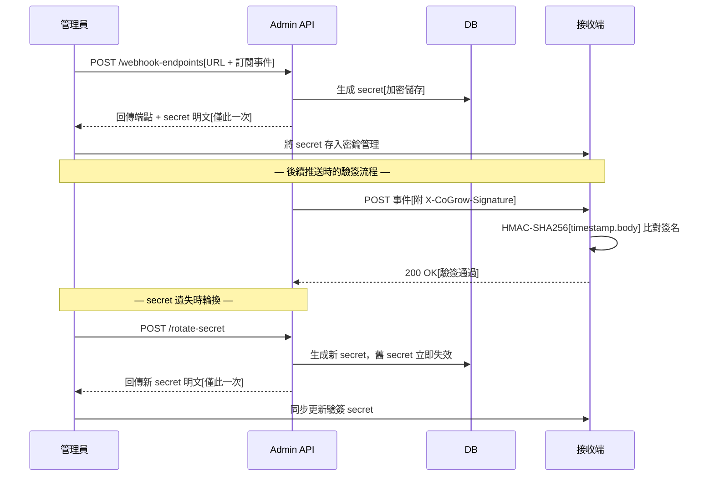
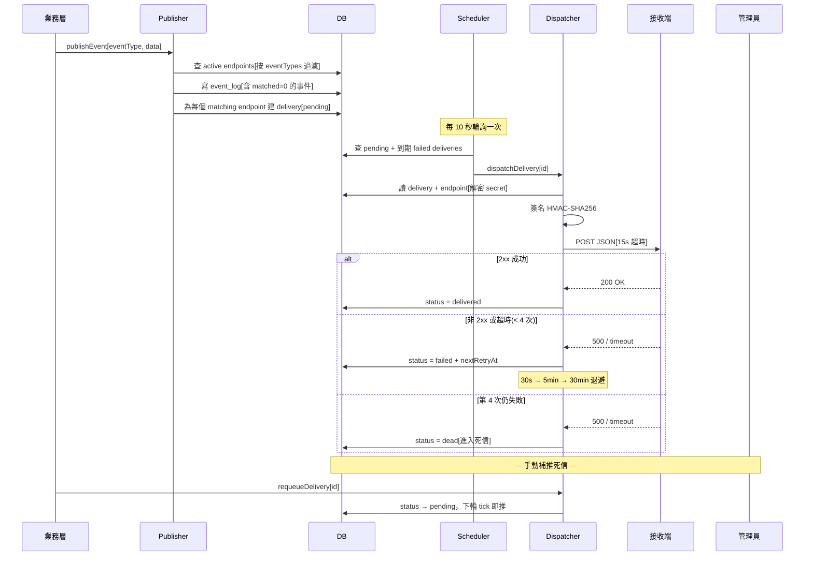

# Webhook 事件通知

當裝置註冊、命令執行完成、Agent 上報等業務事件發生時，系統透過 Webhook 將事件即時推送至甲方註冊的接收端，實現跨系統事件驅動整合。

## 子流程一：端點註冊與 Secret 簽名驗證



### 流程說明

1. **管理員註冊端點**：透過 `POST /admin/tenants/{tid}/webhook-endpoints` 提交接收 URL 與訂閱的事件類型（留空＝訂閱全部）。
2. **系統生成 secret**：後端產生隨機 secret，以加密形式寫入資料庫，僅在此次回應中回傳明文。
3. **管理員保存 secret**：secret 不會在後續任何 GET 回應中出現，必須立即存入密鑰管理。
4. **推送時帶簽名**：每次推送在 `X-CoGrow-Signature` header 帶上 `sha256={hex}` 格式簽名。
5. **接收端驗簽**：以 `HMAC-SHA256(secret, "{timestamp}.{body}")` 計算並比對簽名，防止偽造請求。
6. **secret 輪換**：透過 `POST .../rotate-secret` 產生新 secret，舊 secret 立即失效，接收端需同步更新。

## 子流程二：事件觸發 → 推送 → 重試 → 死信



### 流程說明

1. **業務層觸發**：任何業務事件（如裝置註冊完成）呼叫 `publishEvent()`，傳入事件類型與 payload。
2. **Publisher 匹配端點**：查詢該 tenant 下所有 active 端點，按各端點的 `eventTypes` 訂閱過濾；空陣列＝訂閱全部。
3. **寫 event_log**：無論有無匹配端點都寫一行 `event_log`，確保「事件確實發了」可被審計。
4. **建立 delivery 佇列**：為每個匹配端點建立一筆 `webhook_deliveries`，狀態 `pending`。
5. **Scheduler 輪詢**：每 10 秒掃描到期的 pending / failed delivery，單輪上限 50 筆。
6. **Dispatcher 推送**：讀取 delivery 與 endpoint（解密 secret），計算 HMAC-SHA256 簽名後 POST 到接收端，超時 15 秒。
7. **成功 → delivered**：接收端回傳 2xx，標記 `delivered` 並記錄 `deliveredAt`。
8. **失敗 → 三段退避重試**：依序等待 30 秒、5 分鐘、30 分鐘後重試。
9. **超過重試次數 → dead**：第 4 次嘗試仍失敗，進入死信佇列，不再自動重試。
10. **手動補推**：透過 `requeueDelivery()` 將死信重置為 `pending`，下輪 scheduler tick 即推。接收端用 `event_id` 做冪等去重。

## 事件類型清單

| 領域 | 事件類型 | 說明 |
|------|---------|------|
| **裝置生命週期** | `device.enrolled` | 裝置完成 MDM 註冊 |
| | `device.online` | 裝置上線 |
| | `device.offline` | 裝置離線 |
| | `device.transferred` | 裝置跨租戶轉移 |
| | `device.unenrolled` | 裝置取消註冊 |
| **地理圍欄** | `device.geofence_enter` | 裝置進入圍欄（見 [22-geofence](22-geofence.md)） |
| | `device.geofence_exit` | 裝置離開圍欄 |
| **軟 Wipe** | `device.soft_wipe_started` | 深度軟 wipe 開始 |
| | `device.soft_wiped` | 深度軟 wipe 完成 |
| | `device.soft_wipe_failed` | 深度軟 wipe 失敗 |
| **MDM 命令** | `command.queued` | 命令已排入佇列 |
| | `command.sent` | 命令已發送至裝置 |
| | `command.acknowledged` | 裝置已確認收到命令 |
| | `command.completed` | 命令執行完成 |
| | `command.failed` | 命令執行失敗 |
| **配置描述檔** | `profile.applied` | 描述檔套用成功 |
| | `profile.failed` | 描述檔套用失敗 |
| | `profile.removed` | 描述檔已移除 |
| **Inventory** | `inventory.updated` | 裝置清冊 / 已裝軟體清單更新（見 [21-installed-apps-inventory](21-installed-apps-inventory.md)） |
| **App 派發** | `app.installed` | App 安裝成功 |
| | `app.install_failed` | App 安裝失敗 |
| | `app.uninstalled` | App 已解除安裝 |
| **Agent** | `agent.installed` | Agent 安裝完成 |
| | `agent.checkin` | Agent 啟動簽入（觸發待辦如 LAPS 輪換） |
| | `agent.reported` | Agent 定時上報裝置狀態 |
| | `agent.usage_reported` | Agent 上報使用時長 |
| | `agent.usage_anomaly` | 使用時長回退異常（疑似本地資料被篡改） |
| | `agent.gps_reported` | Agent 上報 GPS 位置（見 [19-agent-gps-reporting](19-agent-gps-reporting.md)） |

事件命名規則：`{resource}.{action}`，動詞用過去式表示「已發生」。

## 關鍵技術細節

### HMAC-SHA256 簽名機制

| 項目 | 值 |
|------|---|
| 演算法 | HMAC-SHA256 |
| 簽名範圍 | `{unix_timestamp}.{json_body}`（`.` 分隔避免長度模糊性攻擊） |
| 輸出格式 | `sha256={hex}`（對齊 GitHub / Stripe 業界慣例） |
| 驗證方式 | `timingSafeEqual` 防時序側信道攻擊 |
| Secret 儲存 | DB 內加密儲存，明文僅建立 / 輪換時回傳一次 |

### 推送 HTTP Headers

| Header | 說明 |
|--------|------|
| `Content-Type` | `application/json` |
| `User-Agent` | `CoGrow-Webhook/1.0` |
| `X-CoGrow-Event` | 事件類型（如 `device.enrolled`） |
| `X-CoGrow-Delivery` | 投遞 UUID（每次嘗試唯一） |
| `X-CoGrow-Timestamp` | Unix 時間戳（秒），用於簽名驗證 |
| `X-CoGrow-Signature` | `sha256={hex}` HMAC 簽名 |

### 推送 JSON Envelope

```json
{
  "event_id": "穩定事件 ID（同事件重試不變，可作冪等鍵）",
  "delivery_id": "投遞 UUID（每次嘗試不同）",
  "event_type": "device.enrolled",
  "occurred_at": "2026-06-16T08:00:00.000Z",
  "tenant_id": "租戶 UUID",
  "data": { "...事件特有 payload..." }
}
```

### 重試策略

| 嘗試次數 | 間隔 | 說明 |
|---------|------|------|
| 第 1 次 | 立即 | 首次推送（Scheduler 輪詢取出） |
| 第 2 次 | 30 秒 | 第 1 次失敗後 |
| 第 3 次 | 5 分鐘 | 第 2 次失敗後 |
| 第 4 次 | 30 分鐘 | 第 3 次失敗後 |
| 超過 4 次 | — | 標記 `dead`，進入死信佇列 |

- HTTP 推送超時：15 秒
- 成功判定：2xx 回應
- 單輪最大處理量：50 筆
- Scheduler 輪詢間隔：10 秒
- Response body 截斷：4096 bytes

### 投遞狀態流轉

```
pending → delivered（2xx 成功）
pending → failed → failed → failed → dead（連續失敗）
dead → pending（手動 requeueDelivery 補推）
```

### 可觀測性端點

| 端點 | 用途 |
|------|------|
| `GET /admin/tenants/{tid}/event-log` | 查詢事件發布記錄（含無訂閱者的事件） |
| `GET /admin/tenants/{tid}/webhook-deliveries` | 查詢投遞記錄（含重試 / 死信狀態） |

兩端點搭配使用：`event-log` 確認「事件發了沒」，`webhook-deliveries` 追蹤「投遞成功了沒」。可透過 `eventId` 跨兩表對齊同一事件的完整鏈路。

## 相關源碼

| 檔案 | 職責 |
|------|------|
| `app/services/webhooks/events.ts` | 事件類型清單與 Envelope 型別定義 |
| `app/services/webhooks/signature.ts` | HMAC-SHA256 簽名計算與驗證 |
| `app/services/webhooks/publisher.ts` | 事件發布入口（匹配端點 + 寫 event_log + 建 delivery） |
| `app/services/webhooks/dispatcher.ts` | 單次推送 + 重試退避 + 死信處理 + 手動補推 |
| `app/services/webhooks/scheduler.ts` | 10 秒輪詢排程器（驅動 dispatcher） |
| `app/routes/v1/admin/webhook-endpoints.ts` | Webhook 端點 CRUD + secret 輪換 API |
| `app/routes/v1/admin/webhooks.ts` | 事件記錄 / 投遞記錄查詢 API（可觀測性） |
