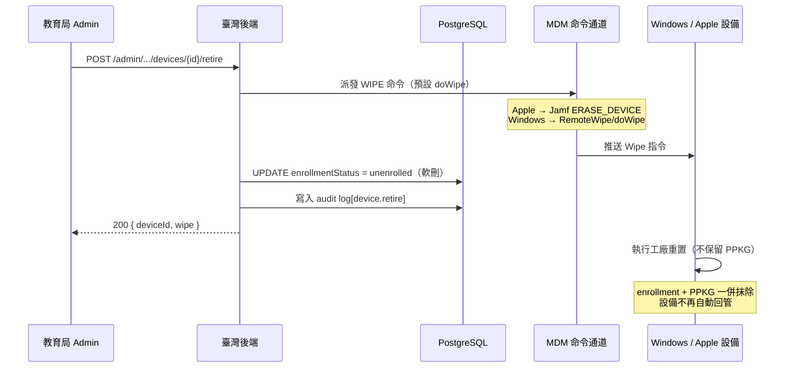

# 設備退役

設備永久離開管理（畢業淘汰 / 報廢 / 歸還）：派發**全量工廠重置**（連 PPKG + MDM enrollment 一併抹除）並標記為 `unenrolled`。設備重置後**不會**自動回管。此操作不可逆，執行前須確認資料已備份。

> 💡 **退役 vs 轉校**：退役走預設 `doWipe`，連預配資料一併清空，設備徹底脫管；轉校走 `doWipePersistProvisionedData` 保留 PPKG 讓設備自動歸入新分組，見 [10-device-transfer](10-device-transfer.md)。
>
> 💡 **退役 vs 優雅卸載**：退役是**破壞性**工廠重置（抹除使用者資料 + OS）；若只想讓設備脫管但保留資料（如歸還給使用者前的清理），改用自建 MDM 的優雅卸載鏈 `POST /api/mdm/win/devices/{udid}/unenroll`（重置密碼 → 移除 PPKG → Agent 自卸載 → DMClient Unenroll，不抹資料）。

## 整體流程



## 流程說明

### 1. 發起退役請求

教育局管理員呼叫 Admin API，僅需設備 ID：

```
POST /api/v1/admin/tenants/{tenantId}/devices/{deviceId}/retire
Authorization: Bearer <ADMIN_API_TOKEN>
```

### 2. 派發全量 Wipe

依設備平台自動路由（複用 `sendCommandToDevice` 的中性 `WIPE` 命令，**不帶** `wipeAction` → 預設 `doWipe`）：

| 平台 | 命令路徑 | 實際操作 |
|------|----------|----------|
| Apple | Jamf Pro API → `ERASE_DEVICE` | 遠端擦除（ADE 設備是否重新註冊由 ABM 端決定，退役前應先從 ABM 移除） |
| Windows | SyncML → `RemoteWipe/doWipe` | 工廠重置，連 PPKG + enrollment 一併抹除，設備不再自動回管 |

### 3. 標記脫管（軟刪）

Wipe 派發成功後，標記 `mdm_devices.enrollmentStatus = unenrolled`（複用 `unenrollDeviceInTenant`，**不刪 row**，保留 `mdm_commands` / `agent_reports` / Jamf 同步歷史的外鍵引用完整）。

**失敗策略**：先派 Wipe，派發失敗則錯誤冒泡、不標記 unenrolled，caller 可安全重試；Wipe 派發成功後才標記 DB，避免 row 狀態與設備實際狀態不一致。

## 關鍵技術細節

- **冪等性**：`unenrollDeviceInTenant` 為冪等軟刪，已 unenrolled 再呼叫仍回 200。Wipe 命令本身冪等。
- **鑑權**：需 `ADMIN_API_TOKEN` Bearer token（`adminAuth` 中介層）+ 可選 HMAC 簽名。
- **審計日誌**：成功後寫入 `action: "device.retire"` 審計記錄。
- **錯誤碼**：
  - `404 device_not_found` — 設備不存在或不屬於該 tenant
  - `409 device_not_jamf_managed` — Apple 設備未綁定 Jamf 實例
  - `409 device_missing_udid` — Windows 設備缺少 UDID（註冊未完成）
- **Windows Wipe CSP**：走 `./Device/Vendor/MSFT/RemoteWipe/doWipe`，由 `buildRemoteWipe()`（預設動作）構建 SyncML 命令。

## 相關源碼

| 檔案 | 說明 |
|------|------|
| `app/routes/v1/admin/devices.ts` | 路由定義、OpenAPI spec、audit log 記錄 |
| `app/services/devices.ts` → `retireDevice()` | 核心業務：派 doWipe → 標記 unenrolled |
| `app/services/devices.ts` → `sendCommandToDevice()` | 跨平台命令派發（Apple/Windows 路由），`wipeAction` 控制 RemoteWipe 動作 |
| `app/services/devices.ts` → `unenrollDeviceInTenant()` | DB 軟刪（標記 enrollmentStatus=unenrolled） |
| `app/services/mdm/windows/csp.ts` → `buildRemoteWipe()` | RemoteWipe SyncML 命令（doWipe / doWipeProtected / doWipePersistProvisionedData） |
| `app/middleware/admin-auth.ts` | Admin Bearer token 鑑權中介層 |
| `app/services/admin/audit.ts` | 審計日誌服務 |
