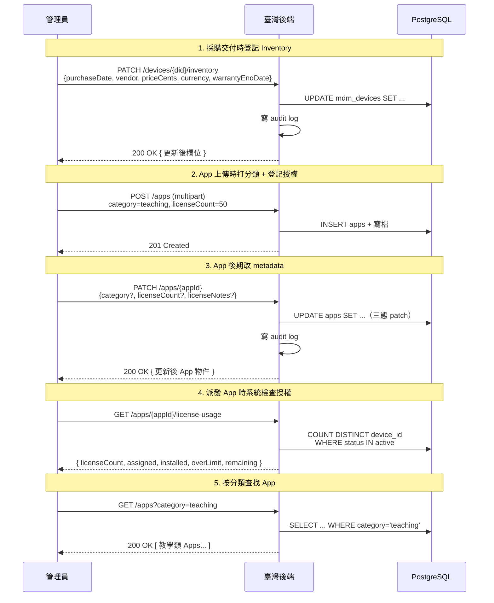

# 設備購買 Inventory 與 App 分類授權管理

本文檔涵蓋 PRD §5.3 / §5.7 三項業務字段管理功能:

1. **設備購買 Inventory**(購買日期 / 廠商 / 採購金額 / 保固到期日)
2. **App 分類管理**(教學類 / 系統工具 / 辦公室軟體等標籤)
3. **App 授權數量管理**(已購買授權數 + 已派發數追蹤 + 超限警示)

這三項都是純資料庫字段管理,**不涉及 MDM 協議下發**,只在後端記錄與查詢。

## 業務流程



## 1. 設備購買 Inventory

| 項目 | 說明 |
|------|------|
| 端點 | `PATCH /admin/tenants/{tid}/devices/{did}/inventory` |
| 鑑權 | Bearer admin token |
| 對應 PRD | §5.7 購買資訊管理 |

### Inventory 欄位

| 參數 | 型別 | 說明 |
|------|------|------|
| `purchaseDate` | string? (ISO 8601 date) | 採購日期,如 `2025-08-15` |
| `purchaseVendor` | string? | 採購廠商名稱(最長 256 字元) |
| `purchasePriceCents` | integer? | 採購金額(**分為單位**避免浮點精度,如 TWD 25,000.00 = `2500000`) |
| `purchaseCurrency` | string? (length=3) | ISO 4217 三字幣別碼,如 `TWD` / `USD` |
| `warrantyEndDate` | string? (ISO 8601 date) | 保固到期日 |

### 三態 Patch 語意

| 傳值 | 行為 |
|------|------|
| 欄位省略 | 不動,保留現有值 |
| 傳 `null` | 清空該欄位 |
| 傳具體值 | 寫入 |

### 金額顯示

```js
// 前端從 cents 還原:
const displayPrice = priceCents / 100;
// 依 currency 格式化(略)
```

### Audit log

`action=device.update_inventory`,payload 含完整 patch 內容。

## 2. App 分類管理

| 項目 | 說明 |
|------|------|
| 上傳時打分類 | `POST /admin/tenants/{tid}/apps` multipart 加 `category` 欄位 |
| 後期修改 | `PATCH /admin/tenants/{tid}/apps/{appId}` JSON 含 `category` |
| 按分類查 | `GET /admin/tenants/{tid}/apps?category=teaching` |
| 對應 PRD | §5.3 App 分類管理 |

### 分類欄位

| 參數 | 型別 | 說明 |
|------|------|------|
| `category` | string? (最長 32) | App 分類標籤(自由字串,前端做 dropdown) |

**為什麼自由字串而非 enum**:避免後續新增分類要改 enum + migration。前端維護一份建議分類清單(如 `teaching` / `system_tools` / `office` / `utility` / `multimedia`),admin 也可填自訂值。

### 常用分類建議

| 識別符 | 中文 | 範例 |
|--------|------|------|
| `teaching` | 教學軟體 | 互動白板、評量系統、教材編輯 |
| `system_tools` | 系統工具 | 7-Zip、CCleaner、CPU-Z |
| `office` | 辦公軟體 | Office、WPS、PDF 編輯 |
| `multimedia` | 多媒體 | VLC、PhotoShop、Audacity |
| `utility` | 公用程式 | Chrome、Firefox、Notepad++ |

### Audit log

`action=app.update`,payload 含完整 patch 內容(`category` / `licenseCount` / `licenseNotes` / `displayName` 等)。

## 3. App 授權數量管理

| 項目 | 說明 |
|------|------|
| 上傳時登記 | `POST /apps` multipart 加 `licenseCount` + `licenseNotes` |
| 後期修改 | `PATCH /apps/{appId}` JSON 含 `licenseCount` / `licenseNotes` |
| 查詢使用率 | `GET /admin/tenants/{tid}/apps/{appId}/license-usage` |
| 對應 PRD | §5.3 授權數量管理 |

### 授權欄位

| 參數 | 型別 | 說明 |
|------|------|------|
| `licenseCount` | integer? | 已購買授權總數;**null = 無限制**(免費 / 內部 App) |
| `licenseNotes` | string? | 授權備註(採購合同編號等) |

### License Usage 回傳結構

```json
{
  "appId": "ede87538-ff00-48c3-810d-052b207885ca",
  "licenseCount": 50,
  "assigned": 32,
  "installed": 28,
  "overLimit": false,
  "remaining": 18
}
```

| 欄位 | 計算 |
|------|------|
| `licenseCount` | 從 `apps.license_count` 取(null=無限制) |
| `assigned` | DISTINCT `device_id` 數,`app_assignments.status IN (pending, installing, installed)` |
| `installed` | DISTINCT `device_id` 數,`status = 'installed'` |
| `overLimit` | `licenseCount` 非 null 且 `assigned > licenseCount` |
| `remaining` | `licenseCount === null ? null : max(0, licenseCount - assigned)` |

### MVP 限制

- `scope=device_group` 的派發(沒具體 `device_id`)目前**不計入 assigned**
- 同一設備同一 App 已被 DB partial unique index 保證 distinct,計算不會重複
- 不冗餘儲存「已派發數」,每次查 license-usage 即時計算(<10ms)

### Audit log

授權字段變更走 `action=app.update`,跟 metadata 更新合併。

## DB Schema 變更

對應 migration `0009_ordinary_kabuki.sql`(2026-06-29):

```sql
-- 設備購買 Inventory（PRD §5.7）
ALTER TABLE "mdm_devices" ADD COLUMN "purchase_date" date;
ALTER TABLE "mdm_devices" ADD COLUMN "purchase_vendor" text;
ALTER TABLE "mdm_devices" ADD COLUMN "purchase_price_cents" bigint;
ALTER TABLE "mdm_devices" ADD COLUMN "purchase_currency" varchar(3);
ALTER TABLE "mdm_devices" ADD COLUMN "warranty_end_date" date;

-- App 分類與授權（PRD §5.3）
ALTER TABLE "apps" ADD COLUMN "category" varchar(32);
ALTER TABLE "apps" ADD COLUMN "license_count" integer;
ALTER TABLE "apps" ADD COLUMN "license_notes" text;
CREATE INDEX "apps_category_idx" ON "apps" USING btree ("category");
```

## 端點清單

| 方法 | 路徑 | 用途 |
|------|------|------|
| `PATCH` | `/admin/tenants/{tid}/devices/{did}/inventory` | 更新採購 Inventory |
| `POST` | `/admin/tenants/{tid}/apps` | 上傳 App(可帶 category / licenseCount / licenseNotes) |
| `PATCH` | `/admin/tenants/{tid}/apps/{appId}` | 更新 App metadata(分類 / 授權 / 顯示名 等) |
| `GET` | `/admin/tenants/{tid}/apps` | 列出 apps(支援 `?category=` 過濾) |
| `GET` | `/admin/tenants/{tid}/apps/{appId}/license-usage` | 查 App 授權使用統計 |

## 相關源碼

| 檔案 | 說明 |
|------|------|
| `app/db/schema/devices.ts` | mdm_devices schema(含 purchase* / warranty* 欄位) |
| `app/db/schema/apps.ts` | apps schema(含 category / licenseCount / licenseNotes 欄位) |
| `app/db/migrations/0009_ordinary_kabuki.sql` | 對應 DB migration |
| `app/services/devices.ts` | `updateDeviceInventory()` service |
| `app/services/apps.ts` | `updateAppMetadata()` / `getAppLicenseUsage()` / `listAppsByTenant(opts)` |
| `app/routes/v1/admin/devices.ts` | `PATCH .../inventory` admin 路由 |
| `app/routes/v1/admin/apps.ts` | `PATCH .../apps/{appId}` + `GET .../license-usage` + `?category=` 過濾 |
