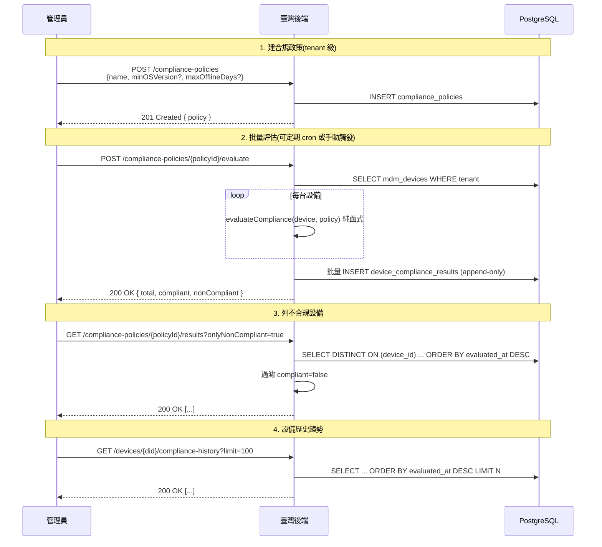

# 合規政策批量評估與歷史(PRD §5.5)

本文檔涵蓋合規政策的 CRUD、批量評估、不合規清單查詢、設備歷史趨勢四項功能,
擴展原本只有「單台即時評估不持久化」的 `compliance/evaluate` 端點。

## 業務流程



## 端點清單

| 方法 | 路徑 | 用途 |
|------|------|------|
| `POST` | `/admin/tenants/{tid}/compliance-policies` | 建立政策 |
| `GET` | `/admin/tenants/{tid}/compliance-policies` | 列政策(`?activeOnly=true` 只列啟用中) |
| `PATCH` | `/admin/tenants/{tid}/compliance-policies/{pid}` | 更新政策(三態 patch) |
| `DELETE` | `/admin/tenants/{tid}/compliance-policies/{pid}` | 刪除政策(cascade 清歷史) |
| `POST` | `/admin/tenants/{tid}/compliance-policies/{pid}/evaluate` | 批量評估 |
| `GET` | `/admin/tenants/{tid}/compliance-policies/{pid}/results` | 列最新結果(`?onlyNonCompliant=true`) |
| `GET` | `/admin/tenants/{tid}/devices/{did}/compliance-history` | 設備歷史(`?limit=100` 預設,最大 500) |
| `POST` | `/admin/tenants/{tid}/devices/{did}/compliance/evaluate` | 即時評估(原端點,不持久化,留作快速檢查用) |

## 政策欄位

| 參數 | 型別 | 說明 |
|------|------|------|
| `name` | string | 政策名稱(tenant 內唯一,最長 128) |
| `description` | string? | 描述 |
| `minOSVersion` | string? | dotted-decimal,如 `10.0.26100`;null = 不檢查 |
| `maxOfflineDays` | integer? | 最久允許離線天數;null = 不檢查 |
| `isActive` | boolean | 啟用中(預設 `true`);僅啟用政策可批量評估 |

至少要設 `minOSVersion` 或 `maxOfflineDays` 其一,否則 400 `empty_policy`。

## 評估結果結構

`device_compliance_results` 每筆紀錄:

```json
{
  "id": "uuid",
  "policyId": "uuid",
  "deviceId": "uuid",
  "compliant": false,
  "violations": [
    {
      "rule": "min_os_version",
      "expected": "10.0.26100",
      "actual": "10.0.19045",
      "message": "OS 版本 10.0.19045 低於最低要求 10.0.26100"
    }
  ],
  "evaluatedAt": "2026-06-29T06:03:11.470Z"
}
```

## 設計決策

### Append-only 歷史

每次批量評估 INSERT 全部設備一筆紀錄(無論合規與否),不更新舊筆。優點:

- **趨勢圖**可以查「某 tenant 合規率隨時間變化」(GROUP BY date_trunc('day', evaluatedAt))
- **設備歷史**可以查「某設備的合規狀態何時翻轉」(時序倒序)
- 評估失敗不會影響舊紀錄

清理:走 pg_cron(同 audit-webhook-retention 機制,365 天保留)。

### listLatestResults 用 DISTINCT ON

不依賴「同 batch 的 evaluatedAt 相同」假設(設備可能跨多次 evaluate 出現),
而是用 PG `SELECT DISTINCT ON (device_id) ... ORDER BY device_id, evaluated_at DESC` 取每台設備最近一筆,反映「設備當前狀態」。

### `policy.isActive=false` 拒絕評估

防止意外對暫停政策跑批量。改活躍狀態用 PATCH `{isActive: true}`。

### 規模

8000 台 PRD 規模:單次 batch INSERT 約 8000 rows × 7 columns ≈ 56k 參數,
仍在 Postgres 65k 上限內。真上萬時改 chunk 即可,當前實作不需要分批。

## 規則引擎(`evaluateCompliance` 純函式)

MVP 兩條規則(`app/services/compliance.ts`):

| 規則 | 邏輯 |
|------|------|
| `min_os_version` | `compareVersion(device.osVersion, policy.minOSVersion) >= 0` |
| `max_offline_days` | `(now - device.lastSeenAt) / 86400 <= policy.maxOfflineDays` |

缺失欄位視為違規(`actual: null`),保留警示意義。新規則(防火牆 / Defender / BitLocker 等)
擴展時在 `compliance.ts` 加 case 即可,DB schema 不需要動(violations 是 jsonb)。

## DB Schema(`migration 0010_mighty_ted_forrester.sql`)

```sql
CREATE TABLE "compliance_policies" (
  "id" uuid PRIMARY KEY DEFAULT gen_random_uuid() NOT NULL,
  "tenant_id" uuid NOT NULL REFERENCES tenants(id) ON DELETE CASCADE,
  "name" varchar(128) NOT NULL,
  "description" text,
  "min_os_version" varchar(64),
  "max_offline_days" integer,
  "is_active" boolean DEFAULT true NOT NULL,
  "created_at" timestamp with time zone DEFAULT now() NOT NULL,
  "updated_at" timestamp with time zone DEFAULT now() NOT NULL
);
CREATE UNIQUE INDEX ON compliance_policies (tenant_id, name);

CREATE TABLE "device_compliance_results" (
  "id" uuid PRIMARY KEY DEFAULT gen_random_uuid() NOT NULL,
  "tenant_id" uuid NOT NULL REFERENCES tenants(id) ON DELETE CASCADE,
  "policy_id" uuid NOT NULL REFERENCES compliance_policies(id) ON DELETE CASCADE,
  "device_id" uuid NOT NULL REFERENCES mdm_devices(id) ON DELETE CASCADE,
  "compliant" boolean NOT NULL,
  "violations" jsonb DEFAULT '[]'::jsonb NOT NULL,
  "evaluated_at" timestamp with time zone DEFAULT now() NOT NULL
);
CREATE INDEX ON device_compliance_results (tenant_id, policy_id, evaluated_at DESC);
CREATE INDEX ON device_compliance_results (device_id, evaluated_at DESC);
CREATE INDEX ON device_compliance_results (policy_id, device_id, evaluated_at DESC);
```

## 相關源碼

| 檔案 | 說明 |
|------|------|
| `app/db/schema/compliance.ts` | compliance_policies + device_compliance_results schema |
| `app/db/migrations/0010_mighty_ted_forrester.sql` | DB migration |
| `app/services/compliance.ts` | evaluateCompliance 純函式引擎(unchanged) |
| `app/services/compliance-batch.ts` | CRUD + batchEvaluatePolicy + listLatestResults + getDeviceHistory |
| `app/services/compliance-batch.integration.test.ts` | 8 個整合測試(全綠) |
| `app/routes/v1/admin/compliance.ts` | 6 新端點 admin API |
