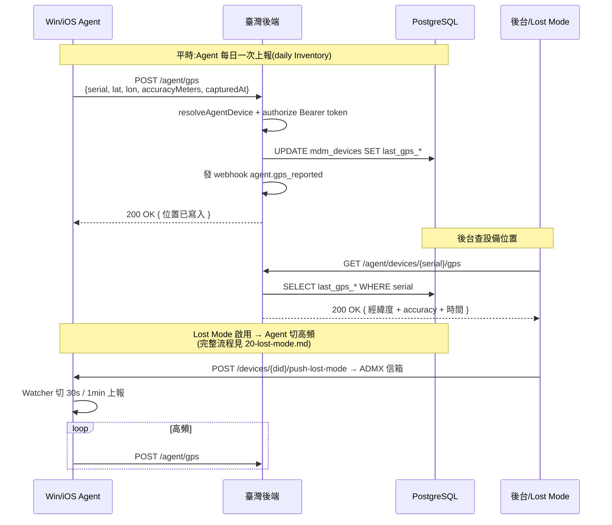

# Agent GPS 位置上報(PRD §5.2 Lost Mode + §5.7 Inventory)

Agent App 上報設備地理位置;設備只保**最新一筆**(無歷史),用於遺失設備追蹤與地理位置 Inventory。

## 業務流程



## 端點清單

| 方法 | 路徑 | 鑑權 | 用途 |
|------|------|------|------|
| `POST` | `/api/v1/tenants/{tid}/agent/gps` | Agent Bearer token(若已簽發) | Agent 上報 GPS 位置 |
| `GET` | `/api/v1/tenants/{tid}/agent/devices/{serial}/gps` | 無 | 查詢設備最新 GPS |

## 上報參數

```json
{
  "serialNumber": "PF5XSMN1",
  "latitude": 25.0339,
  "longitude": 121.5645,
  "accuracyMeters": 30,
  "capturedAt": "2026-06-29T14:30:00Z"
}
```

| 參數 | 型別 | 必填 | 範圍 / 說明 |
|------|------|------|-------------|
| `serialNumber` | string | ✅ | 設備序號(用於 resolve 內部 device id) |
| `latitude` | number | ✅ | 緯度(WGS84,範圍 -90 ~ 90) |
| `longitude` | number | ✅ | 經度(WGS84,範圍 -180 ~ 180) |
| `accuracyMeters` | integer? | | 誤差半徑(米);null = 未知 |
| `capturedAt` | string (ISO 8601)? | | 設備本地取位置時間;省略則用 server now() |

## 查詢回傳結構

```json
{
  "deviceId": "uuid",
  "latitude": "25.0339",
  "longitude": "121.5645",
  "accuracyMeters": 30,
  "capturedAt": "2026-06-29T14:30:00Z"
}
```

設備從未上報過時,各欄位皆為 `null`。

## 設計決策

### 只保最新,無歷史

PRD §5.7「**非即時追蹤**,僅記錄 Inventory 用」明確指出不需要時序歷史。
schema 直接在 `mdm_devices` 加 4 個欄位,而非新建表。對比 `device_compliance_results`
做 append-only 是為了趨勢圖,GPS 場景不需要。

### Lost Mode 高頻上報由 Agent 端控制

後端不限制上報頻率(只有 rate limit 在 nginx 層),由 Agent C# Watcher 端切換:

- **平時**:每日一次(daily inventory)
- **Lost Mode 啟用**:30s / 1min 高頻

切換邏輯在 Agent 端做,因為 Lost Mode flag 已透過 Registry CSP 信箱送到設備
(`HKLM\Software\CoGrow\Agent\State\LostMode`)。後端不需要主動 push「切高頻」命令。

### 經緯度用 text 而非 numeric

避免 PostgreSQL `numeric` ↔ JS `number` 精度差,直接存字串原樣。前端解析時:

```js
const lat = parseFloat(data.latitude);
const lon = parseFloat(data.longitude);
```

6 位小數已是 ~10cm 精度,GPS / WiFi triangulation 誤差遠大於此。

### 鑑權:Bearer token + serialNumber

沿用 `/agent/reports` 同一套(`resolveAgentDevice` + `authorizeAgentReport`):

- 設備已簽發 token → 必須帶 `Authorization: Bearer <token>`
- 設備未簽發 token → 不檢查(iOS 早期 / 過渡期)

token hash 比對採平台無關設計,加 token 不重做鑑權層。

## Webhook 事件

成功上報後發布 `agent.gps_reported` 事件給訂閱者:

```json
{
  "device_id": "uuid",
  "serial_number": "PF5XSMN1",
  "latitude": "25.0339",
  "longitude": "121.5645",
  "accuracy_meters": 30,
  "captured_at": "2026-06-29T14:30:00Z"
}
```

## Agent C# Watcher(延後實作)

目前後端 API 已就緒,Windows Agent 端 `GpsCollector` 類別**延後到下一個 session**
做(需要 Windows build machine)。實作要點:

- 用 `Windows.Devices.Geolocation` API 取設備位置
- 平時用 `desiredAccuracyInMeters: 1000`(低耗電)
- Lost Mode 切 `100`(高精度)
- 監聽 `HKLM\Software\CoGrow\Agent\State\LostMode` Registry 信箱切換頻率
- 上報透過 `POST /agent/gps`(對接 HttpClient 已有 token)

iOS Agent 同步加上(對 iOS Custom App 用 Core Location)。

## DB Schema(`migration 0011_acoustic_vivisector.sql`)

```sql
ALTER TABLE "mdm_devices" ADD COLUMN "last_gps_latitude" text;
ALTER TABLE "mdm_devices" ADD COLUMN "last_gps_longitude" text;
ALTER TABLE "mdm_devices" ADD COLUMN "last_gps_accuracy_meters" integer;
ALTER TABLE "mdm_devices" ADD COLUMN "last_gps_at" timestamp with time zone;
```

## 相關源碼

| 檔案 | 說明 |
|------|------|
| `app/db/schema/devices.ts` | mdm_devices 加 last_gps_* 欄位 |
| `app/db/migrations/0011_acoustic_vivisector.sql` | DB migration |
| `app/services/agent.ts` | updateDeviceGps + getDeviceGps |
| `app/routes/v1/agent.ts` | POST /agent/gps + GET .../gps |
| `app/services/webhooks/events.ts` | `agent.gps_reported` event type 註冊 |
