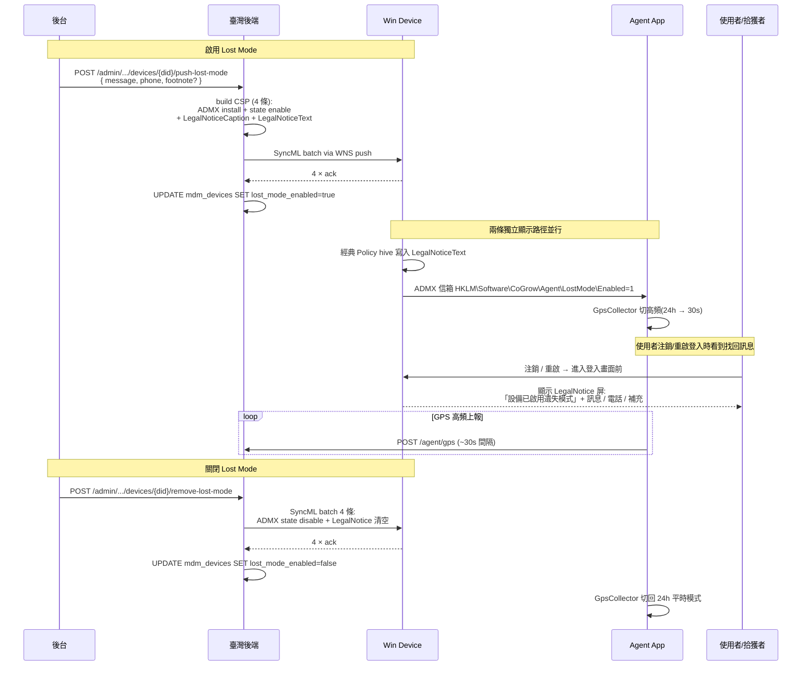

# 遺失模式（Lost Mode） — Windows 端完整閉環(PRD §5.2)

> 設備遺失場景的後端介入流程:管理員透過 admin 端點觸發 Lost Mode → 設備鎖屏前顯示找回訊息 + Agent 切高頻 GPS 上報協助定位。

⚠️ **平台差異**:Apple iOS 在監督模式下有原生 `LostMode` MDM 命令(走獨立流程,本文不涵蓋);**Windows 沒有等同的原生 MDM Lost Mode 指令**,本文描述的是我方用 Policy CSP + Agent ADMX 信箱組合出的等效實作。

## 業務流程



## 端點清單

| 方法 | 路徑 | 鑑權 | 用途 |
|------|------|------|------|
| `POST` | `/api/v1/admin/tenants/{tid}/devices/{did}/push-lost-mode` | Bearer admin | 啟用設備遺失模式 |
| `POST` | `/api/v1/admin/tenants/{tid}/devices/{did}/remove-lost-mode` | Bearer admin | 關閉設備遺失模式 |

### Request body(push-lost-mode)

```json
{
  "message": "請聯絡光復國小資訊組",
  "phone": "02-1234-5678",
  "footnote": "拾獲者請聯絡校方"
}
```

| 欄位 | 型別 | 說明 |
|------|------|------|
| `message` | string 1-255 | 鎖屏顯示找回訊息(學校名 / 部門名) |
| `phone` | string 1-64 | 鎖屏顯示聯絡電話 |
| `footnote` | string 0-255 | **【選填】** 鎖屏顯示輔助訊息(例如「拾獲者可獲報酬」) |

### Response(同 push-lost-mode 與 remove-lost-mode)

```json
{
  "ok": true,
  "data": {
    "commandIds": ["uuid", "uuid", "uuid", "uuid"]
  }
}
```

`commandIds` 是 4 條 SyncML 命令的 `command_uuid` 列表(對應 `mdm_commands` 表),可用於追蹤命令執行狀態。

## ⚠️ 關鍵行為:LegalNotice 只在 logon 時顯示

**這是台灣團隊必踩的坑,前置貼出來:**

Windows `InteractiveLogon_MessageText*` Policy 只在**使用者登入(logon)時**顯示:
- ❌ **Win+L 鎖屏 → 密碼框**:**不顯示** LegalNotice(已登入 session 喚醒,不算新 logon)
- ✅ **完全注銷帳戶**(開始選單 → 使用者頭像 → 登出) → 重新登入:顯示「設備已啟用遺失模式」屏 → 點 OK 進密碼框
- ✅ **設備重啟**:同樣會顯示

Microsoft 官方文檔原文:
> *"This policy applies when users log on. For users who are already logged on, this notice does not appear automatically."*

對策略 demo 與真機驗證的影響:
- demo 給客戶看 Lost Mode 效果時必須**注銷帳戶**才能展示 LegalNotice 屏,別只 Win+L
- 客戶問「為什麼鎖屏看不到找回訊息」 → 回答「設計如此,登入時才顯示;如需鎖屏顯示需另行實作 LockScreenImageUrl 動態圖片」(本期未做)

## ⚠️ Apple/Windows 差異

| 維度 | Apple iOS | Windows(本實作) |
|------|-----------|-------------------|
| 觸發指令 | 原生 `LostMode` / `PlayLostModeSound` / `DeviceLocation` MDM 命令 | Policy CSP + Agent ADMX 信箱組合(無原生指令) |
| 鎖屏顯示找回訊息 | ✅ 設備完全鎖到 Lost Mode 屏,不能用 | ❌ Win+L 鎖屏不顯示;✅ 注銷重新登入時顯示 |
| GPS 位置 | ✅ MDM 命令直接拿(`DeviceLocation`) | ✅ Agent GpsCollector 切 30s 高頻 |
| 強制鎖到單一畫面 | ✅ Lost Mode 屏無法繞過 | ❌ 使用者輸入密碼仍可登入 |
| 強制發聲 | ✅ `PlayLostModeSound` | ❌ 無 |
| 觸發遠端擦除 | 獨立流程 | 獨立流程(`RemoteWipe` CSP) |

**這意味著 Windows Lost Mode 是「軟」找回模式,不是「硬」鎖死設備**;適合場景:
- ✅ 學生忘在教室、家長拿錯設備、丟在公共場所等好心人撿到的場景
- ❌ 防盜(小偷不會去注銷帳戶 → 看不到找回訊息;小偷會直接重灌)

## 內部實作

### 4 條命令的拆解

`push-lost-mode` 在後端 build 出 4 條 SyncML 一起批量入隊:

| # | 命令類型 | CSP 目標 | 用途 |
|---|---------|---------|------|
| 1 | `policy_admx_install` | `./Device/Vendor/MSFT/Policy/ConfigOperations/ADMXInstall/CoGrowMDM/Policy/LostModePolicy` | 安裝自定義 LostMode ADMX(idempotent Replace,新舊設備統一) |
| 2 | `policy_set` | `./Device/Vendor/MSFT/Policy/Config/CoGrowMDM~Policy~CoGrowLostMode/LostModeState` | 設 `<enabled/>` + Message/Phone/Footnote/LostModeId,落 `HKLM\Software\CoGrow\Agent\LostMode\*` 信箱 |
| 3 | `policy_set` | `./Device/Vendor/MSFT/Policy/Config/LocalPoliciesSecurityOptions/InteractiveLogon_MessageTitleForUsersAttemptingToLogOn` | 登入前畫面標題「設備已啟用遺失模式」 |
| 4 | `policy_set` | `./Device/Vendor/MSFT/Policy/Config/LocalPoliciesSecurityOptions/InteractiveLogon_MessageTextForUsersAttemptingToLogOn` | 登入前畫面正文(message + 聯絡電話 + footnote 分行) |

`remove-lost-mode` 對稱推 4 條:ADMX install + state `<disabled/>` + LegalNotice Caption/Text 推空字串覆蓋。

### Registry 信箱 → Agent 切頻

設備收到 #2 後 OS Policy engine 把值落到:
- `HKLM\Software\CoGrow\Agent\LostMode\Enabled` (DWORD)
- `HKLM\Software\CoGrow\Agent\LostMode\Message` (REG_SZ)
- `HKLM\Software\CoGrow\Agent\LostMode\Phone` (REG_SZ)
- `HKLM\Software\CoGrow\Agent\LostMode\Footnote` (REG_SZ)
- `HKLM\Software\CoGrow\Agent\LostMode\LostModeId` (REG_SZ)

Agent `GpsCollector` 內部 30s tick 讀 `Enabled`,決定本次 tick 是平時 24h interval 還是 Lost Mode 30s interval(詳見 [19-agent-gps-reporting.md](19-agent-gps-reporting.md))。

### PolicyManager → 經典 Policy hive 同步

這是疑點高的部分,真機驗證確認**無同步缺口**:

- CSP 寫入 → `HKLM\Software\Microsoft\PolicyManager\current\device\LocalPoliciesSecurityOptions\InteractiveLogon_MessageText*`
- **同時自動同步到**經典 hive:`HKLM\Software\Microsoft\Windows\CurrentVersion\Policies\System\LegalNoticeText` + `LegalNoticeCaption`
- Winlogon GINA 讀經典 hive,所以登入畫面看得到

真機驗證證據(PF5XSMN1, Win11 24H2 Pro, 2026-06-29):
```
HKLM\Software\Microsoft\PolicyManager\current\device\LocalPoliciesSecurityOptions:
  InteractiveLogon_MessageTextForUsersAttemptingToLogOn: 請聯絡光復國小資訊組\n\n聯絡電話:02-1234-5678\n\n拾獲者請聯絡校方
  InteractiveLogon_MessageTitleForUsersAttemptingToLogOn: 設備已啟用遺失模式

HKLM\Software\Microsoft\Windows\CurrentVersion\Policies\System:
  LegalNoticeCaption: 設備已啟用遺失模式
  LegalNoticeText: 請聯絡光復國小資訊組\n\n聯絡電話:02-1234-5678\n\n拾獲者請聯絡校方
```

## 配套策略:LetAppsAccessLocation 強制啟用位置存取

`GpsCollector` 用 `Windows.Devices.Geolocation.Geolocator.RequestAccessAsync()` 採位置,若使用者把 `Settings > Privacy > Location` 關閉會回 `Denied` → GPS 採集跳過。

學校統一管控場景下,**enrollment 時自動推**一條 Policy CSP 強制啟用:
- 路徑:`./Device/Vendor/MSFT/Policy/Config/Privacy/LetAppsAccessLocation`
- 值:`1`(Force Allow,使用者無法在 Settings 關閉,選項變灰)
- 觸發點:`install-agent` 流程內附帶推送,新設備 enroll 後立即生效

`Lost Mode 啟用 → GPS 採不到位置` 的最大失敗模式就是這個隱私設置,此策略 enrollment 時一次性消除。

## DB 字段同步

`push-lost-mode` 同步寫 `mdm_devices`:
| 欄位 | 寫入值 |
|------|--------|
| `lost_mode_enabled` | `true` |
| `lost_mode_message` | body.message |
| `lost_mode_phone` | body.phone |
| `lost_mode_footnote` | body.footnote ?? null |
| `lost_mode_enabled_at` | `now()` |

`remove-lost-mode` 只清:
| 欄位 | 寫入值 |
|------|--------|
| `lost_mode_enabled` | `false` |
| `lost_mode_enabled_at` | `null` |

> 注意:`message` / `phone` / `footnote` 不自動清空(保留最後一次 Lost Mode 內容供審計查閱);如需完全清除走 PATCH endpoint(本期未做)。

## 真機驗證證據(2026-06-29 PF5XSMN1, Win11 24H2 Pro)

- ✅ `push-lost-mode` 4/4 命令 acknowledged(sent → responded ~1 秒)
- ✅ Agent ADMX 信箱 Registry 全部寫入
- ✅ PolicyManager → 經典 hive 同步無缺口(LegalNoticeCaption/Text 都有值)
- ✅ GpsCollector 切高頻:11 次連續上報,平均 32s 周期
- ✅ 真機注銷 → 重新登入顯示「設備已啟用遺失模式」LegalNotice 屏
- ✅ `remove-lost-mode` 4/4 acknowledged,經典 hive 清空,ADMX `Enabled=0`,GPS 切回 24h(5 min 無新上報)

## 相關文件

- [05-remote-lock-wipe-reboot.md](05-remote-lock-wipe-reboot.md) — 遠端鎖定 / 清除 / 重啟(Lost Mode 是「軟」找回,LOCK 是「硬」鎖屏)
- [19-agent-gps-reporting.md](19-agent-gps-reporting.md) — GpsCollector 雙頻採集細節
- [07-device-policies.md](07-device-policies.md) — 其他設備策略推送模式
- [15-webhook-events.md](15-webhook-events.md) — Webhook 事件(本期未為 Lost Mode 配 webhook,後續 phase 加 `device.lost_mode_enabled`)
