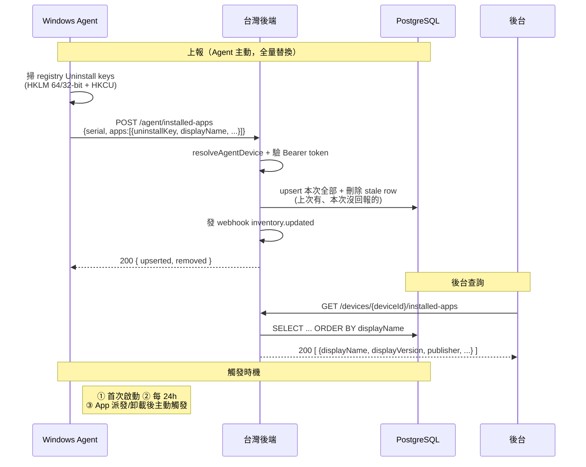

# App 安裝清單 Inventory（PRD §4.2 / §1.4 App 安裝清單）

Agent 掃描設備 registry Uninstall keys，取得每台設備目前已安裝的 **MSI / Win32 軟體清單**並上報；後端**全量替換**存儲，管理員後台按設備查詢。用於掌握「哪台裝了什麼軟體、版本多少」。

> **MSIX / UWP 應用不走本流程**——那條走 AppInventory CSP pull，落 `mdm_windows_apps` 表，與此處的 registry 掃描結果分開。

## 業務流程



## 端點清單

| 方法 | 路徑 | 鑑權 | 用途 |
|------|------|------|------|
| `POST` | `/api/v1/tenants/{tid}/agent/installed-apps` | Agent Bearer token（若已簽發） | Agent 上報完整已裝清單（全量替換） |
| `GET` | `/api/v1/admin/tenants/{tid}/devices/{deviceId}/installed-apps` | Bearer admin token | 查詢設備上次上報的已裝清單 |

## 上報參數

```json
{
  "serialNumber": "PF5XSMN1",
  "apps": [
    {
      "uninstallKey": "{6015F333-8075-432B-BBEA-B7DCBADF0022}",
      "displayName": "Microsoft Edge",
      "displayVersion": "128.0.2739.79",
      "publisher": "Microsoft Corporation",
      "installDate": "2026-05-14",
      "estimatedSizeKb": 348192,
      "uninstallString": "MsiExec.exe /X{6015F333-...}"
    }
  ]
}
```

| 參數 | 型別 | 必填 | 說明 |
|------|------|------|------|
| `serialNumber` | string | ✅ | 設備序號（用於 resolve 內部 device id） |
| `apps` | array | ✅ | 設備當前**完整**已裝清單（後端全量替換，不是增量） |
| `apps[].uninstallKey` | string | ✅ | Registry Uninstall 子 key 名（GUID 或 exe 廠商自訂）；設備內唯一 |
| `apps[].displayName` | string | ✅ | 軟體顯示名（Registry `DisplayName`） |
| `apps[].displayVersion` | string? | | 版本字串 |
| `apps[].publisher` | string? | | 廠商 |
| `apps[].installDate` | string? | | 安裝日期；建議 ISO 8601（原 registry `YYYYMMDD` 也接受） |
| `apps[].estimatedSizeKb` | integer? | | 估算佔用空間（KB，registry `EstimatedSize`） |
| `apps[].uninstallString` | string? | | 卸載命令列（管理員參考，後端不主動執行） |

## 上報回傳結構

```json
{ "deviceId": "uuid", "upserted": 42, "removed": 3 }
```

- `upserted`：本次 upsert 的 row 數（新增 + 更新）
- `removed`：本次刪除的 stale row 數（上次上報有、本次沒回報的，代表已卸載）

## 查詢回傳結構

```json
[
  {
    "id": "uuid",
    "uninstallKey": "{6015F333-...}",
    "displayName": "Microsoft Edge",
    "displayVersion": "128.0.2739.79",
    "publisher": "Microsoft Corporation",
    "installDate": "2026-05-14",
    "estimatedSizeKb": 348192,
    "uninstallString": "MsiExec.exe /X{...}",
    "lastSyncedAt": "2026-07-06T02:11:00Z"
  }
]
```

設備從未上報過時回空陣列 `[]`。

## 設計決策

### 全量替換而非增量

Agent 每次送**完整**清單，後端 upsert 全部 + 刪除本次未回報的 row。這樣不需要 Agent 追蹤「上次上報了什麼、這次新增/移除了什麼」——Agent 端無狀態，掃到什麼送什麼；卸載軟體自然反映為「下次清單裡沒有 → 後端刪掉」。

### MSI/Win32 與 MSIX/UWP 分表

- **本流程（registry 掃描）**：MSI / Win32 傳統桌面軟體 → `mdm_installed_win32_apps` 表
- **AppInventory CSP pull**：MSIX / UWP 現代應用 → `mdm_windows_apps` 表

兩者資料來源、識別符（`uninstallKey` vs PackageFamilyName）、上報通道都不同，故分表存儲。

### 上報頻率由 Agent 端控制

後端不主動拉取，由 Agent 在以下時機推送：首次啟動一次；之後每 24h（跟 DeviceFacts daily report 同節奏）；App 派發 / 卸載後主動觸發一次（讓後台立即看得到變化）。

## Webhook 事件

清單更新後發布 `inventory.updated` 事件給訂閱者。

## 相關源碼

| 檔案 | 說明 |
|------|------|
| `app/services/installed-apps.ts` | `replaceInstalledApps`（全量替換）+ `listInstalledApps`（查詢） |
| `app/routes/v1/agent.ts` | `POST /agent/installed-apps` 上報端點 |
| `app/routes/v1/admin/devices.ts` | `GET /devices/{id}/installed-apps` 查詢端點 |
| `app/db/schema/installed-apps.ts` | `mdm_installed_win32_apps` 資料表 |
