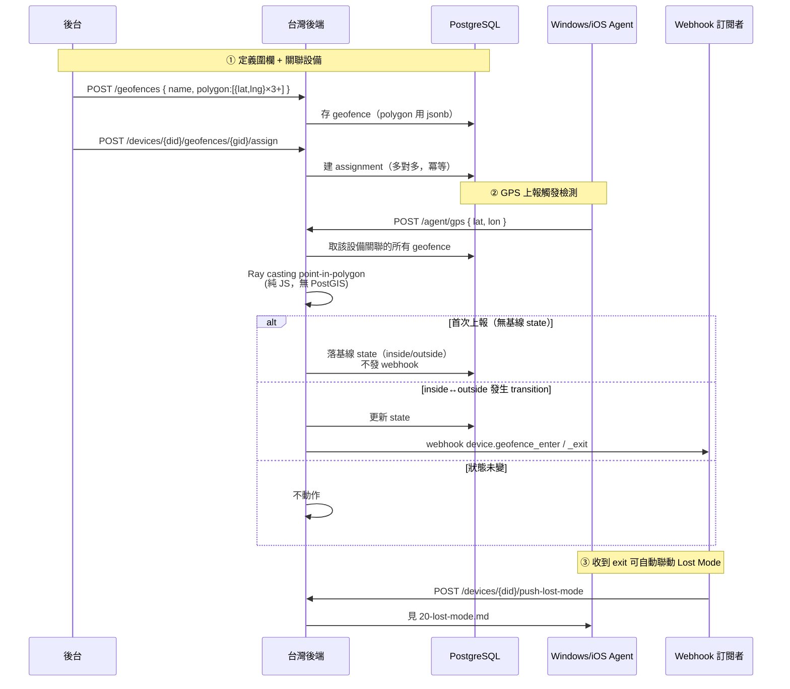

# Geofence 地理圍欄（PRD §6 Future 落地）

學校場景「設備離開校園自動觸發警報 / 派 Lost Mode」的後端閉環：管理員定義多邊形圍欄 → 關聯設備 → Agent GPS 上報時後端做 point-in-polygon 檢測 → 進出圍欄（transition）時發 webhook，台灣後端收到後可自動聯動 Lost Mode。

> 端點的完整字段規格見 [integration-guide.md §5.14](../integration-guide.md)；本文補通訊流程序列圖。GPS 上報本身見 [19-agent-gps-reporting.md](19-agent-gps-reporting.md)。

## 業務流程

## 端點清單

見 [integration-guide.md §5.14](../integration-guide.md)（8 個端點：geofence CRUD ×5 + assign / unassign + 查設備 in/out 狀態）。

## Webhook 事件

| 事件 | 觸發時機 |
|------|----------|
| `device.geofence_enter` | 設備從圍欄外進入圍欄內 |
| `device.geofence_exit` | 設備從圍欄內離開到圍欄外 |

事件 payload 帶 `device_id` / `serial_number` / `geofence_id` / `geofence_name`。詳見 [15-webhook-events.md](15-webhook-events.md)。

## 設計要點

- **首次落表不發 webhook**：assign 後首次 GPS 上報只落基線 state（避免大量設備 assign 時的噪音），只有真的 transition 才發事件。
- **多對多**：一台設備可關聯多個 geofence（跨校區 / 多層圍欄）；一個 geofence 可覆蓋多台設備。
- **依賴 Agent GPS**：從未上報過位置的設備，state 表無 row，`GET .../geofences` 該圍欄 `status` 為 `null`。
- **不做即時追蹤 / 軌跡回放**：符合 PRD §5.7「非即時追蹤」，geofence 只記入/出事件，不留連續位置歷史。
- **不用 PostGIS**：polygon 用 jsonb 存 `{lat,lng}[]`，point-in-polygon 純 JS Ray casting，學校規模秒級足夠、部署簡單。

## 相關源碼

| 檔案 | 說明 |
|------|------|
| `app/services/geofence.ts` | point-in-polygon 檢測 + transition 判斷 + 發 webhook |
| `app/routes/v1/admin/geofences.ts` | geofence CRUD + assign / unassign + 狀態查詢 |
| `app/db/schema/geofences.ts` | `geofences` / `device_geofence_assignments` / `device_geofence_states` |
| `app/services/webhooks/events.ts` | `device.geofence_enter` / `_exit` event type 註冊 |
