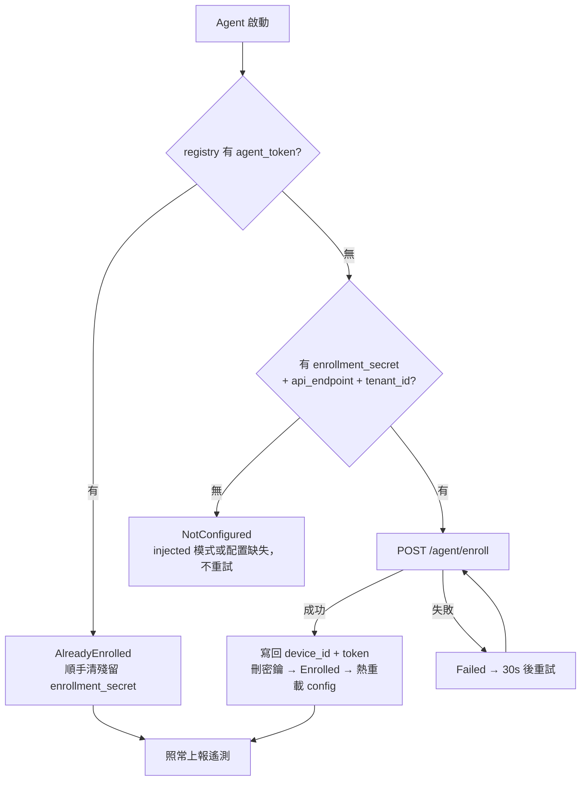

# Intune 共存 — Agent 自助註冊（遙測 only）

存量設備若仍由 **Microsoft Intune** 納管，其 OMA-DM 通道被 Intune 佔用，本平台無法逐台注入
per-device token（自建 MDM 的 `install-agent` 走不通）。本流程讓這類設備仍能接入本平台的
**遙測層**（使用時長 / 設備資訊 / 已裝軟體 / 電量 / 網路）：由 Intune 下發只帶「tenant 級共享
密鑰」的 Agent MSI，Agent 首啟帶密鑰 + 序號向後端換取 per-device token，之後照常上報。

> ⚠️ **能力邊界**：此路徑只換來**遙測**。設備管理面（遠端鎖定 / wipe / LAPS / BitLocker /
> Kiosk / CSP 策略）仍歸 Intune —— 本平台不對 Intune 納管設備下 OMA-DM 命令（一台 Windows 的
> OMA-DM 納管通道只能歸一個 MDM）。要拿全套管理能力，須脫離 Intune、走自建 PPKG/OMA-DM 納管
> （見 [01-device-enrollment](01-device-enrollment.md)）。這是**共存 / 過渡**方案，與 PRD
> 「把 Intune 設備遷至本平台」是相反方向的折衷。

---

## 1. 自助註冊完整流程

管理員先生成一次性共享密鑰、把只帶密鑰的 MSI 交給 Intune 派發；設備端 Agent 首啟自註冊換 token。

```mermaid
sequenceDiagram
    participant 管理員 as 管理員/台灣後端
    participant 後端 as CoGrow 後端
    participant Intune as Microsoft Intune
    participant 設備 as Windows 設備(Intune 納管)
    participant Agent as Agent Service

    Note over 管理員,後端: 前置：生成 tenant 級共享密鑰(一次)
    管理員->>後端: POST /admin/.../agent-enrollment-secret
    後端->>後端: randomBytes(24)→48 hex；SHA-256 存 DB
    後端-->>管理員: enrollmentSecret(明文僅此一次回傳)

    Note over 管理員,Intune: 打包 MSI(只帶共享密鑰，非 per-device token)
    管理員->>Intune: 上傳 MSI + 設定安裝命令行
    Note right of Intune: msiexec /qn API_ENDPOINT=.. TENANT_ID=.. ENROLLMENT_SECRET=..

    Intune->>設備: 派發並安裝 MSI(同一條命令行給 N 台)
    設備->>設備: MSI 寫 HKLM(api_endpoint/tenant_id/enrollment_secret;<br/>device_id/agent_token 留空)

    Agent->>Agent: Windows Service 啟動 → 讀 registry
    Note over Agent: 無 token 但有共享密鑰 → 觸發自註冊
    Agent->>後端: POST /agent/enroll { serialNumber, enrollmentSecret }
    後端->>後端: 驗共享密鑰(SHA-256 比對)
    後端->>後端: 按 (tenant, serial) upsert windows agent_only 設備<br/>selfMdmManaged=false
    後端->>後端: 簽發 per-device token(SHA-256 存 DB)
    後端-->>Agent: { deviceId, agentToken, issuedAt }
    Agent->>Agent: 寫回 HKLM device_id + agent_token;<br/>刪除 enrollment_secret(縮小暴露)

    Note over Agent,後端: 之後與 install-agent 設備完全同路徑
    Agent->>後端: POST /agent/checkin / reports / usage [Bearer token]
    後端-->>Agent: 200 / 201
```

### 流程說明

1. **生成共享密鑰**：`POST /api/v1/admin/tenants/{tid}/agent-enrollment-secret`，後端以
   `randomBytes(24)` 產生 48 字元 hex 密鑰，DB 只存 `SHA-256`，**明文僅此次回傳**。非 null
   即開啟該 tenant 的自助註冊；再次呼叫 = 輪換（舊密鑰立即失效）。
2. **Intune 打包**：把 Agent MSI 上傳 Intune（Win32 `.intunewin` 或 LOB MSI），安裝命令行帶
   `API_ENDPOINT` + `TENANT_ID` + `ENROLLMENT_SECRET`。**同一條命令行派給所有設備**（共享密鑰
   非 per-device，故 Intune「一包多機」的模型天然適用）。`DEVICE_ID` / `AGENT_TOKEN` 留空。
3. **MSI 注入 registry**：MSI 把三個公開屬性寫入 `HKLM\SOFTWARE\Policies\CoGrowMDM\Agent`
   （`device_id` / `agent_token` 值為空）。
4. **Agent 首啟自註冊**：Service 啟動時讀 registry，發現無 token 但有共享密鑰 →
   `POST /agent/enroll` 帶本機序號（`Win32_BIOS.SerialNumber`）+ 共享密鑰。
5. **後端建設備 + 簽 token**：驗密鑰後按 `(tenant, serial)` upsert 一台
   `platform=windows / enrollmentType=agent_only / selfMdmManaged=false` 設備，簽發
   per-device token（DB 存 hash），回傳 `deviceId` + `agentToken`。
6. **寫回 + 清密鑰**：Agent 把 `device_id` + `agent_token` 寫回 registry，並**刪除**
   `enrollment_secret`（本鍵 ACL 對 Users 開放讀，tenant 級密鑰不宜久留）。
7. **照常上報**：之後 checkin / reports / usage 全走 `Bearer <agent_token>` 鑑權，與
   `install-agent` 派發的設備完全一致（見 [04-agent-install-and-reporting](04-agent-install-and-reporting.md)）。

---

## 2. Agent 首啟決策（EnsureEnrolled）

Agent 在 `host.Run()` 前跑一次同步嘗試（讓 `JitterScheduler` 取到真 `device_id`，避免整批
Intune 設備 `hash("")` 同 offset 導致上報錯峰塌縮），並由 `AgentEnrollmentService` 作「開機
網路未就緒」的重試兜底。



- **AlreadyEnrolled**：registry 已有 token（injected 模式，或先前已自註冊）。若殘留共享密鑰則清掉。
- **NotConfigured**：既無 token 也無共享密鑰 → 非自註冊模式（injected 模式應由 MSI 注入 token），
  不重試，交由 StartupSelfCheck / 上報端 skip 呈現。
- **Enrolled**：本次成功換 token 並寫回 → `TryReload()` 讓其餘服務本進程內即時用上（免重啟）。
- **Failed**：有密鑰但請求失敗（網路等）→ 每 30s 重試直到成功。

---

## 3. 兩種模式對照

| 維度 | 自建 MDM `install-agent`（injected） | Intune 共存（self-enroll） |
|------|--------------------------------------|----------------------------|
| 納管通道 | 本平台自建 PPKG / OMA-DM | Microsoft Intune |
| token 來源 | 後端**逐台**簽發，經 EDA-CSP MSI property 注入 | Agent 首啟帶共享密鑰**自助換取** |
| MSI 命令行 | 每台不同（含 `DEVICE_ID` / `AGENT_TOKEN`） | **所有設備相同**（只含共享密鑰） |
| 設備標記 | `selfMdmManaged=true`，完整管理 | `selfMdmManaged=false`，僅遙測 |
| 能力 | 全套（鎖定 / wipe / LAPS / CSP + 遙測） | **僅遙測** |
| 派發者 | 本平台 | Intune |

> 兩種模式的**上報鑑權完全一致**（平台無關的 hash-gated Bearer，見 `agent-auth.ts`）；差異只在
> token 怎麼到設備、以及設備的管理面歸誰。

---

## 4. 密鑰輪換與撤銷

| 操作 | 端點 | 效果 |
|------|------|------|
| 生成 / 輪換 | `POST /admin/tenants/{tid}/agent-enrollment-secret` | 生成新密鑰（明文回一次），舊密鑰立即失效；已簽發的 per-device token **不受影響** |
| 撤銷（關閉自助註冊） | `DELETE /admin/tenants/{tid}/agent-enrollment-secret` | 清除密鑰，後續 `POST /agent/enroll` 一律 403；已簽發 token 照常鑑權 |

> ⚠️ 共享密鑰是 tenant 級授權：洩漏可被拿去建假設備 / 消耗 token。緩解 = 可輪換 + 可撤銷；
> per-device token 一旦簽發即走正常 hash 鑑權，與密鑰解耦。

---

## 關鍵技術細節

### `/agent/enroll` 端點

| 項目 | 說明 |
|------|------|
| 路徑 | `POST /api/v1/tenants/{tenantId}/agent/enroll` |
| 鑑權 | **不帶 Bearer**（設備此時尚無 token）；以 body 內 `enrollmentSecret` 授權 |
| body | `{ serialNumber, enrollmentSecret, udid? }` |
| 回應 | `{ deviceId, agentToken, issuedAt }`（`agentToken` 僅此回傳一次） |
| 冪等 | 同序號再呼叫 = 重簽 token（舊 token 立即失效），覆蓋 MSI 重裝 / token 遺失 |
| 錯誤 | 403 `agent_enroll_disabled`（未開啟）/ 401 `enrollment_secret_invalid`（密鑰不符） |
| 事件 | 成功後觸發 webhook `agent.installed`（`data.source = "intune_self_enroll"`） |

### MSI 屬性與升級保留

| 屬性 | injected 模式 | Intune 模式 |
|------|---------------|-------------|
| `API_ENDPOINT` | ✅ | ✅ |
| `TENANT_ID` | ✅ | ✅ |
| `DEVICE_ID` / `AGENT_TOKEN` | ✅（逐台） | ➖ 留空，Agent 自註冊後補寫 |
| `ENROLLMENT_SECRET` | ➖ | ✅（共享） |

> **升級保 token**：MSI 的 `RegistrySearch` 回填（方案 C）對兩種模式都生效 —— Intune 升級時
> 命令行不帶 `DEVICE_ID` / `AGENT_TOKEN`，會從現有 registry（Agent 自註冊寫入的真值）回填，
> **升級不丟 token**。`enrollment_secret` 屬瞬態（Agent 消費即刪），不掛回填。

---

## 相關源碼

| 檔案 | 說明 |
|------|------|
| `app/services/agent-enroll.ts` | 自助註冊服務（`enrollAgentDevice` / `generateAgentEnrollmentSecret` / `clearAgentEnrollmentSecret`） |
| `app/routes/v1/agent.ts` | 設備面 `POST /agent/enroll` 路由 |
| `app/routes/v1/admin/install-agent.ts` | 管理面密鑰 `POST` / `DELETE` 端點 |
| `app/db/schema/self-mdm.ts` | `self_mdm_configs.agentEnrollmentSecretHash` / `agentEnrollmentSecretIssuedAt` |
| `win-agent-app/src/CoGrowMDMAgent/Config/RegistryConfig.cs` | registry 讀寫 + `ReadBootstrap` / `PersistEnrolledIdentity` / `ClearEnrollmentSecret` |
| `win-agent-app/src/CoGrowMDMAgent/Enrollment/` | `AgentEnrollment` / `AgentEnrollmentClient` / `AgentEnrollmentService` |
| `win-agent-app/src/CoGrowMDMAgent.Installer/Product.wxs` | `ENROLLMENT_SECRET` property + `enrollment_secret` registry value |

> 操作步驟（生成密鑰 → Intune 打包 → 驗證）見
> [windows-deployment/intune-coexistence-agent-enroll.md](../windows-deployment/intune-coexistence-agent-enroll.md)。
