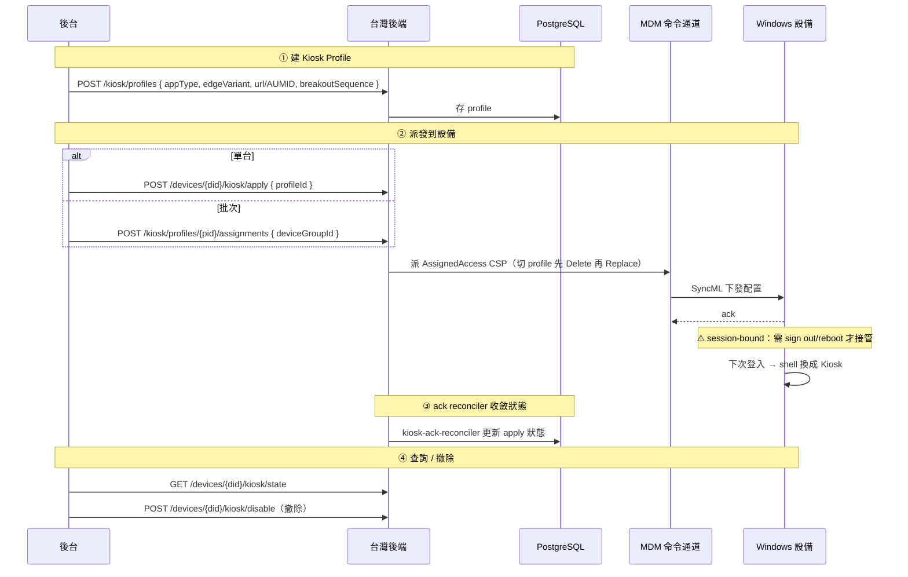

# Kiosk Mode 對接指南（PRD Phase 3）

> **適用對象**：台灣團隊後端工程師 + 學校 IT 管理員。
> **前提**：Win10/11 Pro / Enterprise / Edu；設備已納管；PPKG 建立 `student` 本機帳號（或 `autoLogonAccount` 指定的其他帳號）。
> **真機驗證**：PF5XSMN1 (Win 11 24H2 Pro) 全 10 場景通過（2026-07-06）。

---

## 1. 功能概述

Windows Kiosk Mode 把設備鎖成**單一 App 專用機**，適合考試、展示、公用瀏覽場景。基於 Windows 內建 **AssignedAccess CSP**，無需第三方軟體。

**兩種模式**（同一 API 涵蓋）：

| 模式 | `appType` | 用途 | 配置 |
|---|---|---|---|
| **UWP Kiosk** | `uwp` | 鎖成單一 UWP App（考試軟體、教學 App 等）| 指定 AUMID |
| **Chromium Edge Kiosk** | `edge_kiosk` | 鎖成 Edge 瀏覽器 + URL 白名單 | 指定 URL + 兩子變體 |

**Edge Kiosk 兩子變體**：

| `edgeVariant` | 場景 | 特性 |
|---|---|---|
| `public_browsing` | 考試模式 | InPrivate window，`--kiosk-idle-timeout-minutes=N` 到期自動清 session 重啟 |
| `digital_signage` | 展示屏 | 全屏持續顯示，不清 session |

### 業務流程（序列圖）



---

## 2. ⚠️ 重要：Kiosk 是 **session-bound**，切換必須 sign out / reboot

**這是 Windows AssignedAccess 硬邊界，寫死在對接文檔顯著位置**：

- AssignedAccess 是 shell replacement 機制，**只在 user session 建立時 attach**
- **已在 session 內的用戶**（例：學生已登入桌面）**收到 Kiosk config 後不會被接管**，設備仍是普通桌面
- 要讓 Kiosk 生效，**必須 sign out + sign in cycle**（或重啟設備）

### 服務端唯二觸發生效的路徑

| `activation` | 行為 | 用戶體感 |
|---|---|---|
| `next_logon`（**預設**）| 只派 kiosk XML config，不觸發任何生效動作 | 用戶下次自己 sign in 才會進 Kiosk |
| `reboot` | apply 完成後 5 秒延遲派 `RebootNow` | 設備彈 5 分鐘倒數重啟通知，重啟後 AutoLogon 進 Kiosk |

**沒有「立即生效不打擾用戶」的官方 CSP 路徑**。Windows MDM 沒有標準 signout CSP，走 Custom PowerShell（`shutdown /l /f`）複雜且不穩妥，暫不支援。

### 對接時給老師 / 學校 IT 的預期管理

告知使用者：
- 「派 Kiosk 後**學生下次登入才會進 Kiosk 模式**」
- 「若急用（考試前 5 分鐘配置），用 `activation=reboot` 讓設備自動重啟」
- 「進 Kiosk 後要退出用 Ctrl+Alt+Del（切換使用者）或按 breakoutSequence 配置的組合鍵」

---

## 3. API 端點總覽

Base path: `/api/v1/admin/tenants/{tenantId}/`

| 端點 | 方法 | 說明 |
|---|---|---|
| `/kiosk/profiles` | POST | 建 profile |
| `/kiosk/profiles` | GET | 列表 |
| `/kiosk/profiles/{profileId}` | GET | 詳情 |
| `/kiosk/profiles/{profileId}` | PUT | 全量更新（自動升 version） |
| `/kiosk/profiles/{profileId}` | DELETE | 刪 profile（cascade） |
| `/kiosk/profiles/{profileId}/assignments` | POST | 指派 device / device_group |
| `/kiosk/assignments/{assignmentId}` | DELETE | 移除指派 |
| `/devices/{deviceId}/kiosk/apply` | POST | 派發到設備 |
| `/devices/{deviceId}/kiosk/disable` | POST | 撤除設備上的 Kiosk |
| `/devices/{deviceId}/kiosk/state` | GET | 查詢當前狀態 |

鑑權：`Authorization: Bearer $ADMIN_API_TOKEN`

---

## 4. Profile 定義（核心配置）

### 4.1 建 Profile

`POST /kiosk/profiles`

```json
{
  "name": "期末考試模式",
  "appType": "edge_kiosk",
  "edgeUrl": "https://exam.school.edu.tw",
  "edgeVariant": "public_browsing",
  "autoLogonAccount": "student",
  "breakoutSequence": "Ctrl+B",
  "allowedUrls": ["exam.school.edu.tw", "*.gov.tw"]
}
```

### 4.2 欄位規格

| 欄位 | 型別 | 必填 | 說明 |
|---|---|---|---|
| `name` | string(1-128) | ✅ | tenant 內唯一 |
| `appType` | `edge_kiosk` \| `uwp` | ✅ | 決定鎖哪類 app |
| `edgeUrl` | string url | edge_kiosk 必填 | 啟動 URL |
| `edgeVariant` | `public_browsing` \| `digital_signage` | edge_kiosk 必填 | 考試 vs 展示 |
| `aumid` | string | uwp 必填 | UWP AppUserModelId（PowerShell `Get-StartApps` 取得）|
| `autoLogonAccount` | string(1-64) | 選填（預設 `student`）| 本機帳號名 |
| `breakoutSequence` | string(?) | 選填 | 應急退出鍵；`null` = 完全禁 breakout |
| `allowedUrls` | string[] \| null | 選填 | Edge URL 白名單，僅 edge_kiosk 支援 |

### 4.3 ⚠️ BreakoutSequence 必須雙鍵

**必須雙鍵**（例：`Ctrl+B` / `Ctrl+A` / `Ctrl+Q`），**三鍵組合如 `Ctrl+Alt+B` 完全不生效** —— Alt 修飾鍵在 Chromium Edge Kiosk 全屏下被 Edge process 或 Windows shell 攔截（PF5XSMN1 真機驗證）。MS 官方所有 sample 都用雙鍵。避開跟 Edge 內建 shortcut 撞的組合（例：Ctrl+T=新分頁 不能用）。

觸發後 Windows 顯示標準登入畫面（同 Ctrl+Alt+Del 切換使用者），需輸入 admin 密碼才退出到桌面。走現有 LAPS 通道查 ITAdmin 密碼（見 `laps-password-management.md`）。

### 4.4 ⚠️ URL 白名單語義（Edge Kiosk 專用）

`allowedUrls` 非空時，服務端自動派 **兩條** Chromium URL policy：
- `URLBlocklist=["*"]`（baseline block 所有）
- `URLAllowlist=allowedUrls`（例外准入）

**單派 URLAllowlist 完全無效** —— Chromium 官方語義：白名單是覆蓋黑名單，沒黑名單就無事可覆蓋（PF5XSMN1 驗證過）。所以 API 層自動同時派，對接方**不用手動處理 blocklist**。

URL 語法（Chromium URLBlocklist / URLAllowlist）：
- `"exam.school.edu.tw"` → 匹配該 host + 所有 subdomain（e.g. `www.exam.school.edu.tw`）
- `"*.gov.tw"` → 等價 `gov.tw` bare host（匹配 host + subdomain）
- `"https://foo.com/bar"` → 精確 URL（含 scheme + path）

⚠️ 陷阱：`*://host.com/*` 中 `/*` 是 literal path，反而**不匹配** `https://host.com/`（path 是 `/`）。**用 bare host 就好**。

### 4.5 uwp 模式範例

```json
{
  "name": "計算機專用機",
  "appType": "uwp",
  "aumid": "Microsoft.WindowsCalculator_8wekyb3d8bbwe!App",
  "breakoutSequence": "Ctrl+B"
}
```

`allowedUrls` 對 uwp 模式**無效**（傳非空陣列會 400）—— URL 白名單只對瀏覽器場景有意義。

---

## 5. 派發到設備

### 5.1 直接派給單台設備

`POST /devices/{deviceId}/kiosk/apply`

```json
{
  "profileId": "25c4bc1b-562b-4bbd-9fe7-ba5bef9b95ab",
  "activation": "next_logon"
}
```

| 欄位 | 說明 |
|---|---|
| `profileId` | 要派發的 Kiosk profile UUID（必填）|
| `activation` | 選填，預設 `next_logon`；另可 `reboot`（見 §2）|

回應：

```json
{
  "ok": true,
  "data": {
    "deviceId": "...",
    "profileId": "...",
    "commandIds": ["uuid1", "uuid2", "uuid3"],
    "version": 1
  }
}
```

`commandIds` 依 profile 內容不同 3-5 條：
- KioskApply（AssignedAccess Configuration Replace）
- EdgeAdmxInstall（若 edge_kiosk，ADMX 定義 idempotent Replace）
- EdgeUrlBlocklist（若有 allowedUrls）
- EdgeUrlAllowlist（若有 allowedUrls）
- KioskRemove（若切換 profile 且當前 active，先 Delete 再 Replace）

### 5.2 透過 Assignment 批次派

先建立 assignment：

```
POST /kiosk/profiles/{profileId}/assignments
{
  "scope": "device_group",
  "targetId": "光復國小 UUID"
}
```

**注意**：assignment 本身**不觸發派發**，需管理員另呼叫 `/kiosk/apply` 對每個目標設備。（未來 iteration 可加自動派發勾子）

### 5.3 撤除 Kiosk

`POST /devices/{deviceId}/kiosk/disable`

```json
{
  "activation": "reboot"
}
```

（body 全欄位可選；不傳 body 等同 `{"activation":"next_logon"}`）

服務端派 3-4 條命令：
- KioskRemove（AssignedAccess Configuration Delete）
- EdgeUrlBlocklistClear
- EdgeUrlAllowlistClear
- KioskReboot（若 activation=reboot）

⚠️ **注意**：跟 apply 一樣，disable 也是 session-bound。用戶當前 session 內 Kiosk shell 還在（Edge 全屏還開著），要等 sign out 或 reboot 才會回桌面。`activation=reboot` 派 5min 倒數重啟自動解決。

### 5.4 查詢 Kiosk 狀態

`GET /devices/{deviceId}/kiosk/state`

```json
{
  "ok": true,
  "data": {
    "deviceId": "...",
    "profileId": "...",
    "status": "pending" | "active" | "failed" | "removed",
    "appliedVersion": 2,
    "lastCommandId": "...",
    "errorDetail": null,
    "deployedAt": "2026-07-06T04:00:00Z",
    "removedAt": null,
    "updatedAt": "2026-07-06T04:05:00Z"
  }
}
```

設備從未派過 Kiosk 時 `data=null`。

---

## 6. 常見場景操作流

### 6.1 考試前配置（教師視角）

```
1. 建 profile：期末考試模式（edge_kiosk, exam URL, allowedUrls=[exam URL]）
   POST /kiosk/profiles {...}

2. 派給整個班級的 device_group
   POST /kiosk/profiles/{pid}/assignments  scope=device_group, targetId=班級 UUID
   對每台設備：POST /devices/{did}/kiosk/apply {"profileId":"...", "activation":"reboot"}

3. 學生設備自動 5 分鐘倒數重啟 → AutoLogon 進 Edge Kiosk 考試 URL

4. 考試結束，撤除
   POST /devices/{did}/kiosk/disable {"activation":"reboot"}
```

### 6.2 平時展示屏

```
POST /kiosk/profiles
  {appType:edge_kiosk, edgeVariant:digital_signage, edgeUrl:https://display.school.edu.tw}
POST /devices/{did}/kiosk/apply {"profileId":"...", "activation":"reboot"}
```

`digital_signage` mode 不清 session，適合長時間展示。

### 6.3 應急退出（老師現場）

**方案 A（推薦，管理員後台一鍵）**：
```
POST /devices/{did}/kiosk/disable {"activation":"reboot"}
```

**方案 B（現場鍵盤）**：
1. 按 profile 設定的 `breakoutSequence`（例：`Ctrl+B`）→ 彈登入畫面
2. 選 ITAdmin 帳號 → 輸密碼（走 LAPS 通道查詢：`GET /admin/tenants/{tid}/devices/{did}/laps-password`）
3. 進 ITAdmin 桌面

**方案 C（Windows 標準）**：
按 `Ctrl+Alt+Del` → 切換使用者 → 選 ITAdmin → 輸密碼。這是 Windows secure attention，AssignedAccess 攔不掉，即使沒配 breakoutSequence 也能用。

---

## 7. 已知限制與陷阱清單

| 陷阱 | 原因 | 對策 |
|---|---|---|
| Kiosk 切換必須 sign out / reboot | Windows session-bound 硬邊界 | 用 activation=reboot 或告知用戶手動 sign out |
| BreakoutSequence 三鍵不生效 | Alt 修飾鍵被 Edge 攔 | **只用雙鍵**（Ctrl+B / Ctrl+A / Ctrl+Q）|
| URLAllowlist 單獨無效 | Chromium 語義需要 Blocklist baseline | 服務端已自動兩條同派，對接方不用管 |
| Edge Kiosk Chromium AUMID 塞 KioskModeApp 500 | Edge 是 Win32 exe 不是 UWP | 服務端已用 v4:ClassicAppPath，對接方不用管 |
| 切換 profile 直接 Replace 撞 500 | AssignedAccess 拒絕在 active 狀態下換 profileId | 服務端已自動先 Delete 再 Replace |
| activation=reboot 是 5min 倒數不是立刻 | Windows RebootNow 官方設計 | 對接文檔上這條需向學校 IT 說明 |
| Ctrl+Alt+B 三鍵不生效 | 同上 BreakoutSequence 限制 | 用雙鍵 |
| Win10 Pro 兼容性未驗 | v4 schema MS docs 未明列 Win10 | 若甲方有 Win10 Pro 學生機需另測 |

---

## 8. 關聯資源

- 對接文檔：本頁
- LAPS（Breakout 密碼）：[laps-password-management.md](./laps-password-management.md)
- 觸發機制（WNS push）：[trigger-mechanism.md](./trigger-mechanism.md)
- MS 官方參考：
  - [Configure a Single-App Kiosk With Assigned Access](https://learn.microsoft.com/en-us/windows/configuration/assigned-access/configure-single-app-kiosk)
  - [Create an Assigned Access configuration file](https://learn.microsoft.com/en-us/windows/configuration/assigned-access/configuration-file)
  - [AssignedAccess CSP reference](https://learn.microsoft.com/en-us/windows/client-management/mdm/assignedaccess-csp)
